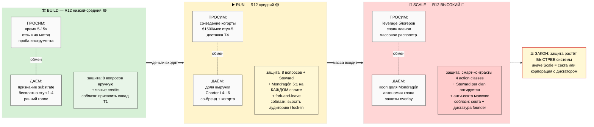

# ⚖️ Phase 4 — Что просим / что даём + R12 на каждом этапе

> **Зачем эта фаза.** Партнёрство = обмен. На каждом этапе обмен **разный**, и соблазн
> «выжать» растёт вместе с деньгами в системе. Здесь: что мы просим и что даём на Build / Run /
> Scale, и как 8 вопросов R12 применяются на каждом этапе. **Главный закон: защита растёт
> быстрее системы** (Build низко → Run средне → Scale высоко ⚠️).
>
> **R12 ENFORCEMENT CELL активна** (influence-ethics receiver-direction). Каждая строка
> «просим/даём» — касание человека, проходит 8 вопросов.

---

## §A 🏗️ Build stage — обмен

### Что просим (от Build-акторов)

| Тип | Что просим |
|---|---|
| **T1 методология** | отзыв на метод + со-дизайн курса + 5-15ч времени |
| **T2 ресурсы** | доступ к аудитории (но **НЕ доим** — каждый сам решает идти) + капитал на runway (€2-5K поддержка) |
| **T3 тестеры** | 1-2ч времени на пробу + честный отзыв + подписанный черновик Charter |
| **T4** | НЕ активен в Build |

### Что даём

| Тип | Что даём |
|---|---|
| **T1** | признание в substrate (методологу часто важнее денег) + кредиты в форке метода + право Charter L5-L6 |
| **T2** | доля L4 Founding **если** когорта генерит доход в Run |
| **T3** | бесплатный доступ к ступеням 1-4 навсегда + признание «когорта-основатель 2026» + голос в дизайне |
| **T4** | НЕ активен |

### 8 вопросов R12 — Build-специфика

1. **Цена ≤ польза?** — actor тратит время на early-stage систему без гарантий → честно про это.
2. **Конкретно?** — Build = недоделанная система; честность про pre-MVP состояние.
3. **Соразмерно отношениям?** — методологу не суём долю немедленно; тестеров не доим временем.
4. **По ступени?** — T1 знают что метод pre-validation; T3 знают что инструмент — черновик.
5. **Канал уместен?** — Telegram/email + голосовой звонок для T1.
6. **Не доим / не запираем?** — T2-аудиторию НЕ extract; fork-and-leave с первого дня.
7. **Нет манипуляции?** — никакой фейк-срочности; честное «строим — будь среди первых».
8. **Стоп-сигнал готов?** — actor говорит «нет» → drop без давления.

**R12-риск Build: преимущественно низкий-средний.** Денег почти нет → почти нечего выжимать.
Главная зона внимания — соблазн присвоить методологический вклад T1 (лечится явными credits).

[src: execution-plan §3-§5 give/ask per type; outreach-content §8.2 Build R12; consolidated-hl §7]

---

## §B ▶️ Run stage — обмен

### Что просим

| Тип | Что просим |
|---|---|
| **T1** | со-ведение когорты + расширение методологии + создание контента курса |
| **T2** | набор когорты (через приглашение, **не extraction**) |
| **T3 (→ члены когорты)** | €1500/мес ступень 5+ + активное участие + органичная адвокатура |
| **T4 (появляется)** | доставка консультаций + ведение суб-когорт |

### Что даём

| Тип | Что даём |
|---|---|
| **T1** | доля выручки (шаблоны Economic V10) + со-бренд + доступ к когорте |
| **T2** | доля L4 Founding + видимость внутри substrate |
| **T3** | доступ к мастерской ступень 5+ + право Charter L4 + сообщество |
| **T4** | доля L4-L6 + обучение + признание + траектория |

### 8 вопросов R12 — Run-специфика (усиливаются)

К Build-вопросам добавляются жёсткие проверки денежного слоя (по 8-пунктовому R12-чеку
Team OS §6 на **каждый денежный шаблон**):
- **Mondragón 5:1** — самая большая выплата ≤ 5× самой маленькой; проверяется на каждом сплите.
- **Fork-and-leave на каждой выплате** — уход с долей пропорционально, без штрафа.
- **Нет lock-in клауз** — «после подписи ты заперт» = запрещённый язык (fork_prevention).
- **Вклад в ledger** — никаких скрытых сплитов мимо учёта.

**R12-риск Run: средний.** Доход течёт = больше соблазнов extraction. Появляется Steward-роль
(ловит «доение» и запирание, останавливает ≤5 сек).

[src: execution-plan §5; Team OS §6 «8-пунктовый R12-чек на каждый денежный шаблон» + §4 Steward;
Economic V10 Mondragón 5:1; partner-offering §3 L5/L6]

---

## §C 📡 Scale stage — обмен

### Что просим

| Тип | Что просим |
|---|---|
| **T1 (clan spawning)** | ведение собственных кланов + рекурсивный форк методологии |
| **T2 блогер/бизнес** | leverage видимости + приглашение аудитории (**не extract**) |
| **T3 массовые адвокаты** | органичное распространение + создание контента |
| **T4 multi-cohort** | масштабированная доставка |

### Что даём

| Кому | Что даём |
|---|---|
| **Всем** | кооперативная доля Mondragón + голос в управлении Charter + защиты Programmable Ethereum overlay (Phase 2+) |
| **Форкам** | полная переносимость fork-and-leave + 30-дневное окно |
| **Кланам** | автономный Charter overlay + niche-specific Layer 2 + Steward только аудит |

### 8 вопросов R12 — Scale-специфика (массовое применение)

8 вопросов применяются **массово + автоматически**:
- Programmable Ethereum overlay механически обеспечивает Mondragón cap + QF-распределение +
  fork-and-leave exit tokens (4 action classes: extraction_beyond_share / wage_ratio_violation /
  non_consensual_distribution / fork_prevention_attempt).
- Steward аудит **per clan** (не один центральный — каждый клан свой, ротируемый).
- Анти-секта защиты массово: нет клятв верности, нет эскалации преданности, нет
  спасителя-фигуры, нет «мы против них», выход звучит первым.

**R12-риск Scale: ВЫСОКИЙ ⚠️.** Самый чувствительный этап. Массовая динамика = риск секты +
соблазн нарушить Mondragón + попытки lock-in через юридическую ловушку. Именно поэтому защита
здесь механическая (смарт-контракты), а не на доброй воле.

[src: CLAUDE.md §4.2 R12 programmable Ethereum 4 action classes; Economic V10; Team OS §10
анти-секта границы; outreach-content §4.4 anti-cult + §8.2 Scale R12]

---

## §D Сводка: обмен × этап × R12-риск

| | 🏗️ Build | ▶️ Run | 📡 Scale |
|---|---|---|---|
| **Что в основном просим** | время + отзыв + проба | участие + €1500/мес + доставка | leverage + спавн + распространение |
| **Что в основном даём** | признание + бесплатный доступ + ранний голос | доля выручки + Charter + когорта | кооп.доля + автономия клана + защиты |
| **Деньги в системе** | ~0 | €1.5-15K/мес | распределённый кооператив |
| **R12-риск** | низкий-средний | средний | **высокий ⚠️** |
| **Механизм защиты** | 8 вопросов вручную + явные credits | 8 вопросов + Steward + Mondragón на каждом сплите | смарт-контракты + Steward per clan + анти-секта массово |
| **Главный соблазн** | присвоить вклад методолога | выжать аудиторию / lock-in | секта + диктатура основателя |

---

## §E ⭐ Mermaid PL-3 — матрица обмена (даём × просим) с градиентом R12-риска

---

*Phase 4 closure. Per-stage give/ask + R12 8-Q per stage (Build вручную → Run +Steward+Mondragón
→ Scale смарт-контракты массово) + escalating risk + сводка + Mermaid PL-3 градиент.
R12 ENFORCEMENT CELL active. F2-F3 derivative. R1 surface only. NO LOCK modified.*
