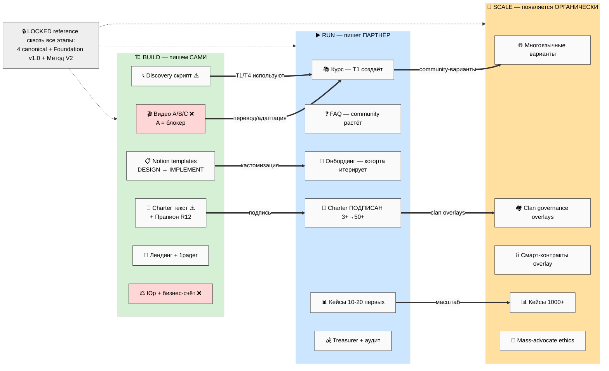

# 📚 Phase 5 — Какие документы на каком этапе

> **Зачем эта фаза.** Документ живёт по-разному на разных этапах: что-то **мы пишем сами
> сейчас** (Build), что-то **пишет партнёр** в Run, что-то **появляется органически** в Scale.
> Эта матрица говорит: какой документ, на каком этапе, кто владелец, и в каком он состоянии
> сейчас. Фокус — что нужно **срочно для выхода из Build.**

---

## §A Большая матрица: Документ × Этап × Владелец × Состояние сейчас

| Документ | 🏗️ Build | ▶️ Run | 📡 Scale | Состояние сейчас |
|---|---|---|---|---|
| **Видео A — методология** | Ruslan автор | перевод/адаптация партнёрами | community-варианты | ❌ не записано (блокер всего) |
| **Видео B — как учим** | Ruslan автор | партнёры используют | многоязычные | ❌ не записано |
| **Видео C — корпорация/платформа** | Ruslan автор | партнёры используют | per-clan варианты | ❌ не записано |
| **Видео D — Welcome (опц.)** | Ruslan, последним | лендинг-intro | — | ❌ опционально |
| **Метод V2** | LOCKED reference | reference для когорты | форк-варианты per clan | ✅ LOCKED |
| **Charter (текст для подписи)** | Ruslan + Прапион (R12) | подписан 3+ → 50+ | clan overlays | ⚠️ дизайн в Team OS §6; текст НЕ написан |
| **Personal OS Notion template** | implementation нужна | кастомизация юзером | clan-niche варианты | ⚠️ DESIGN level (5 баз ядро не внедрено) |
| **Team OS Notion template** | дизайн готов | первый multi-tenant | clan-mode N инстансов | ⚠️ DESIGN level |
| **Discovery-звонок скрипт** | Ruslan репетирует | T1+T4 используют | массово-обученные консультанты | ⚠️ дизайн (шаблон-звонок 8-чек + 7Q) |
| **7-8 шаблонов анализа** (день/нед/мес/кв/год/проект/гипотеза/звонок) | дизайн готов | юзер-кастомизируемые | niche-варианты | ✅ DESIGN (personal-os §7) |
| **Лендинг** | Ruslan черновик (после A+B) | refined per cohort | per-clan | ❌ не сделан |
| **1-pager** | Ruslan (почти готов) | iteration | многоязычный | ⚠️ почти готов |
| **FAQ** | Ruslan (после 3-5 разговоров) | community FAQ растёт | многоязычный | ❌ нет (нужны реальные вопросы) |
| **Юр. документы** (Einzel/GmbH/UG → Cooperative Charter legal) | Steuerberater нужен | операционные | кооператив легализован | ❌ не начато |
| **Финансовая система** (бизнес-счёт + bookkeeping) | основатель solo | + community treasurer + аудит | Steward аудит per clan | ❌ не начато |
| **Курс (материалы)** | скелет по Метод V2 | T1-партнёры создают | community-варианты | ⚠️ скелет (не end-to-end) |
| **Онбординг когорты** | черновик | первая когорта итерирует | авто-онбординг-flows | ❌ черновик (после 5+ тестеров) |
| **Кейсы (case studies)** | нет | первые 10-20 | 1000+ | ❌ нет (появятся в Run) |
| **18 артефактов P0-P6** (outreach-content) | P0-P2 нужны | P3-P5 | P6 | ⚠️ спроектированы, не произведены |
| **Clan governance overlays** | NA | NA (одна когорта) | per-clan | — Scale-only |
| **Programmable Ethereum смарт-контракты** | NA (отложить) | Phase 2+ старт | активное enforcement | — defer |
| **Mass-advocate ethics doc** | NA | черновик | активен | — Run/Scale |
| **execution-plan / consolidated-hl / partner-offering** | ✅ готовы (карты Build) | reference | reference | ✅ готовы |
| **Foundation v1.0 (11 Parts + Pillar A/B/C)** | LOCKED | LOCKED | LOCKED | ✅ LOCKED |
| **4 LOCKED canonical** | LOCKED reference | reference | reference | ✅ LOCKED |
| **outreach-content (7 Bloom + 13 CTA + 6 арх)** | substrate для видео/CTA | per-cohort messaging | mass paradigm | ✅ substrate-complete |
| **Navigation Guide (sanitized public)** | Ruslan polish | публичный | многоязычный | ✅ DRAFT |
| **CRM (180 contacts + funnel tags)** | Ruslan размечает | pipeline активен | per-clan CRM | ⚠️ 180 есть, funnel-теги нужны |
| **Plan-of-Day / Strategic Reflection** | Ruslan R1 ежедневно | продолжается | per-steward | ✅ работает |
| **Книжный substrate (402 книги + 162 вики)** | reference | reference | reference | ✅ есть |

[src: execution-plan §3 + §10; personal-os §7 + §10; team-os §6 + §9; outreach-content §7.3
P0-P6; Point A §4-§5 inventory; consolidated-hl §8]

---

## §B Что готово сейчас (высокий % done) — фундамент Build

✅ 4 LOCKED canonical + Foundation v1.0 + Charter v0 (конституция, не текст-для-подписи) +
execution-plan + consolidated-hl + partner-offering + outreach-content (7 Bloom + 13 CTA) +
Метод V2 + Strategic Plan + Economic V10 + AI Market PLAN + Notion templates **DESIGN** +
7-8 шаблонов анализа DESIGN + Navigation Guide DRAFT + 1-pager почти готов + 180 CRM + книжный
substrate.

**Вывод:** substrate готова. Не хватает не знания, а **выпущенных наружу артефактов.**

## §C Нужно срочно (P1 — на выход из Build)

❗ Видео A/B/C (A = блокер всего) + Notion templates **IMPLEMENTATION** (Personal OS ядро 5 баз
+ Team OS demo) + Charter **текст для подписи** + discovery-звонок отрепетирован + Steuerberater
консультация + бизнес-счёт открыт + лендинг черновик.

## §D Можно отложить до Run (P2)

⏸ Курс end-to-end (создаёт T1-партнёр) + FAQ (после 3-5 реальных разговоров) + онбординг
когорты (после 5+ тестеров) + кейсы (первые в Run) + P3-P5 артефакты.

## §E Ещё не релевантно (Scale)

🔮 Clan governance overlays + Programmable Ethereum смарт-контракты + multi-tenant операции +
массово-обученные консультанты + многоязычные варианты + mass-advocate ethics (черновик в Run).

---

## §F ⭐ Mermaid PL-4 — жизненный цикл документов по этапам

**Чтение PL-4.** Документы «перетекают»: видео мы пишем в Build → в Run партнёры их адаптируют
→ в Scale появляются community-варианты. Charter: пишем текст (Build) → подписывают (Run) →
clan overlays (Scale). LOCKED-документы (4 canonical + Foundation + Метод V2) — неизменный
reference сквозь все этапы.

---

*Phase 5 closure. Матрица 30+ docs × stage × owner × status + готово/срочно/отложить/Scale +
Mermaid PL-4 жизненный цикл. Фокус: Build needs (видео A блокер). F2-F3 derivative. R1 surface only.*
