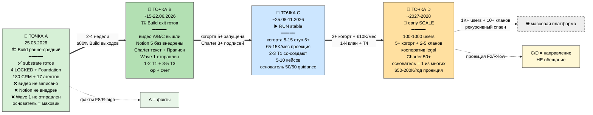

# 📍 Phase 6 — Точка А / B / C / D через lens этапов

> **Зачем эта фаза.** У нас есть Точка А (где мы сейчас) и Точка B (ближний таргет). Здесь
> добавляем Точку C (3-6 мес) и Точку D (12-24 мес) и **накладываем на них lens Build/Run/Scale**.
> Так видно: А и B — внутри Build; C — это Run; D — ранний Scale.
>
> ⚠️ **Все цифры будущего (C/D) — проекции (F2, R-low), не обещания** (per consolidated-hl §8
> «это направление, не обещание»). Точка А — факты (F8/R-high).

---

## §A 📍 Точка А (сейчас, 25.05.2026) — early-mid Build

**В каком этапе:** ранне-средний Build stage.

### Что есть (конкретная опись — факты)

- Видение + методология зафиксированы (Метод V2 LOCKED)
- 4 LOCKED canonical (Method / Strategic / Economic / AI Market)
- Foundation v1.0 LOCKED (11 Parts + Pillar A/B/C) + Charter v0 LOCKED + 8 RUSLAN-ACK
- Substrate массивный: 1509 коммитов / 60 дней / 100+ стратегических docs / 402 книги /
  17 ROY-агентов / 162 вики-концепта
- 4 overnight плана (consolidated-hl + execution-plan + personal-os + team-os)
- Notion existing pages (Command Center / Daily Log / Projects / CRM / Research / Life OS) — работают
- Notion templates DESIGN level готов
- Voice pipeline работает + Mistral OCR + Toggl integration
- CRM 180 contacts + 9 L1 First Clan deep profiles + funnel-теги нужны
- 5+1 архетипов + 7 Bloom + 13 CTA определены

### Чего НЕ есть

- ❌ Видео НЕ записано (Видео A = блокер всего)
- ❌ Notion templates НЕ внедрены (только дизайн)
- ❌ Charter текст для подписи НЕ написан (дизайн есть в Team OS §6)
- ❌ Discovery-звонок НЕ отрепетирован
- ❌ Юр. оформление НЕ начато + бизнес-счёт НЕ открыт
- ❌ Wave 1 outreach НЕ отправлен
- ❌ Первый T3 trial (Дмитрий) состоялся как созвон, но trial инструмента НЕ начат
- ❌ Edu-agent execution prompt НЕ создан

**Позиция основателя в Bloom 7:** переход Engagement→Discovery (сам себя обучает).

[src: Point A §0-§12 inventory; execution-plan §0; Point B §0]

---

## §B 📍 Точка B (2-4 недели, ~15-22.06.2026) — Build exit готовится

**Цель:** закрыть выходные критерии Build.

### Что должно быть

- Видео A+B+C записано + опубликовано (YT или лендинг)
- Notion templates Personal OS ядро 5 баз внедрено
- Notion templates Team OS demo-воркспейс (1 партнёр тестит)
- Charter текст написан + проверен Прапион (R12-эксперт)
- Discovery-звонок отрепетирован + 3-5 звонков проведено
- Steuerberater консультация + решение Einzel/GmbH/UG сделано
- Бизнес-счёт открыт + bookkeeping начат
- Wave 1 первые 7-10 отправлены (Maxim/Oleg/Левенчук/Цэрэн/Прапион)
- 1-2 партнёра T1 confirmed
- 3-5 тестеров T3 активны (Дмитрий + Сева + ближний круг)
- Edu-agent создан (если путь выбран)

### Триггеры готовности к выходу в Run

- ✅ 1-я когорта найдена (5+ участников)
- ✅ 1-2 партнёра T1 активно со-создают
- ✅ Charter подписан 3+
- ✅ Discovery → ступень 5 conversion случился минимум 1 раз

[src: Point B §2-3 1w/1m horizons; execution-plan §6; POINT-B-FOCUSED-WEEK-1 8 шагов]

---

## §C 📍 Точка C (3-6 месяцев, ~25.08-25.11.2026) — Run stage stable

**Цель:** Run работает стабильно. *(проекция, F2/R-low)*

### Что должно быть

- 1-я мастерская-когорта активна (5-15 основателей ступень 5+)
- Доход €5-15K/мес течёт
- 2-3 партнёра T1 активно со-создают курсы
- 1-2 партнёра T2 канальные партнёрства начаты
- 5-10 кейсов задокументировано
- Методология проверена 3+ партнёрами
- Планирование 2-й когорты начато
- Основатель Deep Work переходит к 50% guidance / 50% personal frontier

### Триггеры к выходу в Scale

- Несколько когорт параллельно (3+)
- Доход €10K/мес+ стабильно
- 1-й T4-консультант появился
- 1-й органичный клан (суб-сообщество с отдельным фокусом)

[src: consolidated-hl §8 «конец 2026»; Point B §4 2-month; Strategic Plan; partner-offering §9
trajectory Mo 3-6 (проекция)]

---

## §D 📍 Точка D (12-24 месяца, ~25.05.2027-2028) — early Scale

**Цель:** ранний Scale. *(проекция, F2/R-low — «направление, не обещание»)*

### Что должно быть

- 100-1000 активных пользователей
- 5+ когорт параллельно
- 2-5 частичных кланов появляются
- Кооперативное управление легализовано
- Charter массово подписан (50+)
- Основатель = один из хранителей
- Programmable Ethereum overlay внедрён (Phase 2+, если путь выбран)
- Траектория дохода $50K-$200K/год

### Триггеры к трансформации (→ массовая платформа)

- 1K+ пользователей
- 10+ само-управляющихся кланов
- Рекурсивный спавн когорт
- Траектория $100K → $1M ARR заякорена

[src: consolidated-hl §8 «2027 + 2028+»; Strategic Plan Phase 8 1M users; partner-offering §9
Mo 12-36 (проекция)]

---

## §E Сводка: точки × этапы

| Точка | Когда | Этап | Маркер «кто крутит маховик» |
|---|---|---|---|
| **А** | 25.05.2026 (сейчас) | 🏗️ Build (ранне-средний) | основатель руками; substrate готов, наружу не вышел |
| **B** | ~15-22.06.2026 | 🏗️ Build exit готовится | основатель + первые пробы; видео вышли, 1-2 T1 + 3-5 T3 |
| **C** | ~25.08-25.11.2026 | ▶️ Run stable | основатель + партнёры + петля; когорта платит |
| **D** | ~25.05.2027-2028 | 📡 early Scale | кланы крутят сами; основатель = 1 из хранителей |

---

## §F ⭐ Mermaid PL-5 — таймлайн Точка А → B → C → D с зумами

---

*Phase 6 closure. Точка А (факты) / B / C / D (проекции) через Build/Run/Scale lens +
триггеры переходов + сводка + Mermaid PL-5 таймлайн с зумами. F2-F3 derivative. R1 surface only.
Цифры будущего = направление не обещание.*
