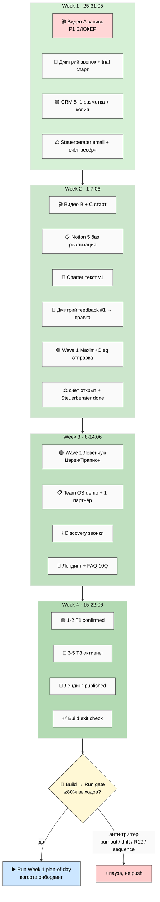

# 📅 Phase 7 — Build stage: конкретные действия на 4 недели

> **Зачем эта фаза.** Только Build конкретизируем по неделям (25.05-22.06). Run/Scale =
> future-state, описаны через **триггеры перехода**, а не пошагово — потому что их форма
> зависит от того, что выяснится в Build.
>
> **Один принцип над всем (из execution-plan §6): всё держится на видео A.** Пока его нет —
> остальное буксует. IP-1: имена = примеры. NO auto-launch — это карта, не запуск.

---

## §A Week 1 (25.05 — 31.05) — запуск производства baseline

| Актор | Конкретные действия |
|---|---|
| **🛠️ Ruslan solo** | Запись **Видео A** (P1 блокер) + полировка 1-pager + быстрый черновик Notion-шаблона для Дмитрия (по дизайну Personal OS) |
| **🔵 T3 trial (Дмитрий)** | Назначить discovery-звонок + начать trial (передать шаблон + доступ к материалам ступеней 1-2) |
| **🟣 T1 Wave 1 prep** | НЕ отправлять (ждём видео); CRM-разметка 5+1 архетипов первых 10 контактов; черновик outreach-копии по CTA-09 + CTA-05 |
| **⚖️ Фундаментальная инфра** | Email Steuerberater + решение об апгрейде Notion Team plan + ресёрч бизнес-счёта |

Пункты Видео A / CRM-разметка / Steuerberater можно начинать **параллельно** — не зависят
друг от друга.

[src: execution-plan §6 «обязательно на этой неделе»; Point B §2 day-by-day; personal-os §10 W1]

## §B Week 2 (1.06 — 7.06) — второе видео + первый цикл обратной связи

- Запись **Видео B**
- Начало записи **Видео C**
- Notion templates Personal OS ядро 5 баз — **реализация**
- Charter текст — первая версия
- Дмитрий trial → сессия обратной связи #1 → правка шаблона
- T1 Wave 1 **первая отправка (Maxim / Oleg — 2 человека, НЕ 7 сразу)** — после Видео C
- Сева онбординг — после правки шаблона по Дмитрию
- Steuerberater консультация выполнена
- Бизнес-счёт открыт

[src: execution-plan §6 «следующая неделя»; Point B §3 Week 2; team-os §9]

## §C Week 3 (8.06 — 14.06) — расширение касаний + лендинг

- T1 Wave 1 **вторая отправка (Левенчук / Цэрэн / Прапион)** — после реакции Maxim/Oleg
- Notion templates Team OS demo-воркспейс (1 партнёр — тестовая настройка)
- Discovery-звонки: Дмитрий + 1-2 других
- FAQ — собрать первые 10 вопросов из **реальных** разговоров
- Лендинг черновик (текст + визуал + Видео A встроено)
- Charter — проверка Прапион (если выбран как R12-эксперт)
- Edu-agent execution prompt создан (если путь выбран)

[src: execution-plan §6 «по триггеру»; outreach-content §7.3 P2-P3; Point B §3 Week 3]

## §D Week 4 (15.06 — 22.06) — выход на Build exit gate

- T1 partner discoveries → 1-2 confirmed
- 3-5 T3 тестеров активны (Дмитрий + Сева + ближний круг)
- Лендинг опубликован (или soft-publish с invite-only доступом)
- Edu-agent выполнен (1 NEW agent + 14 вики, если путь выбран)
- **Проверка Build exit criteria** → если ≥80% met → триггер начала перехода в Run
- Генерация Plan-of-Day для Run stage Week 1 (~22-29.06)

[src: execution-plan §6; Point B §3 Week 4; personal-os §10 W4 «первый форк»]

---

## §E Триггеры перехода Build → Run (gate)

Переходим в Run только когда:
- ✅ ≥1 партнёр T1 confirmed, активно со-создаёт
- ✅ ≥3 T3 тестера активны
- ✅ Charter текст проверен R12-экспертом (Прапион рекомендован)
- ✅ Notion templates внедрены для multi-user trial
- ✅ Discovery-звонок отрепетирован ≥5 раз
- ✅ Юр. оформление начато минимум (решение сделано + Steuerberater'd)

## §F Анти-триггеры (если это есть — НЕ переходим в Run)

- 🚫 Признаки выгорания основателя (Plan-of-Day 24.05 §7 уже флагнул) → пауза, не push
- 🚫 Methodology drift (4 LOCKED тронуты — должно быть ZERO)
- 🚫 R12 violation где-либо (одно нарушение → halt + log + escalate)
- 🚫 Wave 1 отправлен без готового видео (нарушение последовательности → сжигает контакты)

[src: execution-plan §6 + §7; Point B §3; Plan-of-Day 24.05 §7 burnout flag]

---

## §G Run / Scale = future-state (НЕ конкретизируем — только форма)

**Run Week 1+ (~22.06+):** форма зависит от Build-исхода. Ориентир: первая когорта онбординг
(Team OS Week 5-8 roadmap) + Charter подписи + первый доход. Конкретный план генерируется
**после** прохождения Build gate, не сейчас.

**Scale:** не планируется по неделям. Запускается по триггерам выхода из Run (1K+ users, 3+
когорт, €10K/мес, 1-й клан). Форма — кооператив + кланы + leverage.

[src: team-os §9 Week 5-8; consolidated-hl §8; prompt §3 Phase 7 «Run/Scale = future-state»]

---

## §H ⭐ Mermaid — Build 4-недельный zoom (reuse PL-1 + per-week milestones + transition gate)

---

*Phase 7 closure. Build Week 1-4 per-actor действия + Build→Run триггеры + анти-триггеры +
Run/Scale future-state + Mermaid Build 4-week zoom с transition gate. Видео A = блокер.
NO auto-launch. R1 surface only. IP-1 имена=примеры.*
