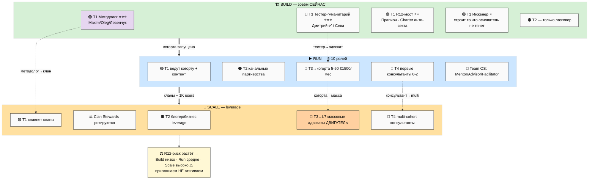
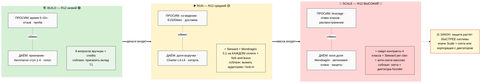
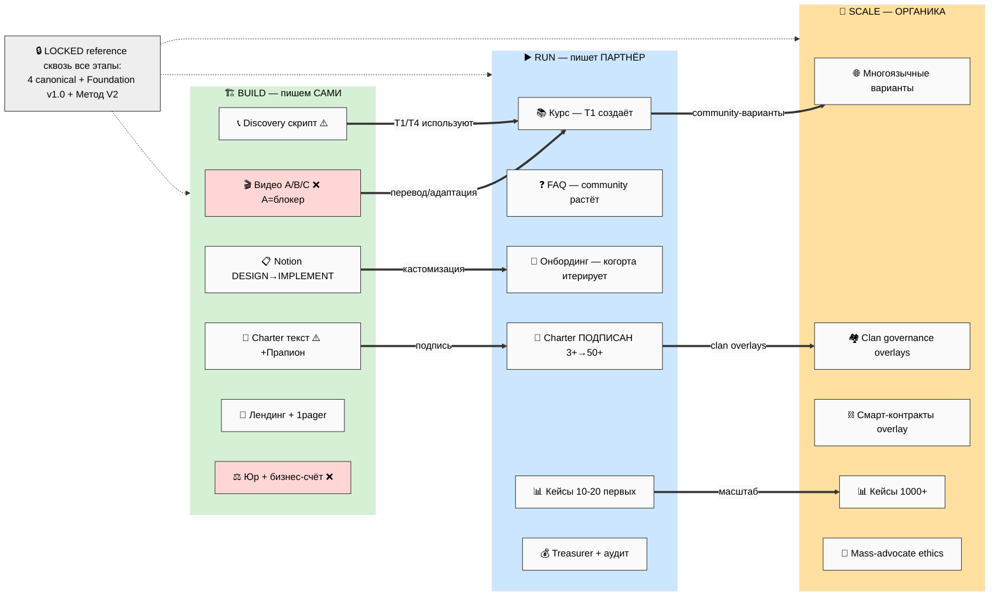

# 🎨 Пять схем PL-1..PL-5 (понятные с одного взгляда)

> Все схемы — светлый фон, чёрный текст, inline-ready для лендинга / звонков / шаринга.
> Каждая встроена в main-документ; здесь — единый каталог.

---

## PL-1 — Три этапа: прогресс Build → Run → Scale (входы/выходы + ловушки)

**Что показывает:** три режима с критериями входа/выхода и анти-паттернами каждого этапа.
Маркер этапа = «кто крутит маховик».

```mermaid
%%{init: {'theme':'base', 'themeVariables': {'primaryTextColor':'#000000','textColor':'#000000','lineColor':'#333333','primaryBorderColor':'#333333','primaryColor':'#fafafa','noteTextColor':'#000000','noteBkgColor':'#fff8d5'}}}%%
graph LR
    subgraph BUILD[🏗️ BUILD — строим руками]
        B_in[ВХОД ✅<br/>Foundation LOCKED<br/>4 canonical · Метод V2]
        B_work[основатель solo<br/>видео A/B/C · 5 шаблонов<br/>1-на-1 пробы]
        B_out[ВЫХОД<br/>видео готовы · Notion внедрён<br/>1-2 T1 + 3-5 T3<br/>Charter draft · юр + счёт]
        B_in --> B_work --> B_out
    end
    subgraph RUN[▶️ RUN — работает как цикл]
        R_in[ВХОД<br/>+ когорта 5+<br/>+ Charter 3+ подписей<br/>+ первый доход]
        R_work[петля обратной связи<br/>когорта 5-50 · €1.5-15K/мес<br/>T1/T2 со-создают · partner-led]
        R_out[ВЫХОД<br/>1K+ users · 3+ когорт<br/>€10K/мес+ · 100+ кейсов<br/>1-й клан + T4]
        R_in --> R_work --> R_out
    end
    subgraph SCALE[📡 SCALE — растит сама себя]
        S_in[ВХОД<br/>+ кооператив legal<br/>+ Charter 50+ · кланы]
        S_work[N кланов parallel<br/>блогер/бизнес leverage<br/>Mondragón 5:1<br/>основатель = 1 из многих]
        S_out[→ массовая платформа<br/>100K+ users · само-управление<br/>рекурсивный спавн]
        S_in --> S_work --> S_out
    end
    B_out ==>|≥80% выходов| R_in
    R_out ==>|1K + 3 когорты + €10K| S_in
    B_work -.анти: накопление substrate.-> TRAP1[🚫]
    R_work -.анти: founder bottleneck.-> TRAP2[🚫]
    S_work -.анти: founder держит контроль.-> TRAP3[🚫]
    style BUILD fill:#d6f0d6,color:#000
    style RUN fill:#cce6ff,color:#000
    style SCALE fill:#ffe0a0,color:#000
    style TRAP1 fill:#ffcccc,color:#000
    style TRAP2 fill:#ffcccc,color:#000
    style TRAP3 fill:#ffcccc,color:#000
```

---

## PL-2 — Карта акторов по этапам (кого зовём где)

**Что показывает:** какие типы партнёров активны на каком этапе + переходы (тестер→адвокат,
методолог→клан). R12-риск растёт слева направо.

---

## PL-3 — Матрица обмена (даём × просим) с градиентом R12-риска

**Что показывает:** что просим и что даём на каждом этапе + защита + соблазн. Цвет = R12-риск
🟢→🟡→🔴.

---

## PL-4 — Жизненный цикл документов по этапам

**Что показывает:** как документы «перетекают» — мы пишем (Build) → партнёр (Run) → органика
(Scale). LOCKED-документы = reference сквозь все этапы.

---

## PL-5 — Таймлайн Точка А → B → C → D с зумами

**Что показывает:** где мы сейчас (А = факты) и куда идём (B/C/D = направление, не обещание),
наложено на Build/Run/Scale.

```mermaid
%%{init: {'theme':'base', 'themeVariables': {'primaryTextColor':'#000000','textColor':'#000000','lineColor':'#333333','primaryBorderColor':'#333333','primaryColor':'#fafafa','noteTextColor':'#000000','noteBkgColor':'#fff8d5'}}}%%
graph LR
    A[📍 ТОЧКА А · 25.05.2026<br/>🏗️ Build ранне-средний<br/>✅ substrate готов<br/>4 LOCKED + Foundation<br/>180 CRM + 17 агентов<br/>❌ видео/Notion/Wave1 нет<br/>основатель = маховик]
    B[📍 ТОЧКА B · ~15-22.06<br/>🏗️ Build exit готов<br/>видео A/B/C вышли<br/>Notion 5 баз внедрены<br/>Charter + Прапион<br/>Wave 1 · 1-2 T1 + 3-5 T3]
    C[📍 ТОЧКА C · ~авг-ноя 2026<br/>▶️ RUN stable<br/>когорта 5-15 ступ.5+<br/>€5-15K/мес проекция<br/>2-3 T1 · 5-10 кейсов<br/>founder 50/50 guidance]
    D[📍 ТОЧКА D · ~2027-2028<br/>📡 early SCALE<br/>100-1000 users<br/>5+ когорт · 2-5 кланов<br/>кооператив legal · Charter 50+<br/>founder = 1 из многих]
    A ==>|2-4 недели · ≥80% Build| B
    B ==>|когорта 5+ · Charter 3+| C
    C ==>|3+ когорт · €10K · 1-й клан + T4| D
    D -.->|1K+ · 10+ кланов · рекурсивный спавн| E[🌐 массовая платформа]
    A -.факты F8/R-high.-> NOTE1[А = факты]
    D -.проекция F2/R-low.-> NOTE2[C/D = направление<br/>НЕ обещание]
    style A fill:#d6f0d6,color:#000
    style B fill:#b3e0b3,color:#000
    style C fill:#cce6ff,color:#000
    style D fill:#ffe0a0,color:#000
    style E fill:#eeeeee,color:#000,stroke-dasharray: 5 5
    style NOTE1 fill:#e8f5e8,color:#000
    style NOTE2 fill:#fff8d5,color:#000
```

---

*Все схемы светлый фон / чёрный текст / inline-ready. Каталог — `diagrams/_INDEX.md`.*
