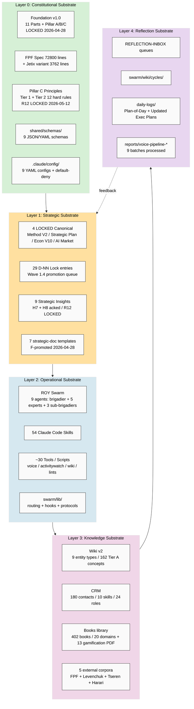

# D2 — Substrate Stack Architecture

```mermaid
%%{init: {'theme':'base','themeVariables':{'primaryTextColor':'#000','textColor':'#000','lineColor':'#333','primaryBorderColor':'#333','primaryColor':'#fafafa'}}}%%
flowchart TB
    subgraph L0[Layer 0: Constitutional Substrate]
        FOUND[Foundation v1.0<br/>11 Parts + Pillar A/B/C<br/>LOCKED 2026-04-28]
        FPF[FPF Spec 72800 lines<br/>+ Jetix variant 3762 lines]
        PRIN[Pillar C Principles<br/>Tier 1 + Tier 2 12 hard rules<br/>R12 LOCKED 2026-05-12]
        SCHEMA[shared/schemas/<br/>9 JSON/YAML schemas]
        CONFIG[.claude/config/<br/>9 YAML configs + default-deny]
    end

    subgraph L1[Layer 1: Strategic Substrate]
        LOCKED4[4 LOCKED Canonical<br/>Method V2 / Strategic Plan / Econ V10 / AI Market]
        LOCKS29[29 D-NN Lock entries<br/>Wave 1.4 promotion queue]
        INSIGHTS[9 Strategic Insights<br/>H7 + H8 acked / R12 LOCKED]
        TEMPLATES[7 strategic-doc templates<br/>F-promoted 2026-04-28]
    end

    subgraph L2[Layer 2: Operational Substrate]
        ROY[ROY Swarm<br/>9 agents: brigadier + 5 experts + 3 sub-brigadiers]
        SKILLS[54 Claude Code Skills]
        TOOLS[~30 Tools / Scripts<br/>voice / activitywatch / wiki / lints]
        LIB[swarm/lib/<br/>routing + hooks + protocols]
    end

    subgraph L3[Layer 3: Knowledge Substrate]
        WIKI[Wiki v2<br/>9 entity types / 162 Tier A concepts]
        CRM[CRM<br/>180 contacts / 10 skills / 24 roles]
        BOOKS[Books library<br/>402 books / 20 domains + 13 gamification PDF]
        EXTERNAL[5 external corpora<br/>FPF + Levenchuk + Tseren + Harari]
    end

    subgraph L4[Layer 4: Reflection Substrate]
        REFLECT[REFLECTION-INBOX queues]
        CYCLES[swarm/wiki/cycles/]
        DAILY[daily-logs/<br/>Plan-of-Day + Updated Exec Plans]
        VOICE[reports/voice-pipeline-*<br/>9 batches processed]
    end

    L0 --> L1
    L1 --> L2
    L2 --> L3
    L3 --> L4
    L4 -.feedback.-> L1

    style L0 fill:#d6f0d6
    style L1 fill:#ffe0a0
    style L2 fill:#d6e8f0
    style L3 fill:#f0d6e8
    style L4 fill:#e8d6f0
```

---

*D2 2026-05-23. Source: Bucket 1, 3, 4, 7.*
