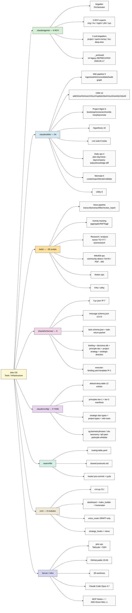

# D3 — Tools Inventory Tree (9 agents + 54 skills + ~30 scripts + 9 schemas)

```mermaid
%%{init: {'theme':'base','themeVariables':{'primaryTextColor':'#000','textColor':'#000','lineColor':'#333','primaryBorderColor':'#333','primaryColor':'#fafafa'}}}%%
flowchart LR
    ROOT[Jetix OS<br/>Tools / Infrastructure]

    ROOT --> AGENTS[".claude/agents/ — 9 ROY"]
    AGENTS --> A1[brigadier<br/>Orchestrator]
    AGENTS --> A2[5 ROY experts<br/>eng / inv / mgmt / phil / sys]
    AGENTS --> A3[3 sub-brigadiers<br/>project / quick-money / lev-deep-dive]
    AGENTS --> A4[_archived/<br/>14 legacy DEPRECATED-2026-05-17]

    ROOT --> SKILLS[".claude/skills/ — 54"]
    SKILLS --> S1[Wiki pipeline 5<br/>ingest/ask/lint/consolidate/build-graph]
    SKILLS --> S2[CRM 10<br/>add/show/list/search/touch/update/dash/stuck/weekly/rebuild]
    SKILLS --> S3[Project Mgmt 5<br/>bootstrap/review/archive/de-morph/promote]
    SKILLS --> S4[Hypothesis 10]
    SKILLS --> S5[Lint suite 8 stubs]
    SKILLS --> S6[Daily ops 4<br/>plan-day/close-day/company-status/knowledge-diff]
    SKILLS --> S7[Mermaid 4<br/>create/export/iterate/validate]
    SKILLS --> S8[Utility 8]

    ROOT --> TOOLS["tools/ — ~30 scripts"]
    TOOLS --> T1[Voice pipeline<br/>transcribe/extract/filter/review_report]
    TOOLS --> T2[Activity tracking<br/>aggregate/AW/Toggl]
    TOOLS --> T3[Research / analysis<br/>tseren TG+YT / autoresearch]
    TOOLS --> T4[Wiki/KB ops<br/>community-detect / lint-fm / PDF→MD]
    TOOLS --> T5[Notion ops]
    TOOLS --> T6[Infra / utility]

    ROOT --> SCHEMAS["shared/schemas/ — 9"]
    SCHEMAS --> SC1[f-g-r.json IP-7]
    SCHEMAS --> SC2[message.schema.json v2.0.0]
    SCHEMAS --> SC3[task.schema.json + task-return-packet]
    SCHEMAS --> SC4[briefing + decisions-db + principle-doc + project-strategy + strategic-direction]
    SCHEMAS --> SC5[executor-binding.yaml.template IP-1]

    ROOT --> CONFIGS[".claude/config/ — 9 YAML"]
    CONFIGS --> CF1[default-deny-table 12 entries]
    CONFIGS --> CF2[principles-tier-1 + tier-2 manifests]
    CONFIGS --> CF3[strategic-doc-types + project-types + wiki-roots]
    CONFIGS --> CF4[sg-banned-phrases / sla-taxonomy / ip5-past-participle-whitelist]

    ROOT --> LIB["swarm/lib/"]
    LIB --> LB1[routing-table.yaml]
    LIB --> LB2[shared-protocols.md]
    LIB --> LB3[hooks/ pre-commit + cycle]

    ROOT --> CRM["crm/ — 8 modules"]
    CRM --> CR1[crm.py CLI]
    CRM --> CR2[dashboard + index_builder + frontmatter]
    CRM --> CR3[voice_router DRAFT-only]
    CRM --> CR4[strategy_hooks + views]

    ROOT --> SERVER["Server / Infra"]
    SERVER --> SV1[jetix-vps<br/>Tailscale + SSH]
    SERVER --> SV2[GitHub public 23.05]
    SERVER --> SV3[28 worktrees]
    SERVER --> SV4[Claude Code Opus 4.7]
    SERVER --> SV5[MCP Notion ✓ / IWE+Drive+Miro ⚠️]

    style ROOT fill:#fff8d5
    style AGENTS fill:#d6f0d6
    style SKILLS fill:#d6e8f0
    style TOOLS fill:#ffe0a0
    style SCHEMAS fill:#f0d6e8
    style CONFIGS fill:#e8d6f0
    style LIB fill:#d6f0e8
    style CRM fill:#f0e8d6
    style SERVER fill:#d6d6f0
```

---

*D3 2026-05-23. Source: Bucket 3.*
