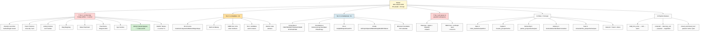

# D4 — Contacts Network Graph

```mermaid
%%{init: {'theme':'base','themeVariables':{'primaryTextColor':'#000','textColor':'#000','lineColor':'#333','primaryBorderColor':'#333','primaryColor':'#fafafa'}}}%%
graph TD
    R[Ruslan<br/>180 contacts CRM<br/>151 people + 29 orgs]

    R --> T1L["⭐ Tier 1: L1 First Clan<br/>9 deep profiles + 1 anchor"]
    R --> T2L["Tier 2: L2 Amplifiers ~35"]
    R --> T3L["Tier 3: L3 Institutional ~51"]
    R --> T1A["⭐ Tier-1 ack queue 14<br/>(parallel namespace)"]

    T1L --> L1a[Anatoliy Levenchuk<br/>methodologist mentor]
    T1L --> L1b[Tseren Tserenov<br/>close ally / tech]
    T1L --> L1c[Andrey Fedorev<br/>tech founder]
    T1L --> L1d[Oleg Braginsky]
    T1L --> L1e[Oskar Khartmann]
    T1L --> L1f[Pavel Durov<br/>Telegram CEO]
    T1L --> L1g[Egor Girenko]
    T1L --> L1h[Dmitriy Гуманитарщина<br/>✅ созвон 22.05]
    T1L --> L1i[Vladimir Tarasov<br/>+1 anchor T1]

    T2L --> T2a[RU AI scene<br/>Kotenkov/Lukyanenko/Markov/Megorskaya]
    T2L --> T2b[Berlin AI Meetup]
    T2L --> T2c[МИМ inner circle<br/>shsm members]
    T2L --> T2d[Tier-1 candidates<br/>warm contacts]
    T2L --> T2e[Mentors outer<br/>advisors]

    T3L --> T3a[Universities 8<br/>HSE/ITMO/MIPT/Skoltech/SHAD<br/>ETH/TUB/TUM]
    T3L --> T3b[Foundations 4<br/>FLI/Linux/Long Now/Open Philanthropy]
    T3L --> T3c[VCs 4<br/>EarlyBird/Speedinvest/YC]
    T3L --> T3d[AI labs<br/>Anthropic/OpenAI/Mistral/DeepMind/HF/SberAI]
    T3L --> T3e[Ethereum Foundation<br/>R12 substrate]

    T1A --> A1[Левенчук + Цэрэн + Karpathy<br/>+ Buterin]
    T1A --> A2[МИМ inner + Anthropic team<br/>+ RU AI 5+]

    R --> ROLES["24 Roles × 6 Groups"]
    ROLES --> RG1[Sales 4: client_lead/active/past/lost]
    ROLES --> RG2[Capital 2: investor_prospect/active]
    ROLES --> RG3[Partnership 3: partner_prospect/active/past]
    ROLES --> RG4[Advisory 4: mentor/advisor/facilitator/consultant]
    ROLES --> RG5[Team 4: cofounder/hire_prospect/active/past]
    ROLES --> RG6[Network 7: friend + others]

    R --> PIPELINE["13 Pipeline Statuses"]
    PIPELINE --> PS1[draft_from_voice → cold → warm]
    PIPELINE --> PS2[contacted → discovery_call → proposal → negotiation]
    PIPELINE --> PS3[closed_won/closed_lost / paused / active / past]

    style R fill:#fff8d5
    style T1L fill:#ffd6d6
    style T1A fill:#ffd6d6
    style L1h fill:#d6f0d6
    style T2L fill:#ffe0a0
    style T3L fill:#d6e8f0
```

---

*D4 2026-05-23. Source: Bucket 5.*
