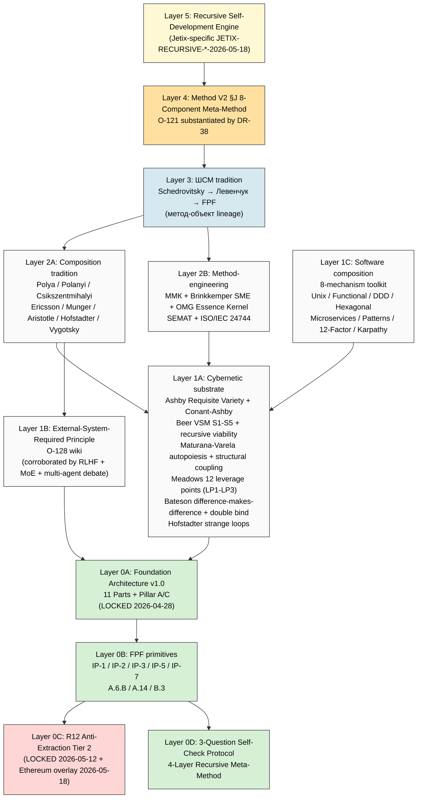

# D7 — Methods Stack

**~15 frameworks stack** per Bucket 7 §14: FPF / Method V2 §J / ШСМ / 5 cybernetic / 4 composition / method-engineering / O-128 / Frankenstein / 3Q + 4-layer / Recursive Engine / F-G-R / R12 / Hub-and-spoke / Append-only.

---

*D7 2026-05-23. Source: Bucket 7.*
