# D8 — Fast-Access People Resource Map

```mermaid
%%{init: {'theme':'base','themeVariables':{'primaryTextColor':'#000','textColor':'#000','lineColor':'#333','primaryBorderColor':'#333','primaryColor':'#fafafa'}}}%%
graph TD
    R[Ruslan]

    R --> T1[T1 Immediate ≤2h<br/>Family / partner / close]
    R --> T2[T2 Same-day ≤24h<br/>L1 inner / close prof]
    R --> T3[T3 Within-48h ≤48h<br/>L1 First Clan extended / mentors]
    R --> T4[T4 Within-week ≤7d<br/>Tier-1 outreach / warm contacts]
    R --> T5[T5 Public ≤variable<br/>L2-L3 / institutional]

    T2 --> P_TSER[Tseren<br/>tech co-creator / engineering]
    T2 --> P_DMIT[Дмитрий<br/>✅ созвон 22.05 / humanities-bridge]
    T2 --> P_ANTON[Anton mentor<br/>200h baseline / direction-of-life]

    T3 --> P_LEV[Anatoliy Levenchuk<br/>FPF author / ШСМ]
    T3 --> P_FED[Andrey Fedorev<br/>tech founder]
    T3 --> P_HART[Oskar Khartmann<br/>L1 cohort]
    T3 --> P_BRAG[Oleg Braginsky<br/>L1 cohort]
    T3 --> P_GIR[Egor Girenko<br/>L1 cohort]
    T3 --> P_TAR[Vladimir Tarasov<br/>+1 anchor T1]

    T4 --> P_KARP[Karpathy<br/>AI substrate cohort]
    T4 --> P_BUT[Buterin<br/>Ethereum + R12]
    T4 --> P_DUR[Pavel Durov<br/>Telegram platform]
    T4 --> P_RUAI[RU AI scene<br/>Kotenkov+Lukyanenko+Markov+Megorskaya]

    T5 --> P_ANT[Anthropic team<br/>HHH/CAI alignment]
    T5 --> P_MIM[МИМ inner / ШСМ]
    T5 --> P_TANG[Audrey Tang]
    T5 --> P_WEYL[Glen Weyl]

    R --> CHANNELS[Telegram channels<br/>owned/managed]
    CHANNELS --> CH1[Personal channel #1]
    CHANNELS --> CH2[Project channel #2]
    CHANNELS --> CH3[Community channel #3]

    P_DMIT --> RES_HUMA[YouTube humanities<br/>RU audience]
    P_TSER --> RES_TECH[Tech engineering<br/>+ RU AI network]
    P_ANTON --> RES_MENTOR[Mentor counsel<br/>strategic life direction]
    P_LEV --> RES_METH[Methodology validation<br/>+ МИМ access]
    P_KARP --> RES_AI[AI substrate credibility<br/>cohort attraction]
    P_BUT --> RES_ETH[Ethereum + R12 substrate]
    P_DUR --> RES_TG[Telegram platform global]

    style R fill:#fff8d5
    style T2 fill:#d6f0d6
    style P_DMIT fill:#d6f0d6
    style P_TSER fill:#d6f0d6
    style P_ANTON fill:#d6f0d6
    style T3 fill:#ffe0a0
    style T4 fill:#d6e8f0
    style T5 fill:#f0d6e8
    style CHANNELS fill:#f0e8d6
```

**Activation order Wave 1** (per Bucket 8 §10): Tseren → Дмитрий → Anton → Левенчук → Tarasov → Fedorev/Хартман/Braginsky/Гиренко/Дуров → Karpathy → Buterin → МИМ/Anthropic/RU AI.

---

*D8 2026-05-23. Source: Bucket 8.*
