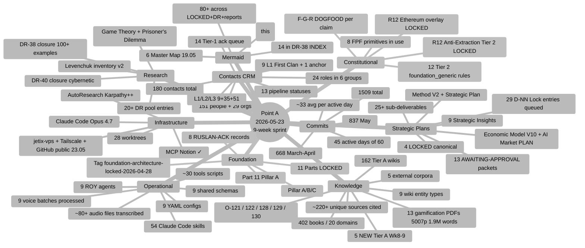

# D9 — Sprint Quantitative Dashboard

```mermaid
%%{init: {'theme':'base','themeVariables':{'primaryTextColor':'#000','textColor':'#000','lineColor':'#333','primaryBorderColor':'#333','primaryColor':'#fafafa'}}}%%
mindmap
  root((Point A<br/>2026-05-23<br/>9-week sprint))
    Commits
      1509 total
      668 March-April
      837 May
      ~33 avg per active day
      45 active days of 60
    Foundation
      11 Parts LOCKED
      Part 11 Pillar A
      Pillar A/B/C
      8 RUSLAN-ACK records
      Tag foundation-architecture-locked-2026-04-28
    Strategic Plans
      4 LOCKED canonical
      Method V2 + Strategic Plan
      Economic Model V10 + AI Market PLAN
      25+ sub-deliverables
      29 D-NN Lock entries queued
      9 Strategic Insights
      13 AWAITING-APPROVAL packets
    Knowledge
      162 Tier A wikis
      5 NEW Tier A Wk8-9
      O-121 / 122 / 128 / 129 / 130
      9 wiki entity types
      402 books / 20 domains
      13 gamification PDFs 5007p 1.9M words
      5 external corpora
      ~220+ unique sources cited
    Contacts CRM
      180 contacts total
      151 people + 29 orgs
      9 L1 First Clan + 1 anchor
      14 Tier-1 ack queue
      L1/L2/L3 9+35+51
      24 roles in 6 groups
      13 pipeline statuses
    Operational
      9 ROY agents
      54 Claude Code skills
      ~30 tools scripts
      9 shared schemas
      9 YAML configs
      9 voice batches processed
      ~80+ audio files transcribed
    Research
      DR-38 closure 100+ examples
      DR-40 closure cybernetic
      20+ DR pool entries
      Game Theory + Prisoner's Dilemma
      Levenchuk inventory v2
    Constitutional
      R12 Anti-Extraction Tier 2 LOCKED
      R12 Ethereum overlay LOCKED
      12 Tier 2 foundation_generic rules
      8 FPF primitives in use
      F-G-R DOGFOOD per claim
    Mermaid
      80+ across LOCKED+DR+reports
      14 in DR-38 INDEX
      6 Master Map 19.05
      12 in Point A (this)
    Infrastructure
      jetix-vps + Tailscale + GitHub public 23.05
      28 worktrees
      Claude Code Opus 4.7
      MCP Notion ✓
      AutoResearch Karpathy++
```

---

*D9 2026-05-23. Source: Buckets 1-8 quantitative aggregates.*
