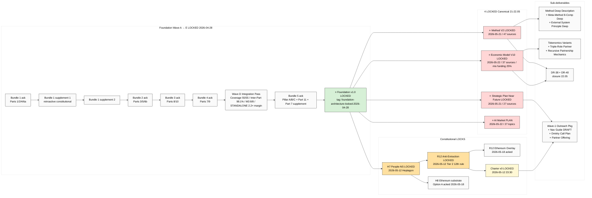

# D10 — LOCKED Canonical Chain

```mermaid
%%{init: {'theme':'base','themeVariables':{'primaryTextColor':'#000','textColor':'#000','lineColor':'#333','primaryBorderColor':'#333','primaryColor':'#fafafa'}}}%%
flowchart LR
    subgraph FOUND[Foundation Wave A → E LOCKED 2026-04-28]
        B1["Bundle 1 ack<br/>Parts 1/2/4/6a"]
        B1S1["Bundle 1 supplement 1<br/>retroactive constitutional"]
        B1S2["Bundle 1 supplement 2"]
        B2["Bundle 2 ack<br/>Parts 3/5/6b"]
        B3["Bundle 3 ack<br/>Parts 8/10"]
        B4["Bundle 4 ack<br/>Parts 7/9"]
        WAVED["Wave D Integration Pass<br/>Coverage 55/55 / Inter-Part 98.1% / M3 8/8 / STANDALONE 2.2× margin"]
        B5["Bundle 5 ack<br/>Pillar A/B/C + Part 11 + Part 7 supplement"]
        F1["⭐ Foundation v1.0 LOCKED<br/>tag: foundation-architecture-locked-2026-04-28"]
    end

    subgraph CONST[Constitutional LOCKS]
        R12L["R12 Anti-Extraction LOCKED<br/>2026-05-12 Tier 2 12th rule"]
        R12E["R12 Ethereum Overlay<br/>2026-05-18 acked"]
        H7L["H7 People-NS LOCKED<br/>2026-05-12 Heptagon"]
        H8L["H8 Ethereum substrate<br/>Option A acked 2026-05-18"]
        CHARTERL["Charter v0 LOCKED<br/>2026-05-12 23:30"]
    end

    subgraph SPRINT[4 LOCKED Canonical 21-22.05]
        METHV2L["⭐ Method V2 LOCKED<br/>2026-05-21 / 47 sources"]
        SPL["⭐ Strategic Plan Near Future LOCKED<br/>2026-05-21 / 27 sources"]
        EML["⭐ Economic Model V10 LOCKED<br/>2026-05-22 / 37 sources / mix funding 25%"]
        AIML["⭐ AI Market PLAN<br/>2026-05-22 / 27 topics"]
    end

    subgraph SUB[Sub-deliverables]
        METHV2D["Method Deep Description<br/>+ Meta-Method 8-Comp Deep<br/>+ External System Principle Deep"]
        EMD["Tokenomics Variants<br/>+ Triple-Role Partner<br/>+ Recursive Partnership Mechanics"]
        DRS["DR-38 + DR-40<br/>closure 22.05"]
        OUTREACH["Wave-1 Outreach Pkg<br/>+ Nav Guide DRAFT<br/>+ Dmitriy Call Plan<br/>+ Partner Offering"]
    end

    B1 --> B1S1
    B1S1 --> B1S2
    B1S2 --> B2
    B2 --> B3
    B3 --> B4
    B4 --> WAVED
    WAVED --> B5
    B5 --> F1

    F1 --> H7L
    H7L --> R12L
    R12L --> CHARTERL
    R12L --> R12E
    H7L --> H8L

    F1 --> METHV2L
    F1 --> SPL
    F1 --> EML
    F1 --> AIML

    METHV2L --> METHV2D
    EML --> EMD
    METHV2L --> DRS
    EML --> DRS
    SPL --> OUTREACH
    CHARTERL --> OUTREACH

    style F1 fill:#d6f0d6
    style METHV2L fill:#ffd6d6
    style SPL fill:#ffd6d6
    style EML fill:#ffd6d6
    style AIML fill:#ffd6d6
    style R12L fill:#ffe0a0
    style CHARTERL fill:#fff8d5
    style H7L fill:#ffe0a0
```

---

*D10 2026-05-23. Source: Bucket 4.*
