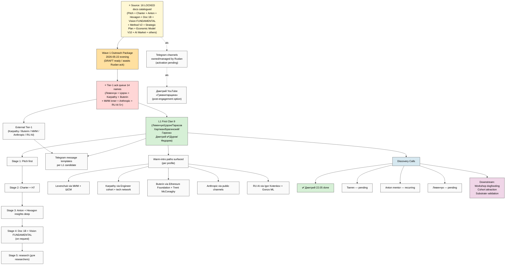

# D11 — Distribution Funnel

```mermaid
%%{init: {'theme':'base','themeVariables':{'primaryTextColor':'#000','textColor':'#000','lineColor':'#333','primaryBorderColor':'#333','primaryColor':'#fafafa'}}}%%
flowchart TB
    SOURCE["⭐ Source: 16 LOCKED docs catalogued<br/>(Pitch + Charter + Anton + Hexagon + Doc 1B + Vision FUNDAMENTAL<br/>+ Method V2 + Strategic Plan + Economic Model V10 + AI Market + others)"]

    WAVE1["Wave 1 Outreach Package<br/>2026-05-22 evening<br/>(DRAFT ready / awaits Ruslan ack)"]

    T1["⭐ Tier-1 ack queue 14 names<br/>(Левенчук + Цэрэн + Karpathy + Buterin<br/>+ МИМ inner + Anthropic + RU AI 5+)"]

    SOURCE --> WAVE1
    WAVE1 --> T1

    T1 --> L1["L1 First Clan 9<br/>(Левенчук/Цэрэн/Тарасов<br/>Хартман/Брагинский/Гиренко<br/>Дмитрий ✅/Дуров/Федорев)"]

    T1 --> EXT["External Tier-1<br/>(Karpathy / Buterin / МИМ / Anthropic / RU AI)"]

    L1 --> STAGE1["Stage 1: Pitch first"]
    STAGE1 --> STAGE2["Stage 2: Charter + H7"]
    STAGE2 --> STAGE3["Stage 3: Anton + Hexagon insights deep"]
    STAGE3 --> STAGE4["Stage 4: Doc 1B + Vision FUNDAMENTAL<br/>(on request)"]
    STAGE4 --> STAGE5["Stage 5: research (для researchers)"]

    L1 --> TG_TEMPL["Telegram message templates<br/>per L1 candidate"]
    EXT --> TG_TEMPL

    L1 --> WARM["Warm-intro paths surfaced<br/>(per profile)"]
    WARM --> LEV_МИМ["Levenchuk via МИМ + ШСМ"]
    WARM --> KARP_ENG["Karpathy via Engineer cohort + tech network"]
    WARM --> BUT_ETH["Buterin via Ethereum Foundation + Trent McConaghy"]
    WARM --> ANT_PUB["Anthropic via public channels"]
    WARM --> RU_GONZO["RU AI via Igor Kotenkov + Gonzo ML"]

    L1 --> DC["Discovery Calls"]
    DC --> DMIT_DONE["✅ Дмитрий 22.05 done"]
    DC --> TSER_PEND["Tseren — pending"]
    DC --> ANT_PEND["Anton mentor — recurring"]
    DC --> LEV_PEND["Левенчук — pending"]

    DC --> DOWN["Downstream:<br/>Workshop dogfooding<br/>Cohort attraction<br/>Substrate validation"]

    SOURCE -.also.-> CHANNELS["Telegram channels<br/>owned/managed by Ruslan<br/>(activation pending)"]
    CHANNELS -.also.-> DMIT_YT["Дмитрий YouTube<br/>«Гуманитарщина»<br/>(post-engagement option)"]

    style SOURCE fill:#fff8d5
    style WAVE1 fill:#ffe0a0
    style T1 fill:#ffd6d6
    style L1 fill:#d6f0d6
    style DMIT_DONE fill:#d6f0d6
    style DC fill:#d6e8f0
    style DOWN fill:#f0d6e8
```

---

*D11 2026-05-23. Source: Bucket 5 + Bucket 8.*
