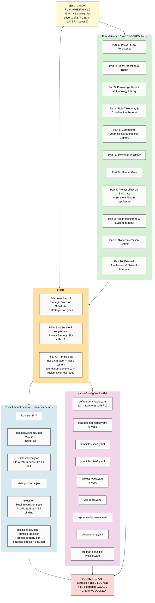

# D12 — Foundation v1.0 + Pillar A/B/C Architecture

```mermaid
%%{init: {'theme':'base','themeVariables':{'primaryTextColor':'#000','textColor':'#000','lineColor':'#333','primaryBorderColor':'#333','primaryColor':'#fafafa'}}}%%
flowchart TB
    FUND["JETIX VISION FUNDAMENTAL v1.0<br/>35 UC × 12 categories<br/>Layer 1 of 2 (RUSLAN-LAYER = Layer 2)"]

    subgraph CORE[Foundation v1.0 — 10 LOCKED Parts]
        P1[Part 1: System State Persistence]
        P2[Part 2: Signal Ingestion & Triage]
        P3[Part 3: Knowledge Base & Methodology Library]
        P4[Part 4: Role Taxonomy & Coordination Protocol]
        P5[Part 5: Compound Learning & Methodology Capture]
        P6A[Part 6a: Provenance Officer]
        P6B[Part 6b: Human Gate]
        P7[Part 7: Project Lifecycle Substrate<br/>+ Bundle 5 Pillar B supplement]
        P8[Part 8: Health Monitoring & System Integrity]
        P9[Part 9: Owner Interaction Scaffold]
        P10[Part 10: External Touchpoints & Network Interface]
    end

    subgraph PILLAR[Pillars]
        PA[Pillar A — Part 11<br/>Strategic Direction Substrate<br/>6 strategic-doc types]
        PB[Pillar B — Bundle 5 supplement<br/>Project Strategy Slot<br/>в Part 7]
        PC[Pillar C — principles/<br/>Tier 1 manager + Tier 2 system<br/>foundation_generic 12 + ruslan_layer_overrides]
    end

    subgraph SCHEMAS[Constitutional Schemas shared/schemas/]
        SC_FGR[f-g-r.json IP-7]
        SC_MSG[message.schema.json v2.0.0<br/>+ acting_as]
        SC_TASK[task.schema.json<br/>+ task-return-packet Part 4 §I.1]
        SC_BRIEF[briefing.schema.json]
        SC_EXEC[executor-binding.yaml.template<br/>IP-1 RUSLAN-LAYER binding]
        SC_DECS[decisions-db.json + principle-doc.json<br/>+ project-strategy.json + strategic-direction-doc.json]
    end

    subgraph CONFIG[.claude/config/ — 9 YAML]
        DD[default-deny-table.yaml<br/>11 → 12 entries with R12]
        SDT[strategic-doc-types.yaml<br/>6 types]
        P_T1[principles-tier-1.yaml]
        P_T2[principles-tier-2.yaml]
        PT[project-types.yaml<br/>4 types]
        WR[wiki-roots.yaml]
        SG[sg-banned-phrases.yaml]
        SLA[sla-taxonomy.yaml]
        IP5W[ip5-past-participle-whitelist.yaml]
    end

    LOCKS["LOCKS: R12 Anti-Extraction Tier 2 LOCKED<br/>+ H7 Heptagon LOCKED<br/>+ Charter v0 LOCKED"]

    FUND --> CORE
    FUND --> PILLAR
    CORE --> PILLAR
    PILLAR --> SCHEMAS
    PILLAR --> CONFIG
    SCHEMAS --> LOCKS
    CONFIG --> LOCKS
    CORE --> LOCKS

    style FUND fill:#fff8d5
    style CORE fill:#d6f0d6
    style PILLAR fill:#ffe0a0
    style SCHEMAS fill:#d6e8f0
    style CONFIG fill:#f0d6e8
    style LOCKS fill:#ffd6d6
```

---

*D12 2026-05-23. Source: Bucket 2, 4.*
