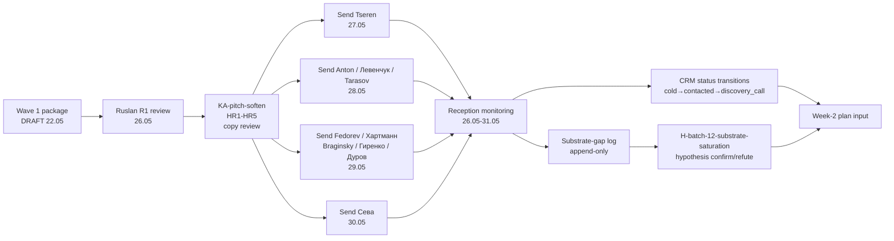

# Точка Б — 1-неделя horizon (24-30.05.2026)

## §0 Контекст (Точка А baseline)

Точка А (фиксация 23.05.2026 evening — `decisions/strategic/POINT-A-CURRENT-STATE-2026-05-23.md`):
- 1509 commits / 60 дней / Foundation v1.0 LOCKED + 4 LOCKED canonical
- Substrate готова для Wave 1 outreach (DRAFT ack pending)
- ROY swarm 9 agents + 54 skills + 30 tools scripts + 9 schemas + 9 configs operational
- 180 CRM + 9 L1 First Clan + Дмитрий созвон 22.05 ✅ done

**Точка Б 1-неделя цель:** trigger promotion-mode operationally (per [[development-promotion-mode-transition]] O-160 fixation); execute Wave 1 outreach к L1 First Clan + deliver first-cohort MVP (Дмитрий via Notion); ground actual feedback loop.

[src: `decisions/strategic/POINT-A-CURRENT-STATE-2026-05-23.md` §0 TL;DR + §19 Final Status; `wiki/concepts/development-promotion-mode-transition.md` §3.1 Activity rebalance]

## §1 Цель недели в одну фразу

**От «substrate готова» к «substrate + Wave 1 контакт + первая cohort feedback».** Конкретно: Notion-MVP для Дмитрия живой, ≥5 L1 First Clan contacted (Tseren / Дмитрий / Anton mentor + 2 из 6 остальных), Wave 1 outreach package либо отправлен либо decision-locked Ruslan-ом, voice-pipeline integration не блокирует.

## §2 Day-by-day (7 дней)

### Понедельник 26.05 — Promotion-mode operational start

**Утро (4-5h):**
- Ruslan R1 prose pass (если выбран ack) — direction-card update «promotion-mode focus» OR §APPEND Strategic Reflection note (per O-160 D12-1 ack option b/c/d)
- Plan-of-Day Шаг 6 CRM cleanup — `/crm-stuck` запуск; surfacing stuck contacts (>14d no touch); cleanup воркфлоу
- `/crm-add` Сева DRAFT-only entry (per CLAUDE.md §4.2 invariant); update Дмитрий §11 next-touch note

**Дневная сессия (3-4h):**
- Wave 1 outreach package review pass (Ruslan-only R1 — `decisions/strategic/WAVE-1-OUTREACH-PACKAGE-2026-05-22-evening.md`)
- KA-pitch-soften pass per D12-3 concern (HR-1 «голод», HR-2 «верх», HR-3 «школьники», HR-4 «мега-популярные», HR-5 anti-target transparency) — per [[cohort-target-profile-ontology]] §6.2
- Pre-outreach copy review (R12 paired-frame mandatory): voluntary opt-in + fork-and-leave + wage-ratio-cap + non-consensual-distribution + fork-prevention-attempt clauses

**Вечер (1-2h):**
- voice-pipeline daily run (transcribe + extract + filter + review_report) → если new voice memos → batch-13 prep
- git commit + push end-of-day

**Метрика дня:** ≥1 R1 prose decision-locked (O-160 follow-through) + Wave 1 copy R12-reviewed + CRM состояние clean

### Вторник 27.05 — Notion-MVP Дмитрий live

**Утро (4-5h):**
- Notion-шаблон для Дмитрия build (per [[notion-mvp-bypass-pattern]] §4 components):
  1. Title + one-liner «метод по объединению методов по улучшению системы самой себя»
  2. 3 visual layers (what / why / how)
  3. Concrete next-step checklist
  4. Resources (books / podcasts / sample recordings)
  5. Feedback channel (comment / message / call invitation)
  6. Voluntary opt-in clause (R12 paired-frame)
  7. Fork-and-leave clause (R12 paired-frame)
- Export discipline: filesystem source-of-truth invariant preserved (CLAUDE.md §4.2)

**Дневная сессия (3-4h):**
- Direct message Дмитрию: «Notion-шаблон готов, посмотри + commentable / call invitation для feedback»
- Send Wave 1 outreach к Tseren (closest ally; first to send per activation order)
- Tseren reply window expected ≤24h (T2 fast-access category)

**Вечер (1-2h):**
- Voice-pipeline run
- Daily Log update
- git commit + push

**Метрика дня:** Notion-MVP Дмитрию delivered + Wave 1 Tseren sent

### Среда 28.05 — Wave 1 wave-broaden

**Утро (4-5h):**
- Wave 1 outreach send к Anton mentor (T2 ≤24h)
- Wave 1 outreach send к Левенчуку (T3 ≤48h; methodologist validation candidate)
- Wave 1 outreach send к Vladimir Tarasov (T3; mentor-candidate +1 anchor)
- Per send: explicit R12 paired-frame in pitch + Notion-template link for context

**Дневная сессия (3-4h):**
- Дмитрий feedback expected (24h post-Tuesday delivery)
- IF Дмитрий feedback surface specific substrate gap → log в `reports/wave-1-feedback/` (append-only per A.6.B); revise approach
- IF Дмитрий feedback positive → cohort onboarding mechanic test passed; document substrate-saturation hypothesis confirmation partial (per O-163 H-batch-12-substrate-saturation)

**Вечер:**
- Voice-pipeline run
- batch-13 voice intake если applicable
- git commit + push

**Метрика дня:** 3 L1 sends done + Дмитрий first feedback received

### Четверг 29.05 — Wave 1 completion + reception analysis

**Утро (4-5h):**
- Wave 1 remaining sends: Fedorev / Хартманн / Braginsky / Гиренко / Дуров (5 contacts; T3 ≤48h)
- Per send: customisation на recipient-specific value-prop (CRM substrate informs)
- Sequence per Точка А §9.4 activation order

**Дневная сессия (3-4h):**
- Wave 1 reception analysis — first batch responses processing
- CRM updates per response (status transitions: cold → contacted → discovery_call requests, etc.)
- IF replies surface substrate gaps → log в `reports/wave-1-feedback/`
- IF replies surface alignment concerns → revisit [[cohort-target-profile-ontology]] §3 anti-target profile applicability

**Вечер:**
- Voice-pipeline run
- git commit + push

**Метрика дня:** 9 L1 First Clan all contacted + replies processing started

### Пятница 30.05 — Сева MVP + Wave 1 mid-week review

**Утро (4-5h):**
- Сева Notion-MVP customisation (crypto/Ethereum substrate emphasis; R12 programmable Ethereum overlay framing per `swarm/awaiting-approval/r12-programmable-ethereum-2026-05-18.md`)
- Сева outreach send (direct message)
- Update CRM Сева entry status (DRAFT-only → contacted)

**Дневная сессия (3-4h):**
- Wave 1 mid-week reception review — что worked, что не worked
- Substrate-gap inventory (если applicable) — `reports/wave-1-feedback/`
- Decision lock: «substrate sufficient» hypothesis status (per O-163)

**Вечер:**
- Voice-pipeline run; potential batch-14 processing
- Weekly retrospective draft start
- git commit + push

**Метрика дня:** Сева MVP + Wave 1 reception mid-week review done

### Суббота 31.05 — Buffer / recovery / Ruslan personal reflection

**Утро (3-4h):**
- Personal R1 reflection time (per Pillar C Tier 1 manager principles; Ruslan self-discipline)
- Plan-of-Day Шаг 12 STRATEGY LOCK week — Ruslan-authored R1 prose pass
- Personal life balance: family / partner / rest

**Дневная сессия (1-2h):**
- Brigadier swarm summary report — week-1 promotion-mode status
- Wave 1 outcome aggregation для Plan-of-Day next-week input

**Вечер:**
- Voice-pipeline run
- git commit + push (final-of-week)

**Метрика дня:** Strategy lock decision (per Plan-of-Day Шаг 12)

### Воскресенье 01.06 — Week retrospective + week-2 plan

**Утро (3-4h):**
- Week retrospective (compound с monthly retro discipline per Точка А §2.3 entry 17 12-month retro pattern)
- Brigadier strategic synthesis: week-1 outcomes feed Plan-of-Day week-2
- Wave 1 outcome consolidation: what substrate gaps surfaced / what cohort feedback / decisions for Week 2 (29.05-04.06)

**Дневная сессия (2-3h):**
- Plan-of-Day для week-2 31.05-06.06 draft (Wave 1 feedback integration + MVP scope refinement preparation)
- IF Дмитрий + Сева cohort engagement strong → expand to 3rd-4th cohort candidate identification
- IF substrate gaps surface → return-to-substrate partial mode plan

**Вечер:**
- git commit + push (week closure)

**Метрика дня:** Week-1 retro done + Week-2 plan drafted

## §3 People-needs снимок недели

| Tier | Person | Action | Status target end-of-week |
|---|---|---|---|
| T1 family | (private layer) | continuous | balance maintained |
| T2 ≤24h | Tseren | Wave 1 outreach send (вторник) | replied + alignment-confirmed |
| T2 ≤24h | Дмитрий | Notion-MVP delivery + feedback collection | feedback received + Notion engagement |
| T2 ≤24h | Anton mentor | Wave 1 outreach send (среда) | replied or pending |
| T3 ≤48h | Левенчук | Wave 1 outreach send (среда) | sent; reply window open |
| T3 ≤48h | Tarasov | Wave 1 outreach send (среда) | sent; reply window open |
| T3 ≤48h | Fedorev / Хартманн / Braginsky / Гиренко / Дуров | Wave 1 outreach send (четверг) | sent; reply window open |
| Сева | Notion-MVP + outreach send (пятница) | delivered + DRAFT→contacted transition |
| T5 institutional | Karpathy / Buterin / RU AI / Anthropic | NOT yet (week-2+) | deferred |

**Total contacts active end-of-week:** ≥10 L1 (9 First Clan + Tseren + Дмитрий + Anton + Сева) — voluntary opt-in clauses preserved во всех outreach copies.

## §4 Outreach pipeline снимок

## §5 Resources / ресурсы используются

| Resource | Usage |
|---|---|
| Wave 1 package (substrate prepared) | `decisions/strategic/WAVE-1-OUTREACH-PACKAGE-2026-05-22-evening.md` |
| Notion-MVP template | Build process Tuesday 27.05; per [[notion-mvp-bypass-pattern]] §4 |
| CRM (180 contacts) | `/crm-stuck` Monday + status updates daily; voice-pipeline DRAFT-only |
| Voice-pipeline | Daily runs (transcribe + extract + filter + review_report) |
| ROY swarm | brigadier dispatch на demand: copy-review (engineering + mgmt); outreach analytics (investor); R12 verification (philosophy) |
| 4 LOCKED canonical | Source-of-truth reference (Method V2 / Strategic Plan / Economic V10 / AI Market PLAN) |
| Substrate wikis (162 Tier A) | Cross-reference в Notion-MVP content + outreach pitch material |

## §6 Constitutional / discipline checks

- ✅ R1 surface only — этот phase-2 = substrate compile / suggestion only; Ruslan-authored R1 prose pass = Monday 26.05
- ✅ R6 inline [src: ...] per claim
- ✅ R11 Default-Deny — план = surface; не decisions (Ruslan ack pending для Wave 1 send authorization)
- ✅ R12 paired-frame — outreach copy review (HR-1...HR-5) mandatory ПЕРЕД sending; KA-pitch-soften per D12-3 concern
- ✅ R12 RUSLAN-LAYER action classes — voluntary opt-in + fork-and-leave + wage-ratio-cap + non-consensual-distribution + fork-prevention-attempt clauses preserved в каждом outreach send
- ✅ IP-1 STRICT — humans (Дмитрий / Tseren / etc.) = humans; agents (brigadier / ROY) = agents; no conflation
- ✅ EP-5 — план surfaces options; Ruslan decisions = explicit ack pattern
- ✅ AP-6 — append-only daily logs / git commits; no overwrite
- ✅ SKIP-list integrity — O-62/66/67/68 + O-83 не re-surfaced
- ✅ Acked-state preservation — 13 LOCKED items untouched; Charter v0 unchanged

## §7 Risks для недели

### §7.1 Wave 1 send delay risk
**Risk:** R1 prose pass на Monday может delay Tuesday/Wednesday sends.
**Mitigation:** Plan-of-Day Monday block carve-out для Ruslan R1 work; brigadier prep-work для KA-pitch-soften copy alternatives Sunday 25.05 evening.

### §7.2 Дмитрий no-response risk
**Risk:** Дмитрий Notion-MVP может не получить engagement в 24h window.
**Mitigation:** Follow-up message через 48h если silence; voluntary opt-in clause preserved (no pressure).

### §7.3 Substrate-gap revelation risk
**Risk:** Wave 1 reception может surface specific substrate gap blocking onboarding.
**Mitigation:** Log в `reports/wave-1-feedback/` append-only; partial return-to-substrate-mode acceptable per [[development-promotion-mode-transition]] §6.1 mitigation.

### §7.4 R12 paired-frame violation risk
**Risk:** Outreach copy без careful review может violate R12 anti-extraction (subtle pressure language / urgency / scarcity).
**Mitigation:** ROY philosophy-expert dispatch для R12 verification pass на all outreach copy перед send.

### §7.5 KA-pitch-soften over-aggressive risk
**Risk:** Soften too aggressively → loses Ruslan voice authenticity → recipients sense corporate-pitch tonality.
**Mitigation:** Ruslan R1 voice review of soften pass (NOT brigadier-only); preserve voice authenticity within R12 / HR constraint.

## §8 Точка Б 1-week (formulated)

**End-of-week 30.05 / 31.05 / 01.06 state target:**

1. **Ruslan R1 prose pass** = direction-card OR Strategic Reflection update per O-160 ack-option authored
2. **Wave 1 outreach** = 9 L1 First Clan all contacted (plus Tseren overlap; Сева sent) — total ≥10 active
3. **Notion-MVP** = live для Дмитрия + customised для Сева; feedback monitoring active
4. **CRM** = clean (`/crm-stuck` processed); status transitions captured (≥5 cold→contacted, ≥1 contacted→discovery_call expected)
5. **voice-pipeline** = daily runs continuing; ≥1 batch-13/14 processed
6. **Substrate-gap log** = `reports/wave-1-feedback/` (NEW directory) with first-week documentation
7. **Hypothesis H-batch-12-substrate-saturation** = first-week verdict surfaced (confirmation partial / refute partial / inconclusive)
8. **Strategy lock decision** = Plan-of-Day Шаг 12 — STRATEGY LOCK для week 31.05-06.06 (Ruslan-authored R1)

## §9 NEXT — Phase 3

NEXT: Phase 3 — 1-месяц horizon (24.05-24.06.2026) per-week milestones.

---

*Phase 2 closure 2026-05-23. Per prompt §1 Phase 2 mandate.*
