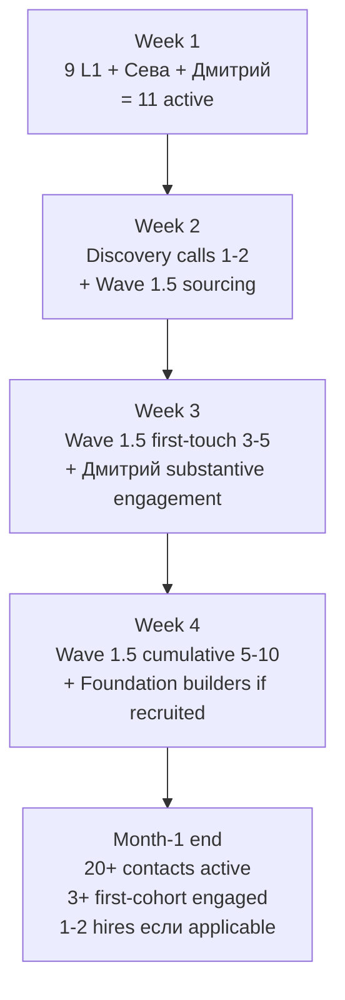

# Точка Б — 1-месяц horizon (24.05-24.06.2026)

## §0 Контекст переход 1w → 1m

1-неделя Phase 2 целью был **Wave 1 outreach execution + first-cohort feedback collection** (Дмитрий + Сева Notion-MVP + 9 L1 contacted). 1-месяц horizon строится поверх этого: **Wave 1 mature + MVP scope decision + Wave 1.5 cohort expansion + first hire decisions (если применимо)**.

**Точка Б 1-месяц цель:** Promotion-mode operational; ≥3 first-cohort members substantively engaged (Дмитрий + Сева + ≥1 from L1 First Clan); MVP scope decided based on Wave 1 + first-cohort feedback; Wave 1.5 cohort sourcing started; Ruslan personal sustainability check (per Pillar C Tier 1 manager principles).

[src: `decisions/strategic/POINT-A-CURRENT-STATE-2026-05-23.md` §9.4 activation order Wave 1 + §17 12-шагов Plan-of-Day; `wiki/concepts/development-promotion-mode-transition.md` §3 operational semantics]

## §1 4-week milestone structure

### Week 1 (24-30.05.2026) — Wave 1 send + Notion-MVP live (per Phase 2)

**Outcomes (per Phase 2 §8):**
1. Wave 1 outreach к 9 L1 + Сева sent
2. Notion-MVP live для Дмитрий + Сева
3. CRM clean + status transitions captured
4. Substrate-gap log NEW (`reports/wave-1-feedback/`)
5. H-batch-12-substrate-saturation first verdict
6. Strategy lock (Plan-of-Day Шаг 12)

### Week 2 (31.05-06.06.2026) — Wave 1 feedback maturation + MVP scope decision

**Цель недели:** Wave 1 feedback fully processed; MVP scope decided based on substrate-gap evidence + first-cohort engagement signals.

**Day-level outline:**

- **Понедельник 31.05** — Wave 1 reception aggregation. CRM transitions captured. Discovery-call requests scheduling. Substrate-gap log review (если ≥3 of 9 surface specific gap → return-to-substrate partial mode activate).
- **Вторник 01.06** — MVP scope decision Ruslan-authored R1 work. Per Plan-of-Day Шаг 10. Options:
  - (A) Notion-template expansion (no platform-build; scale Notion-MVP к 5-10 cohort members)
  - (B) Lightweight platform-MVP (basic web + database; bridge Notion to scale)
  - (C) Full-platform-MVP (Ethereum substrate + R12 programmable overlay; high-effort)
  - **Default-deny-safe:** (A) per [[notion-mvp-bypass-pattern]] §5.1 — Notion-as-platform-lock-in risk acceptable до cohort N=10
- **Среда 02.06** — Дмитрий second-touch + cohort engagement progression. IF Дмитрий active → invite к pair-discussion для humanities-bridge validation per [[external-system-cybernetic-principle]] §3.1.
- **Четверг 03.06** — Wave 1 discovery-call с 1-2 from 9 L1 First Clan (if scheduled). R12 paired-frame mandatory во время call.
- **Пятница 04.06** — Wave 1.5 cohort sourcing brainstorm. Per [[cohort-target-profile-ontology]] 6 dimensions = filter; CRM substrate provides candidate set. Ворсик-клуб / Дмитрий audience / Сева audience = 3 channels (per O-165).
- **Суббота 05.06** — Buffer / family balance / Ruslan personal R1 reflection (week's commitment to Pillar C Tier 1 manager principles per §4 below).
- **Воскресенье 06.06** — Week-2 retrospective + Week-3 plan.

**Week-2 outcomes target:**
1. Wave 1 reception aggregated; CRM status transitions complete
2. MVP scope decision locked (option A/B/C); design plan if A → Notion-shaper start
3. Дмитрий cohort engagement progressing (3rd-4th touchpoint complete)
4. Wave 1.5 cohort 5-10 candidate inventory (CRM substrate)
5. Substrate-gap analysis full (week-1 + week-2 cumulative)

### Week 3 (07-13.06.2026) — Wave 1.5 cohort sourcing + MVP plan execute

**Цель недели:** Wave 1.5 cohort 3-5 первый touch (Дмитрий audience / Сева audience / Ворсик-клуб per O-165); MVP plan execution start; first-cohort Дмитрий substantively engaged (discovery call + concrete next-step adoption documented).

- **Понедельник 07.06** — Wave 1.5 outreach к Дмитрий audience subset (Дмитрий-referred 3-5 candidates per voluntary-opt-in clause; CRM Шамба-канал mention если applicable; per O-165 channels-inventory)
- **Вторник 08.06** — MVP scope plan execute (option A → Notion-shaper development; B → lightweight web start; C → Ethereum substrate Phase 1)
- **Среда 09.06** — Сева audience outreach subset (Сева-referred 2-3 candidates; crypto/Ethereum framing per R12 programmable overlay)
- **Четверг 10.06** — Anton mentor / Tseren / Левенчук follow-up cycle (T2-T3 second-touchpoint maintenance)
- **Пятница 11.06** — First-cohort engagement deepening — Дмитрий pair-discussion на substantive substrate review (humanities-bridge validation per [[external-system-cybernetic-principle]] §3.1)
- **Суббота 12.06** — Buffer / personal reflection
- **Воскресенье 13.06** — Week-3 retrospective + Week-4 plan

**Week-3 outcomes target:**
1. Wave 1.5 cohort 3-5 first-touch (Дмитрий + Сева audiences) — voluntary opt-in active
2. MVP plan execute progress: ≥1 milestone done (Notion-shaper полу-готов OR lightweight web stub OR Ethereum Phase 1 design)
3. First-cohort (Дмитрий) substantive engagement: pair-discussion documented; humanities-bridge validation visible
4. Substrate-gap log: 3-week cumulative analysis; H-batch-12-substrate-saturation verdict updated

### Week 4 (14-20.06.2026) — MVP demonstrable + Foundation builders if recruited

**Цель недели:** MVP feature-set demonstrable (option A → Notion-template scaled to 5+ users; B → lightweight web alpha; C → Ethereum substrate Phase 1 deployed); Foundation builders if recruited start onboarding; Wave 1.5 cohort 5-10 cumulative; hiring decision lock (Plan-of-Day Шаг 8).

- **Понедельник 14.06** — MVP review pass — что demonstrable / что pending. Re-prioritisation per Wave 1.5 cohort feedback.
- **Вторник 15.06** — Hiring decision lock (per Plan-of-Day Шаг 8). Ruslan-authored R1 decision: HIRE NOW (option A) / DEFER (option B) / REVIEW PILOT (option C). R12 paired-frame для compensation arrangements.
- **Среда 16.06** — Foundation builders onboarding если HIRE NOW (option A). Per Charter v0 LOCKED principles + R12 wage-ratio-cap action class. AWAITING-APPROVAL packet for executor binding (per `shared/schemas/executor-binding.yaml.template`).
- **Четверг 17.06** — Wave 1.5 cohort engagement deepening — 5-10 cumulative; CRM status transitions visible (cold→contacted→discovery_call→proposal).
- **Пятница 18.06** — Distribution channels review (Plan-of-Day Шаг 11). Per O-165 Sources-inventory — Ворсик / Дмитрий / Сева channels active; Telegram channels owned/managed mapping (gap closure per Точка А §12 #8).
- **Суббота 19.06** — Buffer / personal reflection / monthly retro start
- **Воскресенье 20.06** — Month-1 retrospective draft

**Week-4 outcomes target:**
1. MVP demonstrable in chosen option
2. Hiring decision Ruslan-locked
3. Wave 1.5 cohort 5-10 cumulative engaged
4. Distribution channels mapping complete
5. Month-1 retro draft ready

## §2 Month-1 outcomes target (24.05-24.06.2026)

Per cumulative weeks 1-4:

| # | Outcome | Status target end-of-month |
|---|---|---|
| 1 | Promotion-mode operational | ✅ Activity rebalance per [[development-promotion-mode-transition]] §3.1 confirmed |
| 2 | Wave 1 outreach + reception | ✅ 9 L1 contacted; ≥5 substantive responses; ≥2 discovery-calls completed |
| 3 | Notion-MVP scaling | ✅ Live для Дмитрий + Сева + 3+ Wave 1.5 cohort members |
| 4 | MVP scope decision | ✅ Option A/B/C locked + plan execution started |
| 5 | First-cohort engagement | ✅ Дмитрий + Сева substantively engaged (pair-discussions + concrete next-step adoption documented) |
| 6 | Wave 1.5 cohort sourcing | ✅ 5-10 candidate inventory + 3-5 first-touch sent |
| 7 | Hiring decision | ✅ Ruslan-locked (HIRE NOW / DEFER / REVIEW PILOT) |
| 8 | Substrate-gap analysis | ✅ Month-1 cumulative; hypothesis H-batch-12-substrate-saturation verdict |
| 9 | Distribution channels mapping | ✅ Per O-165 + Telegram channels gap closure |
| 10 | Month-1 retrospective | ✅ Draft ready end-of-month |

## §3 People needs / resources monthly view

### §3.1 People activation cumulative

### §3.2 ROY swarm dispatch pattern (month-1)

| Expert | Primary monthly load |
|---|---|
| brigadier | Daily dispatch + week-retro orchestration |
| engineering-expert | MVP technical architecture review (week 2-4); copy-review pass |
| investor-expert | Capital allocation review (week 2-4); compensation arrangements R12-check |
| mgmt-expert | Outreach pipeline coordination + CRM transitions + hiring decision support |
| philosophy-expert | R12 paired-frame verification per outreach send + per hire decision |
| systems-expert | Substrate-gap analysis + feedback loop verification (per [[external-system-cybernetic-principle]] §3.3) |
| quick-money-brigadier | Wave 1.5 cohort sales-research dispatch |
| levenchuk-deep-dive-brigadier | DEFER (per stub status) — possible promotion если Левенчук engagement deep |

### §3.3 Capital / runway view (month-1)

Per Точка А §12 #10 — Money runway зависит от Wave 1 outcome (Q3 2026 target $100K).

**Month-1 capital snapshot:**
- Pre-Wave 1: substrate-development phase (no revenue)
- During Wave 1: substrate-development period (revenue не expected within 4 weeks)
- Month-1 end: **revenue indicator** = % first-cohort substantively engaged; if ≥30% (3 of 10) → Q3 $100K trajectory on-track; if <30% → pivot consideration

**Bridge capital decision** (per Точка Б Phase 4 2-month horizon) — pre-decision на Week 4 (если capital runway approaching critical threshold). Default-deny-safe: continue voluntary opt-in; не extract beyond agreed share per R12.

## §4 Sustainability / Pillar C Tier 1 manager principles

Per CLAUDE.md §4.3 — Tier 1 (manager principles) NOT enforced by agents; Ruslan self-discipline только.

**Month-1 sustainability checks (Ruslan self-managed):**

- **Weekly personal reflection** — Suturday afternoon block (per Phase 2 §2 Суббота 31.05 / Phase 3 every Saturday block carved)
- **Family / partner balance** — protected daily hour-minimum; voice-pipeline NOT auto-overrides
- **Sleep / recovery** — per Life OS substrate; Phase 2 buffer days mandatory
- **Burnout signal** — IF >7 days >12h-day → mandatory recovery day insertion (R12 internal: extraction-prevention applies к Ruslan-himself)
- **Monthly retro** — end-of-month surface burnout / recovery metrics

[src: `swarm/wiki/foundations/principles/architecture.md` Tier 1 manager principles + Life OS substrate]

## §5 Decision points (Ruslan-only R1)

Per IP-1 STRICT — agents surface decisions; Ruslan decides. Month-1 decision points:

| Week | Decision | Default-deny-safe |
|---|---|---|
| 1 | Wave 1 send authorization | Send AFTER KA-pitch-soften review pass |
| 2 | MVP scope (A/B/C) | (A) Notion-template expansion default |
| 2 | Pivot signal: continue or pause Wave 1.5 sourcing | Continue (Wave 1 only 1 week) |
| 3 | First-cohort deepening invest level | Per engagement signals — Ruslan judgment call |
| 4 | Hiring (HIRE NOW / DEFER / REVIEW PILOT) | DEFER default (substrate maintenance burden cap) |
| 4 | Bridge capital request planning | DEFER (Q3 $100K trajectory monitor; only if runway critical) |

## §6 Risks для месяца

### §6.1 Wave 1 reception lukewarm risk
**Risk:** 9 L1 contacted but ≤2 substantive responses; substrate-saturation hypothesis refuted partial.
**Mitigation:** Return-to-substrate partial mode per [[development-promotion-mode-transition]] §6.1 mitigation; substrate-gap log explicit; Wave 2 substrate-refinement pass before mass-distribution.

### §6.2 Дмитрий engagement decay risk
**Risk:** Дмитрий Notion-MVP initial engagement strong but decay over 2-4 weeks (no concrete next-step adoption).
**Mitigation:** Pair-discussion mechanism (per Week-3 Friday plan); concrete next-step accountability per [[external-system-cybernetic-principle]] §3.2 self-coaching protocol; voluntary opt-in preserved (no pressure mechanism).

### §6.3 MVP scope creep risk
**Risk:** Option C (full Ethereum platform) attractive but bandwidth-heavy; substrate-development burden return.
**Mitigation:** Default-deny-safe Option A (Notion-template); Ethereum substrate Phase 1 design only (no deployment) если Option C attractive.

### §6.4 Hiring premature risk
**Risk:** Hiring before MVP validated → premature commitment + extraction-risk if compensation arrangements не R12-compliant.
**Mitigation:** DEFER default + R12 wage-ratio-cap mandatory если HIRE NOW; AWAITING-APPROVAL packet for any executor binding.

### §6.5 Capital depletion risk
**Risk:** Month-1 burn rate exceeds reserve; bridge capital decision forced.
**Mitigation:** Weekly capital tracking; bridge capital options explored Week 3 (если signaled); Q3 $100K trajectory monitor.

### §6.6 Personal burnout risk
**Risk:** 1509 commits / 60 days pre-Wave 1 = sustained intense work pattern; Wave 1 promotion-mode adds outreach load.
**Mitigation:** Pillar C Tier 1 sustainability checks (per §4); Saturday buffer days protected; family balance protected.

## §7 Точка Б 1-месяц narrative

**End-of-month 24.06.2026 narrative (substrate compile):**

«За месяц 24.05-24.06.2026 я (Ruslan) перешёл от "substrate готова" к "substrate + Wave 1 + first-cohort + MVP scope decided". Конкретно:
- Wave 1 outreach к 9 L1 First Clan completed + ≥5 substantive responses
- Notion-MVP scales к 5-10 cohort members (Дмитрий + Сева + 3-5 Wave 1.5)
- MVP scope decided (Option A/B/C) с execution started
- Hiring decision Ruslan-locked
- Substrate-gap analysis confirms (or refutes) saturation hypothesis
- Promotion-mode operationally validated
- Sustainability discipline maintained (Pillar C Tier 1)

Substrate-build period 24.03-23.05 (1509 commits / 4 LOCKED canonical) = Точка А state foundation. Promotion-mode period 24.05-24.06 = Точка Б 1-месяц trajectory. Next: 2-month horizon = mass-distribution readiness + cohort growth + bridge capital decision (24.06-24.07).»

[Будет authored Ruslan-only R1 voice prose pass в Week 4 month-1 retro]

## §8 NEXT — Phase 4

NEXT: Phase 4 — 2-месяца horizon (24.05-24.07.2026) mass-distribution target + cohort growth + bridge capital timing.

---

*Phase 3 closure 2026-05-23. Per prompt §1 Phase 3 mandate.*
