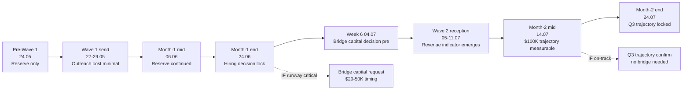

# Точка Б — 2-месяца horizon (24.05-24.07.2026)

## §0 Контекст переход 1m → 2m

1-месяц Phase 3 целью был **Wave 1 mature + first-cohort substantively engaged + MVP scope decided + hiring decision Ruslan-locked**. 2-месяца horizon строится поверх этого: **mass-distribution-ready target (30 июня platform ready per L14 LOCK reference) + Июль mass-distribution start + cohort growth trajectory L4 → L7 + bridge capital decision если applicable**.

**Точка Б 2-месяца цель:** Promotion-mode mature; mass-distribution-ready substrate (Notion-template scale-out OR lightweight platform alpha); cohort 15-25 active engaged; MVP validated по cohort feedback; bridge capital decision Ruslan-locked если runway critical; Q3 $100K trajectory measurable indicator.

[src: `decisions/strategic/POINT-A-CURRENT-STATE-2026-05-23.md` §0 + §12 capital runway; `decisions/strategic/STRATEGIC-PLAN-NEAR-FUTURE-2026-05-21.md` §3 Wave 1 May-Jul baseline; [[development-promotion-mode-transition]] §3 operational semantics]

## §1 Month-2 (25.06-24.07.2026) milestone structure

### Week 5 (21-27.06.2026) — Month-1 retro + Month-2 plan + Wave 2 design

**Цель недели:** Month-1 retrospective complete (Ruslan-authored R1); Month-2 plan Ruslan-locked; Wave 2 outreach design (broader audience beyond L1).

- **Понедельник 23.06** — Month-1 retrospective Ruslan-authored. Substrate-gap analysis verdict. H-batch-12-substrate-saturation outcome. Wave 1 efficacy review.
- **Вторник 24.06** — Month-2 plan Ruslan-locked. Decision: continue scale (Option ALPHA) / pause and refine (Option BETA) / pivot (Option GAMMA).
- **Среда 25.06** — Wave 2 design. Per [[cohort-target-profile-ontology]] 6 dimensions filter + [[outreach-system-scalable]] mechanism. Target audience: Wave 1.5 audiences expanded (Дмитрий audience + Сева audience + Wave 1 referrals + Ворсик-клуб).
- **Четверг 26.06** — Wave 2 outreach copy draft. KA-pitch-soften pass apply (per Phase 2 §2 Monday block discipline).
- **Пятница 27.06** — Wave 2 outreach copy R12-verification pass (philosophy-expert dispatch); R12 RUSLAN-LAYER action classes preservation check.
- **Суббота 28.06** — Buffer / personal reflection.
- **Воскресенье 29.06** — Week-5 retrospective + Week-6 plan.

### Week 6 (28.06-04.07.2026) — Mass-distribution-ready substrate + Wave 2 send

**Цель недели:** Substrate mass-distribution-ready (per L14 LOCK 30 июня target); Wave 2 send executed; bridge capital decision pre-decision если applicable.

- **Понедельник 30.06** — ⭐ **L14 LOCK reference target — platform ready** (per Strategic Plan Near Future LOCKED 2026-05-21). Verify: Notion-template scale-out demonstrable / lightweight platform alpha live / Ethereum substrate Phase 1 deployed (depending on MVP scope option).
- **Вторник 01.07** — Wave 2 send execution. Target: 20-30 contacts (Wave 1.5 expansion + new). Per O-157 distribution sequence scaled; per O-159 R12-respectful frame.
- **Среда 02.07** — Wave 2 reception monitoring + CRM transitions.
- **Четверг 03.07** — First-cohort deepening (Дмитрий / Сева / Wave 1 L1 substantive) — pair-discussion cycles continue.
- **Пятница 04.07** — Bridge capital decision pre-decision если runway critical (per §3 capital view).
- **Суббота 05.07** — Buffer / family balance.
- **Воскресенье 06.07** — Week-6 retrospective + Week-7 plan.

### Week 7 (05-11.07.2026) — Wave 2 reception maturation + cohort growth

**Цель недели:** Wave 2 reception fully processed; cohort 15-20 active; mid-2-month milestone review.

- **Понедельник 07.07** — Wave 2 reception aggregation. CRM transitions captured.
- **Вторник 08.07** — Discovery-calls с Wave 2 substantive responders (5-10 expected per first response rate).
- **Среда 09.07** — Cohort growth verification — 15-20 active target. Substrate-saturation hypothesis status updated (cumulative 2-month data).
- **Четверг 10.07** — MVP iteration based on Wave 1 + Wave 2 cumulative feedback. Notion-template refinement / platform alpha refinement / Ethereum substrate Phase 2 if applicable.
- **Пятница 11.07** — First-hire onboarding если recruited (Week 4 month-1 hiring decision was HIRE NOW). R12 wage-ratio-cap monitoring active.
- **Суббота 12.07** — Buffer.
- **Воскресенье 13.07** — Week-7 retrospective.

### Week 8 (12-18.07.2026) — Cohort 20-25 active + mass-distribution full execution

**Цель недели:** Cohort 20-25 active engaged; mass-distribution mechanism fully operational; Q3 trajectory indicator measurable.

- **Понедельник 14.07** — Cohort engagement metrics review. Per-member status check.
- **Вторник 15.07** — Mass-distribution mechanism scaling (per [[outreach-system-scalable]] + Telegram channels gap closure per Точка А §12 #8).
- **Среда 16.07** — Distribution channel maps fully captured: Ворсик / Дмитрий / Сева + Telegram owned/managed + L1 referrals + Anthropic / Karpathy if T5 institutional contacts initiated.
- **Четверг 17.07** — Pre-Q3 trajectory measurement. Indicator: cohort engagement depth × cohort size × revenue-readiness signals. $100K Q3 trajectory verdict (on-track / partial / pivot).
- **Пятница 18.07** — Wave 3 design (если on-track) / pivot planning (если partial / pivot).
- **Суббота 19.07** — Buffer / monthly retro start.
- **Воскресенье 20.07** — Month-2 retrospective draft.

### Week 9 (19-24.07.2026) — Month-2 retro + 2-month horizon closure

**Цель недели:** Month-2 retrospective complete; 2-month horizon closure; Q3 trajectory locked.

- **Понедельник 21.07** — Month-2 retrospective Ruslan-authored. 2-month sprint analysis. Substrate-saturation hypothesis 2-month verdict.
- **Вторник 22.07** — Q3 $100K trajectory decision Ruslan-locked. Per measurable indicator (Week 8).
- **Среда 23.07** — Strategic plan refresh draft (per CLAUDE.md monthly cadence; Ruslan-authored R1). Next 2-month horizon Plan.
- **Четверг 24.07** — ⭐ **2-month horizon closure milestone**. Точка В (next-target) pre-design.
- **Пятница 25.07** — Buffer / week prep.

## §2 Month-2 outcomes target (25.06-24.07.2026)

Per cumulative weeks 5-9:

| # | Outcome | Status target end-of-2-month |
|---|---|---|
| 1 | Substrate mass-distribution-ready | ✅ Per L14 LOCK 30.06 target (Notion-template scale-out / lightweight platform / Ethereum substrate Phase 1 demonstrable) |
| 2 | Wave 2 outreach + reception | ✅ 20-30 contacts; ≥10 substantive responses; 5-10 discovery-calls |
| 3 | Cohort active count | ✅ 20-25 active engaged (15-20 mid-month → 20-25 end-month) |
| 4 | First-cohort depth | ✅ Дмитрий / Сева / Wave 1 substantive — pair-discussion cycles documented; concrete next-step adoption visible |
| 5 | MVP validated | ✅ Wave 1 + Wave 2 feedback integrated; MVP iteration ≥1 complete |
| 6 | Hiring | ✅ First-hire onboarded (если Week 4 decided HIRE NOW); R12 monitoring active |
| 7 | Mass-distribution mechanism | ✅ Telegram + Дмитрий audience + Сева audience + Ворсик channels active |
| 8 | Bridge capital decision | ✅ Ruslan-locked (proceed / defer / request) |
| 9 | Q3 $100K trajectory | ✅ Measurable indicator end-month; verdict locked (on-track / pivot) |
| 10 | Month-2 retrospective | ✅ Ruslan-authored R1 complete |

## §3 Capital / runway view 2-month

Per Точка А §12 #10 — Money runway зависит от Wave 1 + Wave 2 outcome.

### §3.1 Capital snapshot 24.05.2026 (pre-2-month)
- Self-funded substrate-development phase 1509 commits / 60 days
- No revenue yet (pre-cohort engagement)
- Reserve from past savings (estimated 2-3 months baseline expenses)
- Q3 2026 target $100K mix funding (25% Optimism + 75% varied) per Strategic Plan baseline

### §3.2 Capital trajectory through 2-month horizon

### §3.3 Bridge capital trigger conditions

- **Trigger 1:** End-month-1 (24.06) — IF reserve < 2 months baseline → bridge capital design start
- **Trigger 2:** Week 6 (04.07) — IF Wave 1 reception lukewarm + cohort engagement <30% → bridge capital request consider
- **Trigger 3:** Week 8 (17.07) — IF Q3 $100K trajectory partial/pivot → bridge capital decision Ruslan-locked
- **R12 paired-frame for bridge capital:** Any external capital injection MUST preserve fork-and-leave + Mondragón ratio cap + non-extraction commitments per Charter v0 LOCKED + R12 RUSLAN-LAYER action classes
- **Default-deny-safe:** No bridge capital request unless triggered

[src: `swarm/awaiting-approval/r12-programmable-ethereum-2026-05-18.md` 4 RUSLAN-LAYER action classes; `decisions/strategic/ECONOMIC-MODEL-TOKENOMICS-2026-05-22.md` capital allocation model]

## §4 Cohort growth trajectory L4 → L7 target ranges

Per Точка А §6.4 L1 First Clan (9 + 1 anchor); L2 (35); L3 (51).

**Cumulative cohort active engagement (across 2 months):**

| Stage | Period | Target active cohort | Composition |
|---|---|---|---|
| Pre-Wave 1 | 23.05 | 0 active | Substrate phase |
| Week 1 | 24-30.05 | 10-11 active | 9 L1 + Дмитрий + Сева |
| Week 2 | 31.05-06.06 | 12-15 active | + Wave 1 discovery-calls + Wave 1.5 first-touch |
| Week 3 | 07-13.06 | 15-20 active | + Wave 1.5 cohort 3-5 |
| Week 4 | 14-20.06 | 18-22 active | + Wave 1.5 cumulative + first-cohort substantive |
| Week 5 | 21-27.06 | 20-22 active | Maintenance |
| Week 6 | 28.06-04.07 | 25-30 active | + Wave 2 first-touch 20-30 contacts |
| Week 7 | 05-11.07 | 30-40 active | + Wave 2 substantive responses |
| Week 8 | 12-18.07 | 30-45 active | + Mass-distribution mechanism cohort |
| Week 9 | 19-24.07 | 30-50 active | End-2-month: 30-50 active |

**L4 → L7 target ranges (substrate compile per Точка А People NS):**

- L4 (cohort active) = 30-50 by end-2-month (per Wave 2 reception)
- L5 (engaged + concrete next-step) = 10-20 by end-2-month (subset of L4)
- L6 (substantive contributors / pair-partners) = 5-10 by end-2-month (subset of L5)
- L7 (Foundation builders / Ruslan-recruited) = 0-2 by end-2-month (depending on Week 4 hiring decision)

⚠️ **R12-respectful framing:** «cohort growth» НЕ extraction-mechanism. Each cohort member retains:
- Voluntary opt-in clause active
- Fork-and-leave preserved (R12 RUSLAN-LAYER fork_prevention_attempt blocked)
- No commission / pressure for referrals
- Wage-ratio-cap for compensated members

[src: Точка А §6.4 L1 First Clan + §6.5 Orgs; [[cohort-target-profile-ontology]] §3.2 anti-target ≠ negative judgment + voluntary opt-in mandatory]

## §5 Distribution channels mapping (2-month closure)

Per Точка А §12 #8 — Telegram channels owned/managed gap closure target end-2-month.

### §5.1 Channels inventory (per O-165 Sources)

| # | Channel | Owner/managed by | Audience | Status (24.05) | Status target (24.07) |
|---|---|---|---|---|---|
| 1 | Ворсик-клуб | external | Programmers/products subset | external linked | external linked +visible referrals |
| 2 | Дмитрий «Гуманитарщина» YouTube | Дмитрий | Humanities-bridge audience | personal contact | active cohort recruiter |
| 3 | Сева | Сева | Crypto/Ethereum audience | DRAFT-only intake | active cohort recruiter |
| 4 | Ruslan Telegram channel(s) | Ruslan | (TBD) | gap — not quantified | mapped + content schedule active |
| 5 | L1 referrals network | L1 First Clan | ~ 50-100 1st-degree contacts | passive | warm-referrals active |
| 6 | Anthropic / Karpathy / RU AI institutional | external | T5 deferred | not initiated | maybe initiated (low priority) |

### §5.2 Mass-distribution mechanism design (per [[outreach-system-scalable]])

- **Content cadence** — weekly post / video / podcast appearance (Ruslan personal)
- **CRM-driven outreach** — `/crm-touch` weekly; new candidates from substrate + voice-pipeline
- **Cohort-referral mechanism** — voluntary opt-in (no commission); fork-and-leave preserved
- **R12 paired-frame** на каждый content piece

## §6 ROY swarm dispatch pattern (2-month)

| Expert | Month-2 load |
|---|---|
| brigadier | Daily dispatch + week-retro + 2-month-retro orchestration |
| engineering-expert | MVP iteration (Wave 1 + Wave 2 feedback integration); platform alpha если Option B |
| investor-expert | Capital allocation review (week 5-9); bridge capital design if triggered; Q3 trajectory analytics |
| mgmt-expert | Outreach pipeline + CRM + cohort engagement metrics + hiring onboarding if applicable |
| philosophy-expert | R12 paired-frame verification per Wave 2 send + per content piece; Charter v0 compliance |
| systems-expert | Cohort feedback loop verification + substrate-saturation hypothesis updates + mass-distribution mechanism scaling check |
| quick-money-brigadier | Wave 2 cohort sales-research dispatch; revenue indicator analytics |
| levenchuk-deep-dive-brigadier | Possible promotion if Левенчук substantive engagement Week 5+ |
| project-brigadier templates | Spawn для specific 2-month project deliverables (MVP iteration / mass-distribution mechanism / bridge capital design) |

## §7 Decision points (Ruslan-only R1) 2-month

| Week | Decision | Default-deny-safe |
|---|---|---|
| 5 | Month-2 plan option (ALPHA/BETA/GAMMA) | ALPHA continue scale default if Month-1 verdict on-track |
| 5 | Wave 2 target audience size | 20-30 contacts default (Wave 1.5 expansion + new) |
| 6 | L14 LOCK 30.06 target verification | Verify; если not ready, partial OK |
| 6 | Bridge capital pre-decision | DEFER default if reserve > 1 month |
| 7 | MVP iteration scope (Wave 1+2 feedback integration) | Per substrate-saturation hypothesis verdict; minimal default |
| 8 | Q3 $100K trajectory verdict | On-track / partial / pivot — per measurable indicator |
| 8 | Wave 3 design or pivot planning | Per Q3 verdict |
| 9 | Bridge capital decision Ruslan-locked | Per Week 8 Q3 verdict |
| 9 | Q3 trajectory pre-decision (Q4 prep) | Per Q3 indicator outcome |

## §8 Risks для 2-месяца

### §8.1 Mass-distribution premature risk
**Risk:** Wave 2 mass-distribution before MVP validated → reputational damage + R12 extraction-concerns.
**Mitigation:** MVP validation milestone gate before Wave 2 send; substrate-gap log must be < critical-threshold count before mass send.

### §8.2 Cohort fragmentation risk
**Risk:** 30-50 active cohort by end-2-month → coordination burden + culture dilution.
**Mitigation:** Pair-discussion mechanism scaling (per [[external-system-cybernetic-principle]] §3.1 partnerships role-swap pattern); ROY swarm dispatch automation for cohort engagement metrics.

### §8.3 Q3 trajectory miss risk
**Risk:** Q3 $100K not achievable; pivot mandatory.
**Mitigation:** Week 8 measurable indicator + bridge capital decision Week 9; Charter v0 fork-and-leave preserved (cohort members not captive).

### §8.4 Substrate-saturation hypothesis refutation
**Risk:** H-batch-12-substrate-saturation 2-month verdict = refuted (substrate gaps surface multiple times).
**Mitigation:** Return-to-substrate partial mode acceptable per [[development-promotion-mode-transition]] §6.1; substrate refinement Wave 3 instead of mass-distribution Wave 3.

### §8.5 First-hire onboarding friction
**Risk:** First-hire (если Week 4 HIRE NOW) friction → R12 wage-ratio-cap stress.
**Mitigation:** AWAITING-APPROVAL packet for executor binding (per IP-1 RUSLAN-LAYER); Charter v0 employment terms; R12 paired-frame mandatory.

### §8.6 Personal sustainability fatigue
**Risk:** 8 weeks intense promotion + 4 weeks outreach + hiring + MVP iteration = sustained load risk.
**Mitigation:** Pillar C Tier 1 sustainability checks (weekly Saturday block); monthly retro burnout signal check.

### §8.7 Bridge capital extraction risk
**Risk:** Bridge capital injection без R12-strict terms → covenant violations + community trust loss.
**Mitigation:** R12 RUSLAN-LAYER action classes mandatory in bridge capital terms; Mondragón ratio cap + QF revenue distribution + fork-and-leave exit tokens preservation.

## §9 Point A → Point B 2-month delta narrative

**Narrative (substrate compile; Ruslan-authored R1 reserved):**

«За 2 месяца 24.05-24.07.2026 я (Ruslan) прошёл от Точки А (substrate готова + 1509 commits + Foundation v1.0 LOCKED) к Точке Б 2-месяца (substrate + Wave 1 + Wave 2 + cohort 30-50 active + MVP validated + Q3 trajectory locked).

Constitutional layer: Foundation v1.0 LOCKED preserved; Charter v0 LOCKED preserved; R12 anti-extraction enforced на каждый outreach + cohort interaction + content piece + capital arrangement. 13 LOCKED items неизменны.

Operational layer: promotion-mode operational; Notion-MVP scales к mass-distribution-ready substrate (L14 LOCK 30.06 target); cohort 30-50 active engaged; first-hire onboarded если applicable.

People layer: 9 L1 First Clan + Wave 1.5 + Wave 2 = 30-50 active cohort; Дмитрий / Сева / Anton / Левенчук / Tarasov substantively engaged; first-cohort substantive contributors 5-10.

Capital layer: Q3 $100K trajectory measurable end-2-month; bridge capital decision Ruslan-locked; runway preserved.

Methods layer: ~15 frameworks stack preserved; substrate-saturation hypothesis verdict locked; method-method L4 phase-transition application substantively validated.

Discipline: Pillar C Tier 1 sustainability maintained; family balance preserved; voluntary opt-in clause preserved; fork-and-leave preserved.»

[Будет authored Ruslan-only R1 voice prose pass Week 9 month-2 retro]

## §10 NEXT — Phase 5

NEXT: Phase 5 — 3-perspective narrative (Ruslan personal / partner-facing / cohort-recruit).

---

*Phase 4 closure 2026-05-23. Per prompt §1 Phase 4 mandate.*
