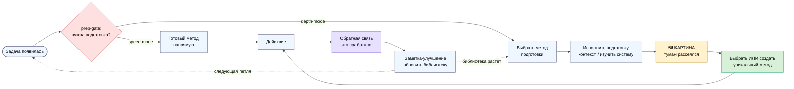
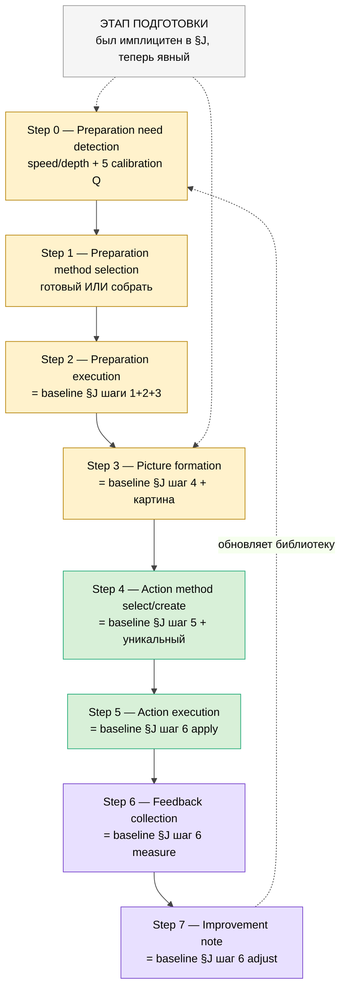
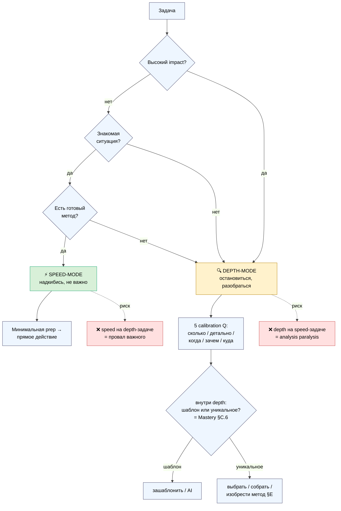
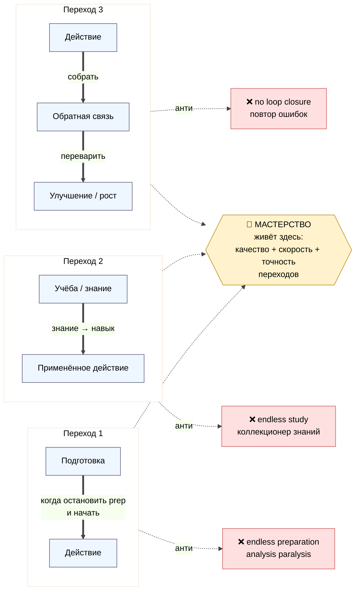

# Mermaid PREP-1..PREP-4

> 4 схемы. Light background (чёрный текст для Notion/PDF), совместимы со стилем WK-1..WK-8
> (workshop-concept) и META-V2-1..10 (метаплан-v2). Каждая ≥10 узлов.

---

## PREP-1 — Полный цикл: Подготовка → Действие → Обратная связь

*(PREP-1 — полная петля. Жёлтое = картина (точка перехода prep→action); зелёное = mastery-момент
создания метода; красное = prep-gate; фиолетовое = замыкание петли обучения.)*

---

## PREP-2 — Extended meta-method (8 шагов, этап подготовки явно)

*(PREP-2 — жёлтое = этап подготовки (Steps 0-3, был имплицитным в §J); зелёное = действие; фиолетовое
= петля. Каждый шаг помечен связью с baseline Method V2 §J — R2 STRICT, расширение не заменяет.)*

---

## PREP-3 — Speed-mode vs Depth-mode (decision tree)

*(PREP-3 — prep-gate триаж. Зелёное = speed; жёлтое = depth. Узел SUB показывает иерархию: prep-gate
ВЫШЕ template/unique-выбора (§C.6 предшественника). Красное = двусторонние ошибки калибровки.)*

---

## PREP-4 — Мастерство на 3 переходах

*(PREP-4 — 3 критических перехода (prep→action / study→action / action→feedback→improvement). Мастерство
= качество переходов, не самих шагов (P-08, P-10). Каждый переход имеет свой анти-паттерн застревания.)*

---

*Phase 6 closure. 4 mermaid (PREP-1 полный цикл · PREP-2 8-шаговая extended procedure с mapping к §J ·
PREP-3 speed/depth decision tree с иерархией над §C.6 · PREP-4 3 перехода мастерства). Все light-bg,
≥10 узлов, стиль-совместимы с WK/META-V2. Inline пойдут в main supplement §8. Переход к Phase 7.*
