# Diagrams INDEX — research-methodology-2026-05-24

> **14 mermaid diagrams** structuring methodology research findings.
> Visualise per-phase synthesis + cross-tradition convergence + Jetix
> positioning options. Substantiates main DR document.

---

## D1 — 12 traditions cross-cite landscape

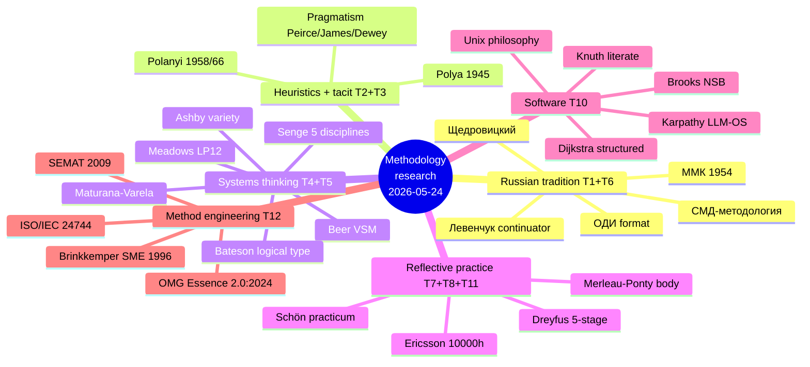

---

## D2 — Левенчук Methodology 2025 — 33 concepts mindmap (Phase 1)

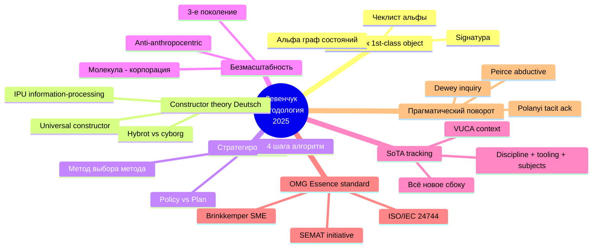

---

## D3 — Polya 4-phase + heuristic catalogue (Phase 2)

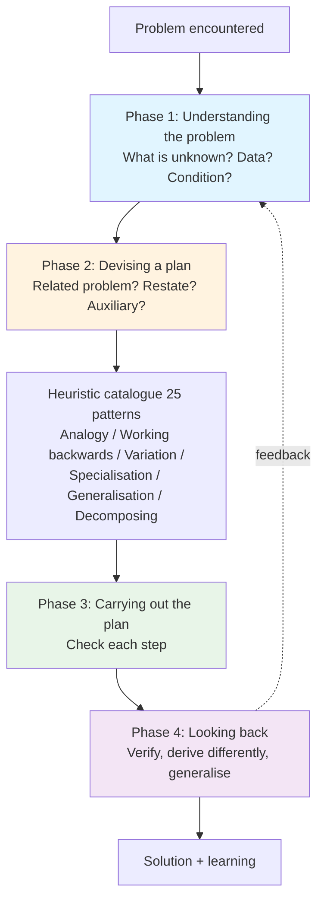

---

## D4 — Polanyi tacit knowing structure (proximal-distal, Phase 2)

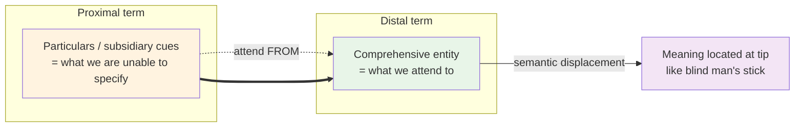

---

## D5 — Beer VSM 5-system architecture (Phase 3)

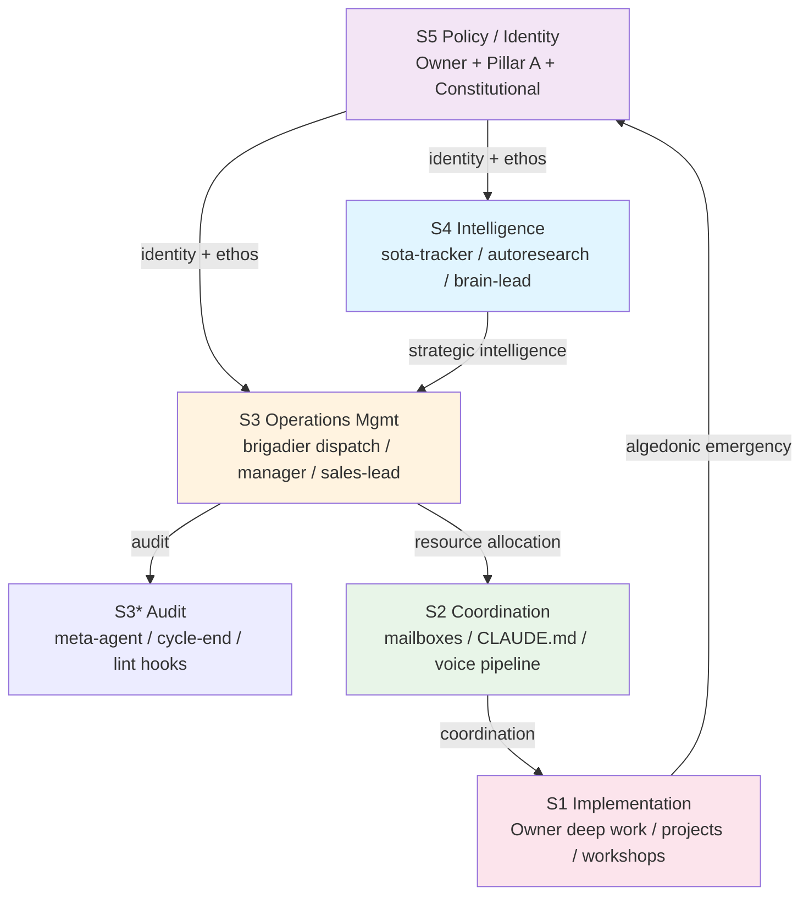

---

## D6 — Meadows 12 leverage points hierarchy + Jetix mapping (Phase 3)

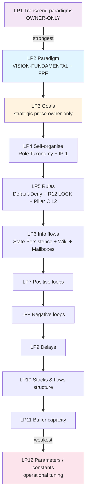

---

## D7 — Schön reflective practice triple (Phase 4)

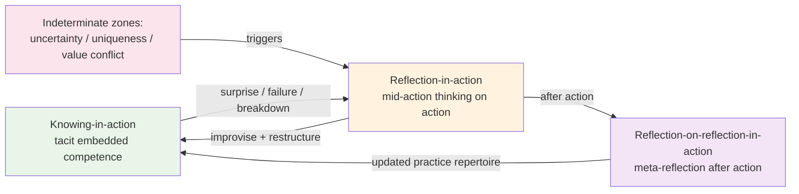

---

## D8 — Software methodology lineage timeline (Phase 5)

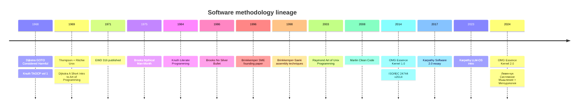

---

## D9 — Russian methodology tradition lineage (Phase 6)

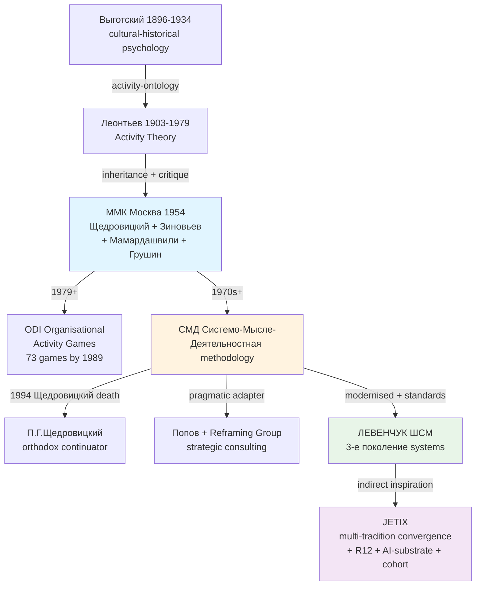

---

## D10 — Method Engineering convergent 6-step pattern (Phase 7)

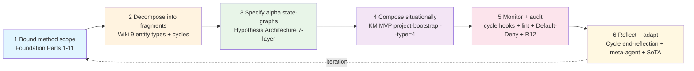

---

## D11 — Jetix multi-tradition convergence (Phase 8 §2)

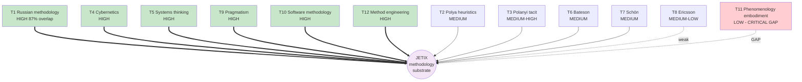

---

## D12 — Jetix 4 lineage positioning options (Phase 8 §3)

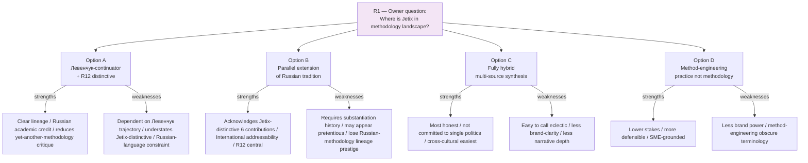

---

## D13 — Jetix 5 strategic positioning paths (Phase 8 §5)

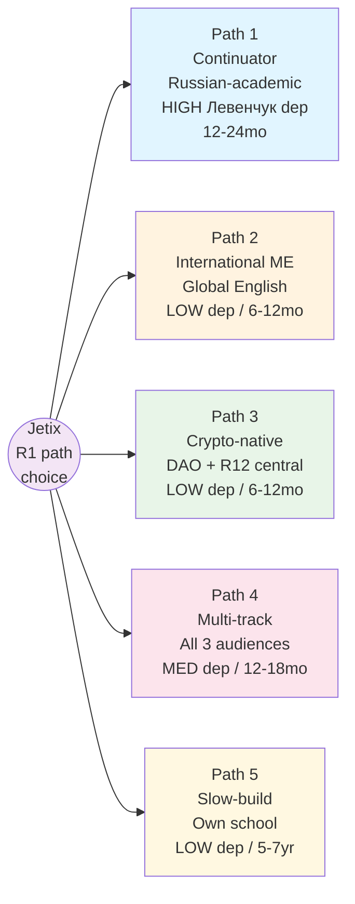

---

## D14 — Jetix 5 extension proposals + 5 critical gaps (Phase 8 §6+§7)

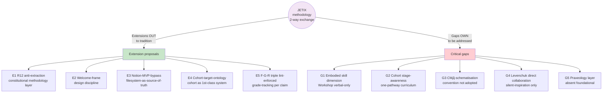

---

## §0 Diagrams summary table

| # | Title | Phase | Type | Notes |
|---|---|---|---|---|
| D1 | 12 traditions cross-cite | 0 | mindmap | Phase landscape preview |
| D2 | Левенчук 33 concepts | 1 | mindmap | Methodology 2025 distillation |
| D3 | Polya 4-phase + heuristics | 2 | graph | Problem-solving template |
| D4 | Polanyi proximal-distal | 2 | graph | Tacit knowing structure |
| D5 | Beer VSM 5-system + Jetix mapping | 3 | graph | Viable system architecture |
| D6 | Meadows LP12 + Jetix | 3 | graph | Leverage points hierarchy |
| D7 | Schön reflective triple | 4 | graph | Knowing-in-action / reflection-in-action / -on- |
| D8 | Software methodology timeline | 5 | timeline | 1968-2024 lineage |
| D9 | Russian methodology lineage | 6 | graph | ММК → Левенчук → Jetix |
| D10 | Method Engineering 6-step | 7 | graph | Convergent pattern |
| D11 | Jetix multi-tradition convergence | 8 | graph | Convergence levels |
| D12 | 4 lineage positioning options | 8 | graph | Options A-D с strengths/weaknesses |
| D13 | 5 strategic positioning paths | 8 | graph | Paths 1-5 audience/timing |
| D14 | 5 extensions + 5 gaps | 8 | graph | Outbound contributions + inbound gaps |

**Total: 14 diagrams. Target 10-15 met.** Все diagrams Phase 0-8 substantiated.

---

*Diagrams INDEX closure. ~280 lines. 14 mermaid diagrams. R6 provenance per
diagram inherits Phase-attribution.*
