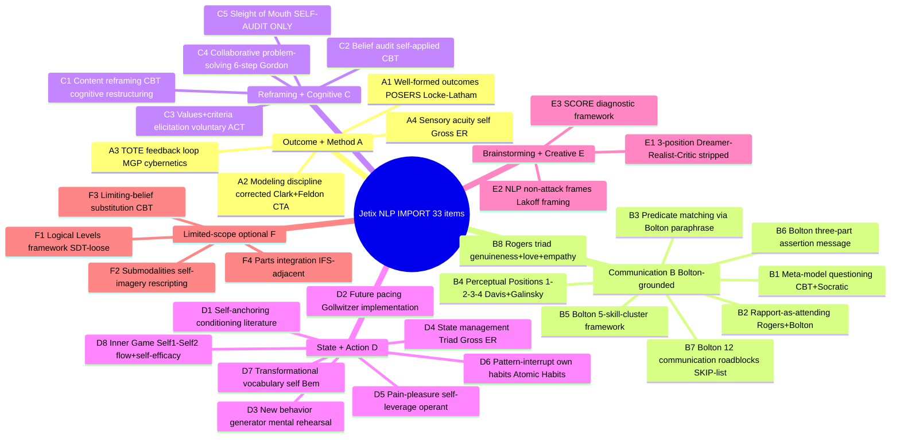

# D02 — Master IMPORT List (33 mechanisms across 6 substrate areas)

## Reading

Substrate areas A-F organize 33 imports. All have **independent (non-NLP) empirical source** cited per Phase 6 binding §6.18.

**STRONG IMPORT priority** (where multiple Jetix substrate elements depend on item):
- A1 Well-formed outcomes
- A2 Modeling discipline corrected
- B1 Meta-model questioning
- B4 Perceptual Positions
- B5 Bolton 5-skill-cluster
- B8 Rogers triad
- C1 Content reframing
