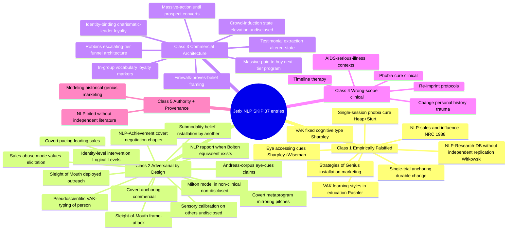

# D03 — Master SKIP List (37 entries × 5 SKIP-classes)

## Reading

- **Class 1 (8 entries)**: Falsified by Sharpley / Heap / NRC / Wiseman / Witkowski / Pashler / Sturt — HARD SKIP regardless of context
- **Class 2 (14 entries)**: Covert / adversarial by design — HARD SKIP for outreach (some clinically OK with consent)
- **Class 3 (8 entries)**: Robbins seminar industry architectural patterns — NEVER copy regardless of technique attractiveness
- **Class 4 (5 entries)**: Clinical territory — wrong scope for Jetix (not «bad» but «not us»)
- **Class 5 (2 entries)**: Authority + provenance discipline failures
