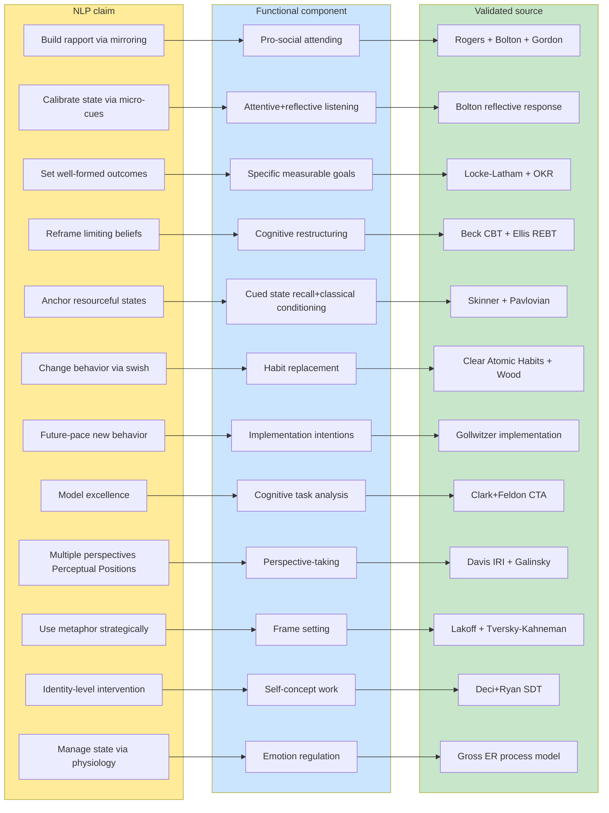

# D04 — Functional Decomposition

## Reading

Phase 6 §6.14 functional decomposition: every R12-compatible NLP claim has a better-validated independent source. Phase 6 binding rule §6.18: cite the VALIDATED SOURCE, не the NLP framing.
