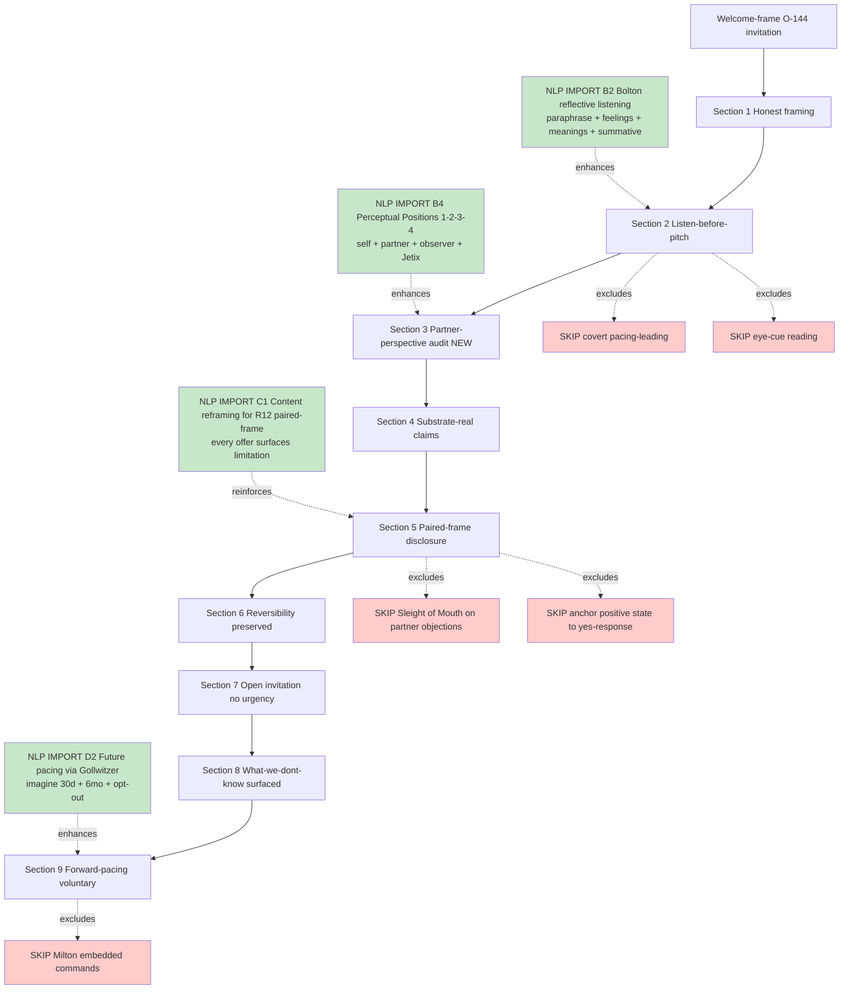

# D05 — Welcome-frame O-144 NLP Enhancement Overlay

## Reading

Welcome-frame O-144 already exists (propaganda Phase 7). NLP overlay = **4 enhancements** in sections 2, 3, 5, 9 + **5 explicit SKIPs** в sections 2, 5, 9 (covert pacing, Sleight on objections, eye cues, anchor to yes, Milton commands).
