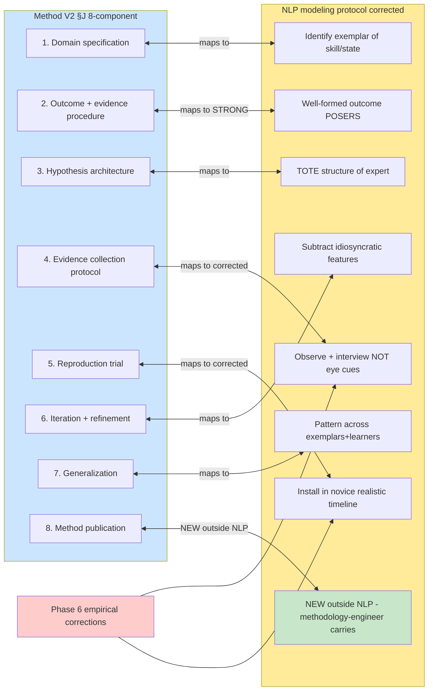

# D06 — Method V2 §J × NLP Modeling Discipline Correspondence

## Reading

NLP modeling discipline (Dilts-derived) maps 1:1 onto Method V2 §J components 1-7. Phase 6 binding corrections at components 4 + 5 (no eye cues, no single-session install claim). Component 8 = Jetix-original, methodology-engineer ROY owns.
