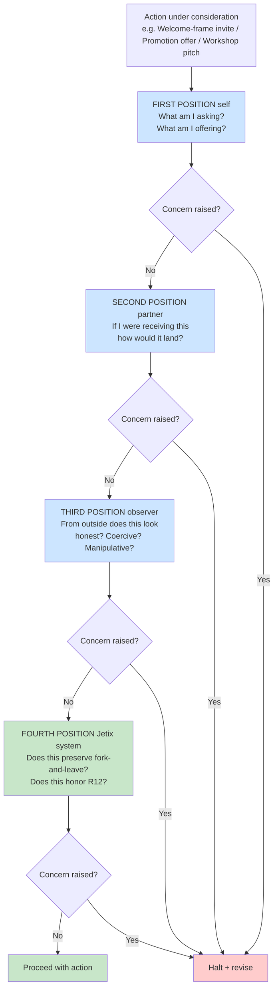

# D07 — Perceptual Positions 4-position Audit Before Action

## Reading

Perceptual Positions discipline applied as **mandatory 4-position check** before any R12-sensitive action. Any single concern = halt + revise.

This is the **identity-binding-free** version of Dilts Logical Levels — adopts perspective-taking discipline without committing to neurological-levels causal claim.
