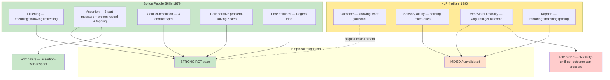

# D08 — Bolton 5-skill-cluster vs NLP 4-pillars comparison

## Reading

Bolton's 5-skill-cluster framework:
- Stronger empirical base (Rogers + Gordon + RCT lineage)
- Natural R12 alignment (assertion defined as «satisfy needs without dominating/manipulating/controlling»)

NLP 4-pillars:
- Mixed empirical base
- «Behavioral flexibility until outcome» framing structurally R12-risky if outcome = influence-over-other

**Phase 7 §7.4 finding**: Prefer Bolton-source для all Jetix communication primer needs.
