# D09 — R12 Violation Classes × NLP Techniques Heat-map

```mermaid
flowchart TB
    subgraph R12CLASSES["RUSLAN-LAYER 4 R12 violation classes + 5th NLP-specific"]
        E1[1. extraction_beyond_share]
        E2[2. wage_ratio_violation]
        E3[3. non_consensual_distribution]
        E4[4. fork_prevention_attempt]
        E5[5. empirically_falsified_overclaim NLP-specific]
    end
    subgraph TECH["NLP technique clusters"]
        T1[Milton model covert<br/>embedded commands<br/>covert pacing]
        T2[Sleight of Mouth<br/>adversarial outreach]
        T3[Covert anchoring<br/>commercial+relationship]
        T4[Robbins escalating-tier<br/>seminar funnel]
        T5[Identity-binding<br/>charismatic leader]
        T6[VAK fixed type]
        T7[Eye accessing cues]
        T8[Single-session phobia cure marketing]
        T9[Strategies of Genius<br/>installation marketing]
        T10[NLP-sales chapter<br/>covert influence]
    end
    T1 -->|HIGH| E1
    T1 -->|HIGH| E3
    T2 -->|HIGH| E1
    T2 -->|HIGH| E4
    T3 -->|HIGH| E3
    T4 -->|HIGH| E1
    T4 -->|HIGH| E2
    T4 -->|HIGH| E3
    T4 -->|HIGH| E4
    T5 -->|HIGH| E4
    T6 -->|HIGH| E5
    T6 -->|MED| E1
    T7 -->|HIGH| E5
    T8 -->|HIGH| E1
    T8 -->|HIGH| E5
    T9 -->|MED| E1
    T9 -->|HIGH| E5
    T10 -->|HIGH| E1
    T10 -->|HIGH| E3
    style E1 fill:#ffcccc
    style E2 fill:#ffcccc
    style E3 fill:#ffcccc
    style E4 fill:#ffcccc
    style E5 fill:#ffe0cc
```

## Reading

NLP technique clusters mapped к R12 violation classes. **Robbins escalating-tier funnel** = unique single pattern violating all 4 RUSLAN-LAYER classes simultaneously (architectural-level violation).

**5th class (empirically_falsified_overclaim)** = NLP-specific addition при Phase 0 §0.7 — covers techniques whose primary R12 risk = promoting falsified claims as authority-extraction.
