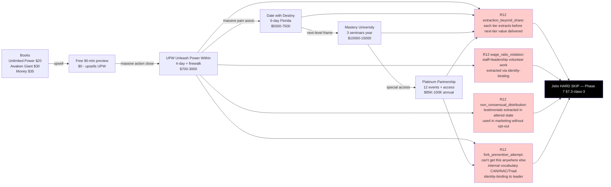

# D10 — Robbins Seminar Tier Architecture (R12 violation walkthrough)

## Reading

Tier-escalation architecture violates **all 4 RUSLAN-LAYER R12 classes simultaneously**. **HARD SKIP regardless of underlying technique effectiveness.** Phase 4 §4.3 + Phase 7 §7.3 class-3.

**Jetix implication**: any Workshop / Clan monetization design MUST NOT replicate this tier-escalation pattern, even if profitable. Per Phase 6 meta-finding: commercial monetization economically selects for R12 violation; only explicit countervailing discipline prevents drift.
