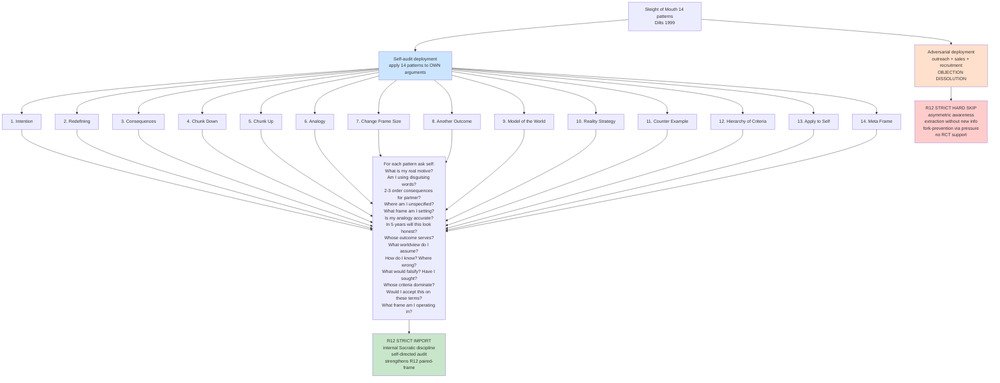

# D11 — Sleight of Mouth: Adversarial SKIP vs Self-Audit IMPORT

## Reading

Same 14-pattern set produces opposite R12 verdicts depending on **direction of application**:
- **Outward (on other's beliefs)** = covert manipulation = HARD SKIP
- **Inward (on own arguments)** = Socratic self-audit = STRONG IMPORT

Parent prompt §2.7 explicit allowance for self-audit version. Confirmed Phase 3 §3.1 + Phase 7 §7.8.
