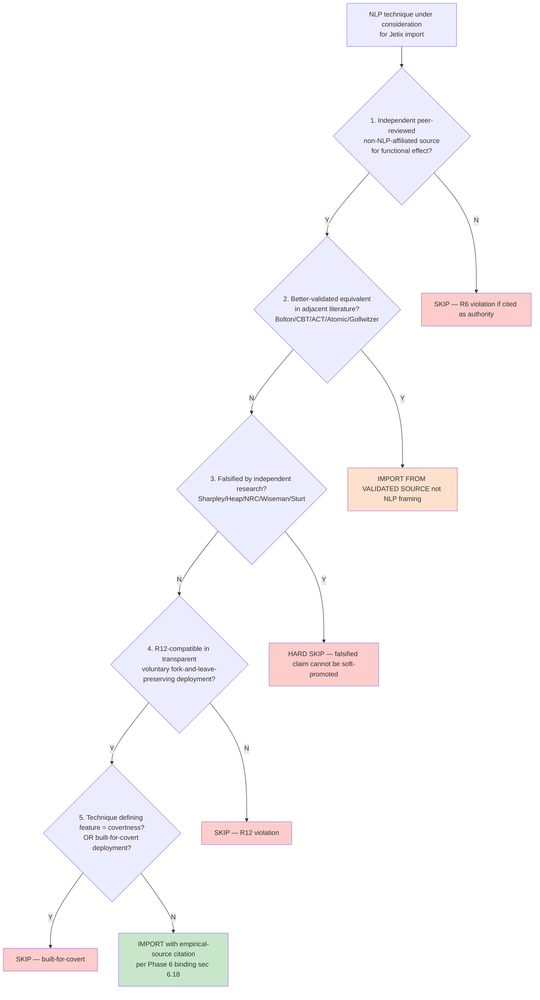

# D12 — Operational Empirical + R12 Filter Funnel (5-clause test)

## Reading

5-clause filter executes Phase 6 + Phase 7 disciplines as operational decision flow. **Any FAIL = SKIP / 5-of-5 PASS = IMPORT.**

This is the daily operational gate when considering NLP-derived material for Workshop curriculum / Welcome-frame enhancement / Cohort building protocol.
