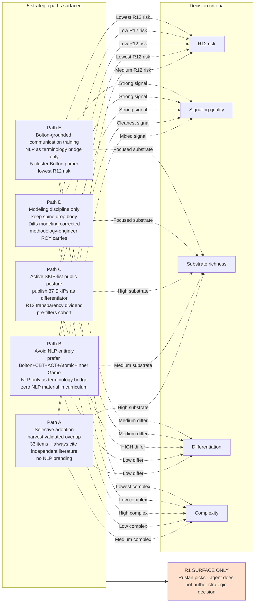

# D13 — 5 Strategic Paths Comparison (R1 — Ruslan picks)

## Reading

5 paths surfaced; **R1 surface posture — Ruslan picks.** Agent does not author strategic decision (Tier 2 rule 1 FUNDAMENTAL §6.1).

**Brigadier-scribe observation surface** (not recommendation):
- Path A = richest substrate but most complexity
- Path B = simplest + lowest risk + lowest differentiation
- Path C = maximum signaling + R12 transparency dividend
- Path D = focused methodology contribution
- Path E = lowest complexity + lowest risk + Bolton-grounded
