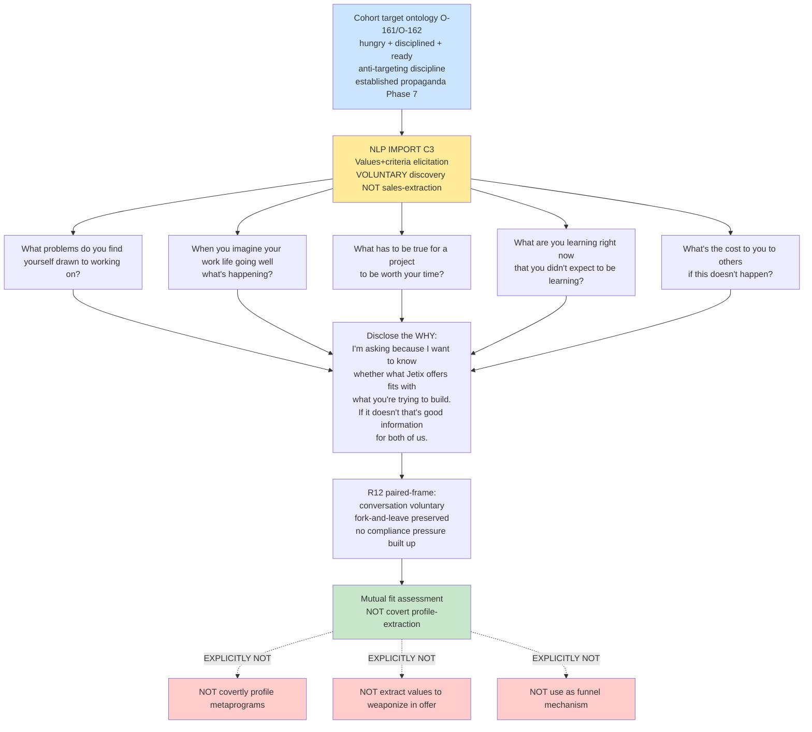

# D14 — Cohort Target Ontology O-161/O-162 + NLP Values-Elicitation Overlay

## Reading

Cohort target ontology O-161/O-162 (established propaganda Phase 7) augmented by NLP IMPORT C3 voluntary values+criteria elicitation. Critical R12 boundary: discovery questions = mutual fit assessment, NOT covert profile-extraction.

Phase 7 §7.5 anti-targeting discipline explicitly excludes: covert metaprogram profile / values weaponization / funnel-mechanism deployment.
