# D15 — NLP Critical Review Timeline

```mermaid
timeline
    title NLP empirical-critical literature 1984-2012
    1975 : Bandler+Grinder Structure of Magic Vol I
         : NLP foundation
    1979 : Frogs into Princes seminar transcript
    1981 : Trance-formations + Milton model
    1982 : Reframing
    1984 : Sharpley J Counseling Psych
         : PRS predicate-matching review
         : No empirical support for stable PRS
    1986 : Robbins Unlimited Power
         : NLP mass-market vector
    1987 : Sharpley J Counseling Psych follow-up
         : eye accessing cues + PRS failed to replicate
         : nonsupportive data or untestable theory
    1988 : Heap interim verdict
         : not proven on present evidence
    1988 : Druckman+Swets NRC report
         : US National Research Council
         : no evidence NLP techniques improve influence/learning/performance
    1991 : Robbins Awaken the Giant Within
         : Neuro-Associative Conditioning branded
    1990 : O'Connor Introducing NLP textbook canonical
    1999 : Dilts Sleight of Mouth
    2000 : Dilts+DeLozier Encyclopedia of Systemic NLP
    2001 : Grinder+Bostic St Clair Whispering in the Wind
         : co-founder retrospective distancing
         : New Code NLP proposed
    2005 : Devilly Aust NZ J Psychiatry
         : power therapies critique
         : NLP grouped with TFT/EFT/TLT
    2009 : Roderique-Davies
         : cargo cult psychology framing
    2009 : Tosey+Mathison Palgrave
         : critical academic appreciation
         : theory unsupported / heuristics survive only with independent grounding
    2009 : Pashler et al Psych Science Public Interest
         : Learning Styles meta-review
         : VAK as instructional principle falsified
    2010 : Witkowski Polish Psych Bulletin
         : 35-year empirical literature review
         : 18.2% supportive / 27.3% refuting
         : NLP-as-marketed = pseudoscience verdict
    2012 : Wiseman et al PLOS ONE
         : eye accessing cues direct experimental test
         : no relationship to lying detection
    2012 : Sturt et al BMJ General Practice
         : systematic review NLP in health
         : little evidence improvement
```

## Reading

35+ years of independent empirical critique. Cumulative verdict: NLP-as-marketed = pseudoscience. Specific falsifications (Sharpley 1984/1987, Pashler 2009, Wiseman 2012) settled empirical questions on VAK + eye-accessing-cues. Most-authoritative single document = NRC 1988 (Druckman+Swets) + Witkowski 2010 35-year review.

Co-founder Grinder's own 2001 retrospective distancing from popularized NLP confirms internal-tradition acknowledgment of issues.

Phase 6 §6.7 + §6.18 binding rule: cite independent literature, not NLP framing.
