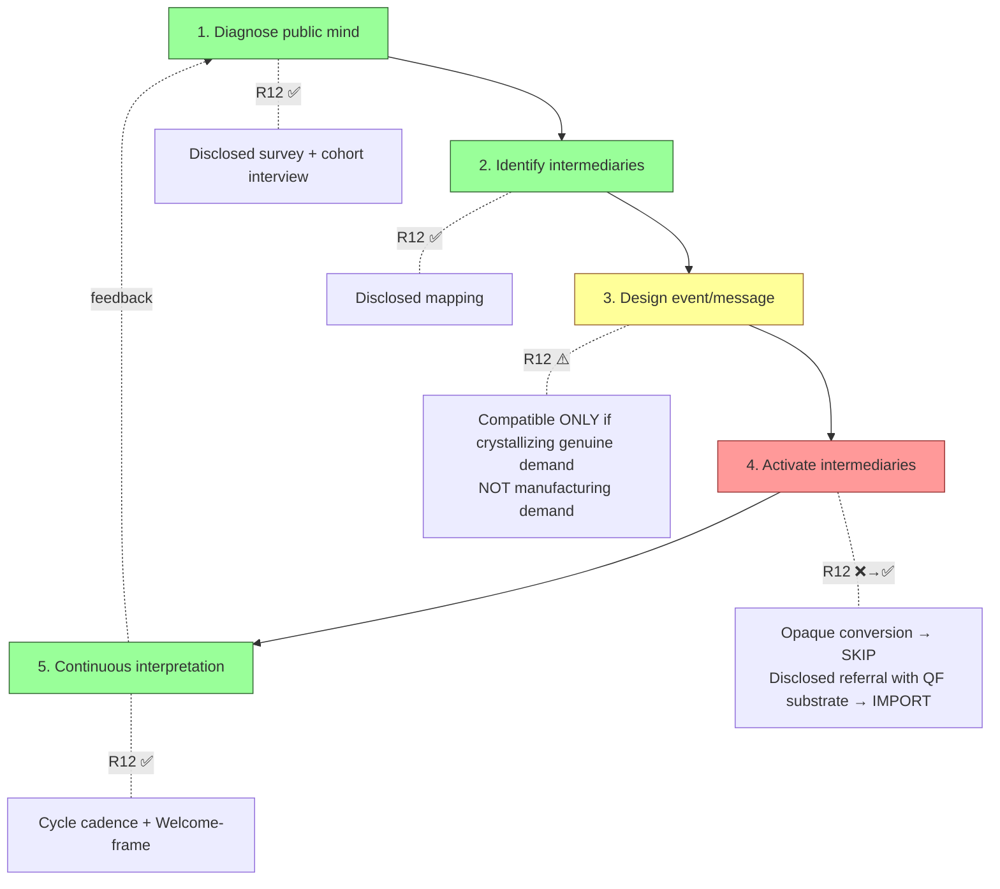

# D01 — Bernays 5-step Operational Loop

**Source:** Phase 1 §1.3 — Bernays method 5-step decomposition.

**R12 verdict:** steps 1, 2, 5 fully R12-compatible; steps 3, 4 require
specific R12-compatible reform (crystallize genuine demand only; disclose
referral economy with QF substrate transparency).

**Jetix mapping:** O-161/O-162 cohort interview (step 1) + Bucket 8 mapping
(step 2) + Welcome-frame O-144 articulation (step 3) + disclosed referral
(step 4) + cycle cadence (step 5).
