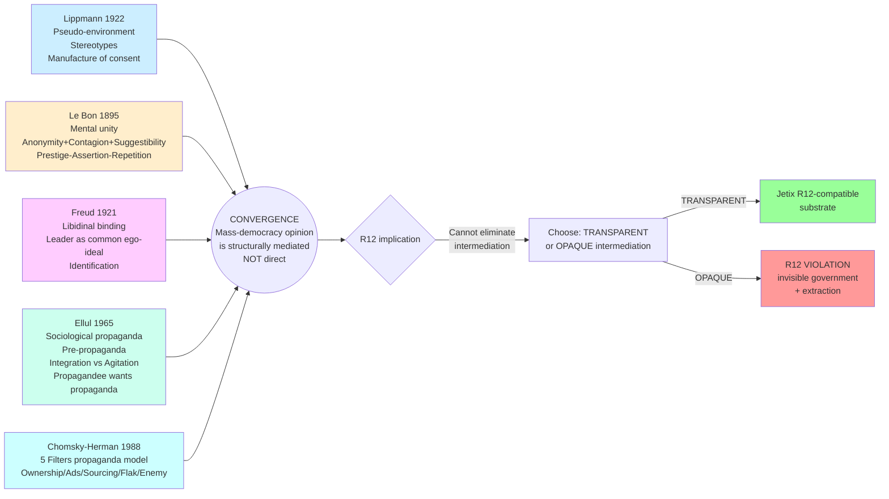

# D02 — Classical Theory Convergence

**Source:** Phase 2 §2.6 cross-author convergence.

**Insight:** 5 different lenses converge on one structural claim — opinion
formation in mass democracy is mediated by intermediaries. R12 doesn't
eliminate intermediation; it determines whether intermediation is
transparent (compatible) or opaque (violation).
