# D03 — Cialdini 6+1 Principles × R12

```mermaid
flowchart TB
    subgraph C[Cialdini 1984/2016 — 6+1 Principles]
        C1[Reciprocation]
        C2[Commitment+Consistency]
        C3[Social Proof]
        C4[Liking]
        C5[Authority]
        C6[Scarcity]
        PS3[Unity — 7th 2016]
    end

    C1 -->|honest gift, no ledger| R1[✅ IMPORT: Give value freely]
    C1 -->|unsolicited obligation<br/>+ rejection-then-retreat| S1[❌ SKIP]

    C2 -->|reversible + portable artifact<br/>+ scaled to evidence| R2[✅ IMPORT: Quarterly opt-in]
    C2 -->|all 4 conditions engineered<br/>foot-in-door / lowball| S2[❌ SKIP: Cult-pattern]

    C3 -->|verifiable work artifacts<br/>named members| R3[✅ IMPORT: Public proof]
    C3 -->|fake reviews / paid testimonials<br/>cherry-picked / bought followers| S3[❌ SKIP]

    C4 -->|honest similarity + warmth| R4[✅ IMPORT: Real cohort fit]
    C4 -->|mirror-and-match scripts<br/>paid attractive presenters| S4[❌ SKIP]

    C5 -->|domain-bounded + F-G-R graded| R5[✅ IMPORT: Verified authority]
    C5 -->|costume / borrowed prestige<br/>celebrity outside domain| S5[❌ SKIP]

    C6 -->|real Dunbar cohort cap<br/>abundance framing default| R6[✅ IMPORT: Real scarcity only]
    C6 -->|fake deadlines / fake limits<br/>manufactured urgency| S6[❌ SKIP: Most-abused 2020s]

    PS3 -->|substrate-grounded we<br/>real shared work| R7[✅ IMPORT: Cohort identity]
    PS3 -->|manufactured we / chosen few<br/>us-vs-them| S7[❌ SKIP: Cult-shape]

    classDef ok fill:#9f9
    classDef bad fill:#f99
    class R1,R2,R3,R4,R5,R6,R7 ok
    class S1,S2,S3,S4,S5,S6,S7 bad
```

**Source:** Phase 3 §3.1-3.3.

**Discipline:** Each principle has both IMPORT path (R12-compatible) and
SKIP path (R12-violating). 8-point Cialdini Discipline Test (Phase 3 §3.6)
operationalizes per-communication audit.
