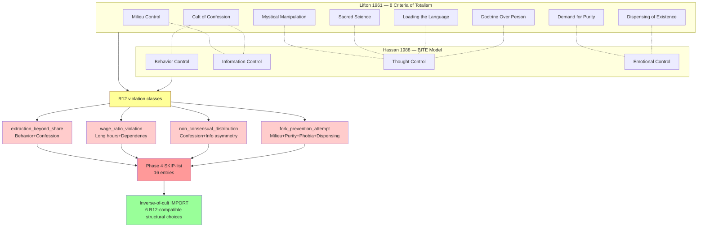

# D04 — Lifton + Hassan Cult Mechanism Crossmap

**Source:** Phase 4 §4.4 cross-author convergence + §4.5 SKIP-list + §4.7
inverse-of-cult imports.

**Critical:** All 4 R12 violation classes have cult-mechanism analogs.
Jetix-Clan can only import the *inverse-of-cult* structural choices
(forking + alumni respect + open milieu + person-over-doctrine + behavioral
autonomy + emotional stability).
