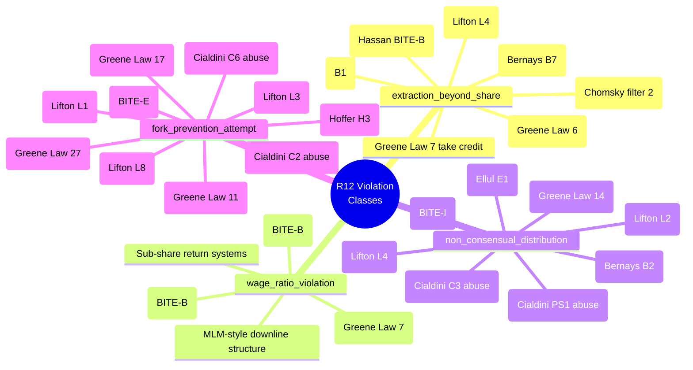

# D05 — 4 R12 Violation Classes × Mechanism Mapping

**Source:** Phase 1-7 cumulative SKIP-list mapped to RUSLAN-LAYER R12
violation classes per `.claude/config/default-deny-table.yaml`.

**Total mechanisms catalogued:** 70 entries spread across 4 classes.
fork_prevention_attempt and non_consensual_distribution have the largest
catalogues (most mechanisms operate by exit-friction or
information-asymmetry).
