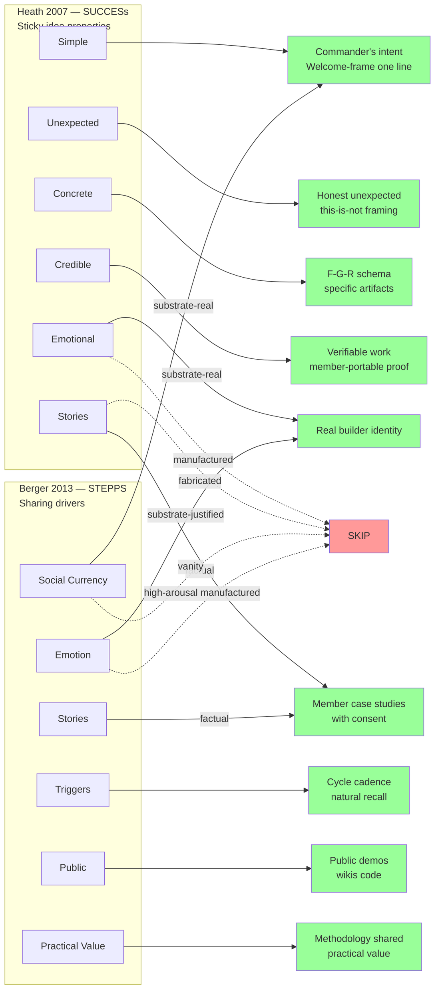

# D06 — Heath + Berger Virality Frameworks (R12-disciplined)

**Source:** Phase 5 §5.2-5.3 + §5.7 imports.

**R12 line:** Both frameworks are R12-compatible **when substrate-grounded**;
SKIP when manufactured. Sticky/viral mechanisms are neutral — what matters
is whether the substrate they ride on is real or fabricated.
