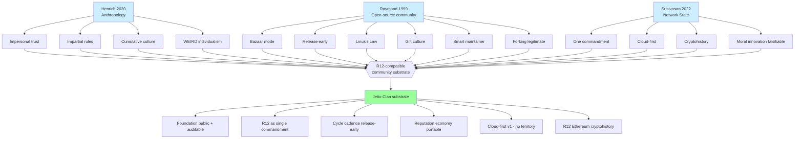

# D07 — Henrich + Raymond + Srinivasan → R12 Substrate

**Source:** Phase 6 §6.4 convergence.

**Insight:** 3 frameworks converge on the same R12-compatible community
substrate. This phase is the **most-importable** — frameworks are already
R12-aligned when applied with substrate honesty.
