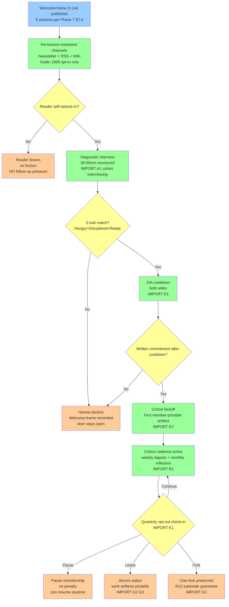

# D08 — Jetix-Clan R12-Compatible Recruitment Funnel

**Source:** Phase 7 §7.9 synthesis.

**Key R12 disciplines:**
- Permission-marketed only (no cold outreach at scale)
- Self-selection by reader (no click-whirr pressure)
- 24h cooldown enforces System 2 (Kahneman)
- Written commitment + reversible (anti-Cialdini-engineered-commitment)
- Quarterly opt-out check-in (anti-sunk-cost binding)
- Fork-and-leave preserved at every stage (R12 substrate)
- Alumni respect at every exit point (anti-Lifton-L8-dispensing)
