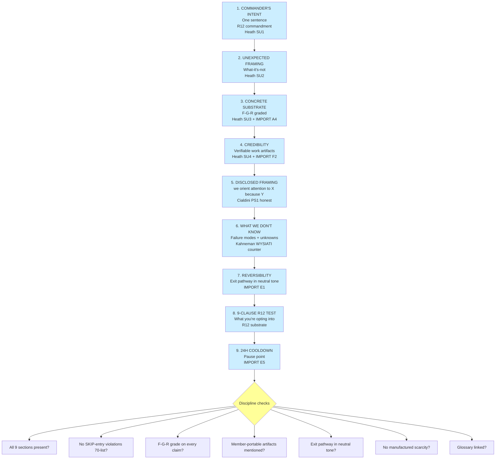

# D09 — Welcome-frame O-144 R12-Compatible Structure

**Source:** Phase 7 §7.4 — Welcome-frame R12-compatible playbook.

**Discipline:** Welcome-frame serves *latent* demand (Bernays B6
crystallization in honest mode); does NOT manufacture demand. Reader who
doesn't fit self-selects out — the R12-compatible form of "consent
engineering".
