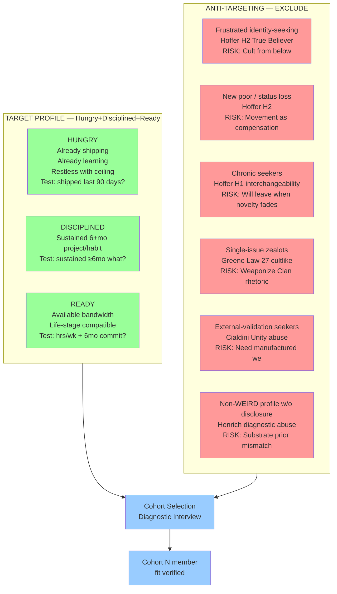

# D10 — Cohort Target Ontology + Anti-Targeting

**Source:** Phase 7 §7.5 — cohort target ontology.

**Strategic insight (Phase 4 H1/H2):** Recruiting True Believer profile
creates cult-shape from below regardless of leader intent. Target
ontology must SCREEN OUT frustrated/identity-seeking profiles to keep
Jetix-Clan substrate R12-compatible.
