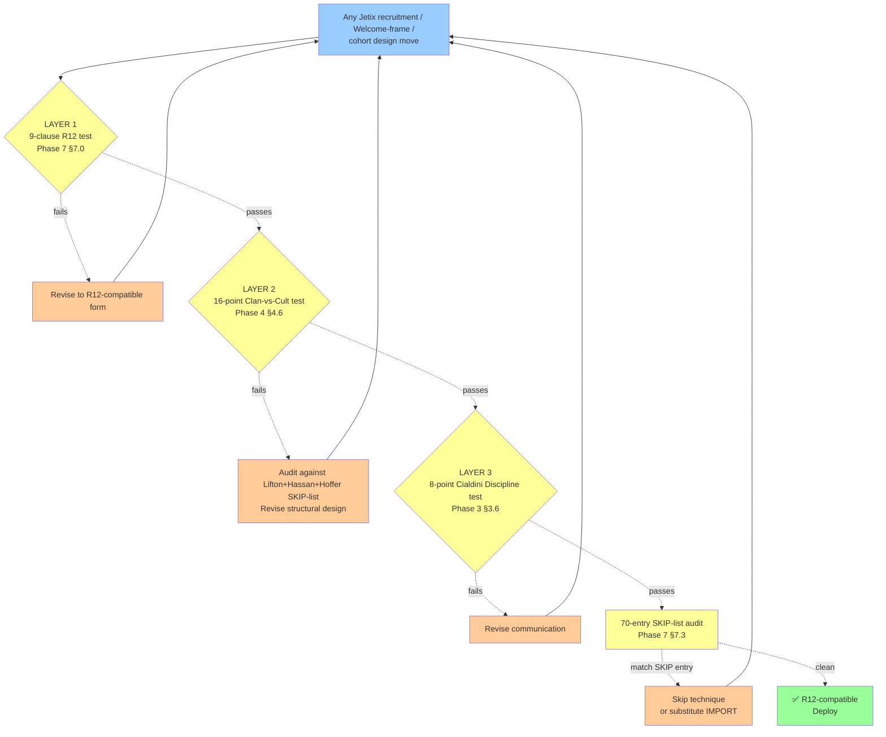

# D11 — 3-Layer R12 Discipline Test Funnel

**Source:** Phase 7 §7.0 + §7.3 + §7.4 + cumulative test artifacts.

**Operational use:** Every recruitment / Welcome-frame / cohort design
decision passes through 4 layers. Failure at any layer → revise. Only
recommendations passing all 4 → deploy.

**Test composition:**
- **9-clause R12 test** = pull/disclose/substrate-real/reversible/portable/glossaried/falsifiable/impartial/fork-preserved
- **16-point Clan-vs-Cult test** = 16 cult-substrate questions inverted
- **8-point Cialdini Discipline test** = per-principle compliance check
- **70-entry SKIP-list** = full mechanism audit
