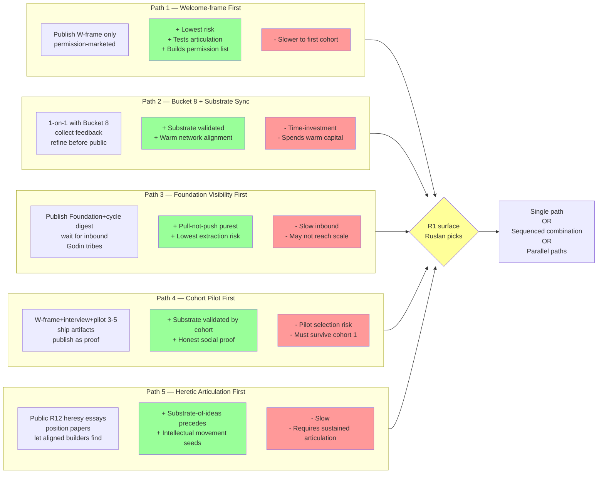

# D12 — 5 Strategic Paths × Tradeoffs

**Source:** Phase 7 §7.10 — R1 surface only.

**R1 discipline:** Agent does not recommend a path. All 5 paths surfaced;
each with explicit + (pros) and - (cons). Ruslan = sole strategist
(FUNDAMENTAL §6.1 rule 1).
