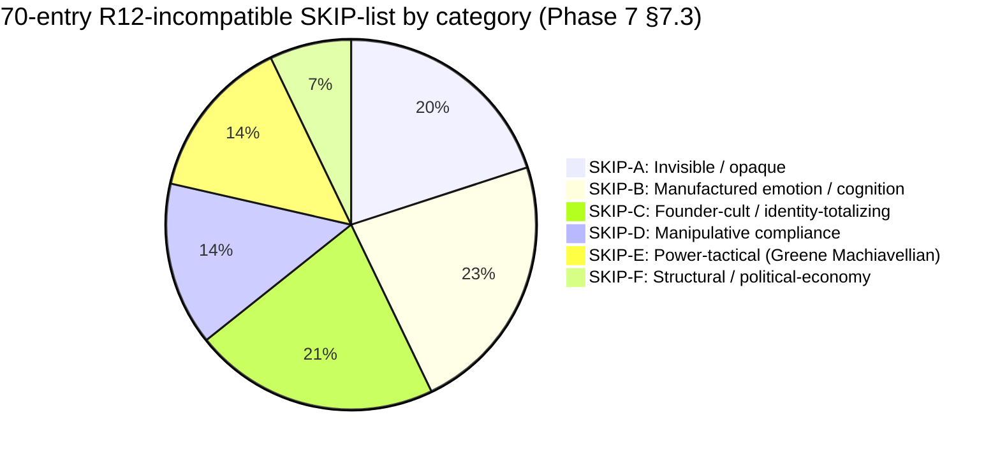

# D13 — Cumulative 70-Entry SKIP-list × Categories

**Source:** Phase 7 §7.3 cumulative SKIP-list breakdown.

**Insight:** Largest categories are manufactured-emotion (B, 16) and
founder-cult (C, 15) and invisible-opaque (A, 14) — these together
account for 64% of total SKIP entries. R12 discipline focuses heavily on
preventing these structural failure modes.

**Inverse insight:** Power-tactical (Greene) and political-economy
(Chomsky) are smaller but still critical — these are the
*high-leverage adversary patterns* Jetix should be able to **detect**
when meeting them externally (extractive partners, predatory platforms),
not just avoid internally.
