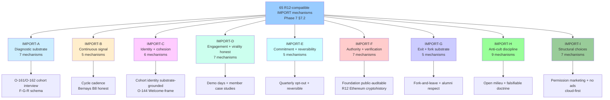

# D14 — 65-Entry R12-Compatible IMPORT List × Substrate Areas

**Source:** Phase 7 §7.2 master IMPORT list.

**Structure:** 9 substrate areas (A-I) × 65 mechanisms total. Heaviest
areas: H Anti-cult discipline (9) + I Structural choices (7) +
D Engagement (7) + F Authority (7) + A Diagnostic (7). Lightest:
B Continuous signal (5) + E Commitment (5) + G Exit (5).

**Note H is heaviest:** Anti-cult discipline requires the most active
substrate counter-design because cult-shape can emerge from members'
True Believer needs even without leader intent (Hoffer Phase 4 H1).
