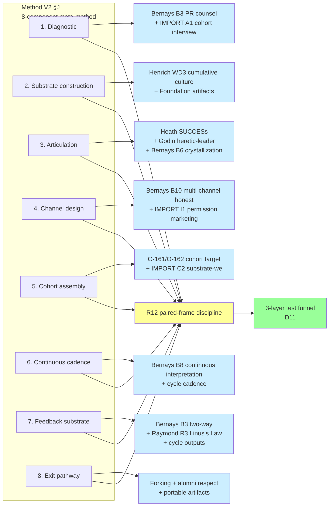

# D15 — Method V2 §J Meta-Method × Research Phase Mapping

**Source:** Phase 7 §7.7 Method V2 §J mapping.

**Insight:** Each §J component has both a propaganda+recruitment substrate
(what to do operationally) AND a R12 discipline filter (what NOT to do).
The meta-method × research synthesis = method-engineered recruitment
substrate.
