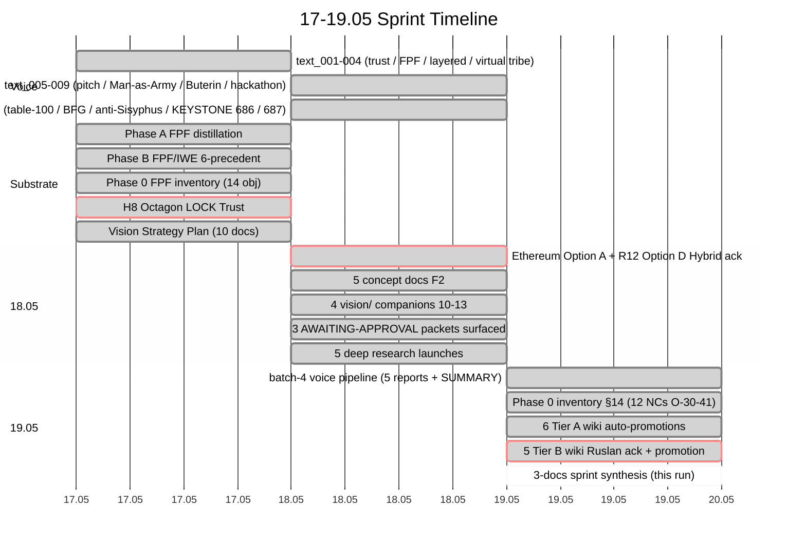

# Doc 1 — New info learned 17-19.05 sprint

> Comprehensive synthesis of what was learned across the 3-day sprint 17-19 мая 2026. 4 voice batches (text_001-009 + audio_669-687), 6 deep research outputs, 5 acked concept docs, 4 vision/ companions, 3 AWAITING-APPROVAL packets, Ethereum architecture ack, 12 NC candidates O-30-41, KEYSTONE findings, 200+ hypotheses across 6 banks. Foundation v1.0 + Pillar C + 8 Octagon LOCKs = PRESERVED untouched.

---

## §0 TL;DR (≤300w)

За 3 дня sprint (17-19.05) substrate шагнул из «Foundation LOCKED + 7 Octagon» → **8 Octagon (H8 Trust LOCKED) + 5 strategic concept docs F2 + 9 vision/ companions + 12 new NCs O-30-41 + H9 candidate + 5 deep concept research outputs (~200 H bank) + Ethereum architecture ack (H8 Option A + R12 Option D Hybrid)**.

**KEYSTONE findings (audio_686 18.05 15:22, F4-F5):**
- **Engineer workshop = explicit STOPPER #1** (F5; «основной стопор сейчас») — primary bottleneck для всех downstream activations
- **Numerical targets EOY 2026** (F2 aspirational + F4 cascade math): 1M active users / $1B investment / 100M user-hours
- **150→15 cascade**: 150 base outreaches → ~15 amplifiers (10% conversion) → million-scale downstream
- **6-resource investor model** (5 explicit: lawyers / financiers / crypto / AI / philosophy + 1 GAP)
- **Two-stage launch protocol** (audio_685): Stage 1 elite plan-mode (~year) → Stage 2 mass-spread

**15+ strategic threads** emerged cross-batches: hackathon platform / recursive engine / system merger / outreach scalable / education layer / two-stage launch / anti-Sisyphus + Responsibility-Era (twin H9 candidate) / engineer workshop stopper / BFG-style workshop vision / table-of-hundreds outreach / brain extension skill test / 5-step pizdaty pattern / EOY 2026 numerical targets / 6-resource investor model / Ethereum substrate + R12 programmable.

**Foundation v1.0 + Pillar C + 8 Octagon + VISION-FUNDAMENTAL = READ-ONLY preserved.** R12 + IP-1 + Pillar C rule 1-12 = clean. Doc 2 (action plan) + Doc 3 (state map) = sibling synthesis для critical path decisions + LOCKED-vs-vapor map.

What changed: pre-sprint baseline = «Foundation built; substrate complete; no growth vehicle». Post-sprint state = «Foundation built; substrate complete; **hackathon = primary growth vehicle confirmed**; **engineer cohort = primary blocker identified**; **monetization = critical gap**; **promotion package 6 docs roadmap clear**».

---

## §1 Day-by-day timeline

### §1.1 17.05 (Sun) — Trust mechanism shift + Phase A/B FPF + Vision Strategy Plan

**Voice (text_001-004 + audio 669-673)**
- text_001: «трust mechanism shift money → FPF / open data / role-based» — H8 origin idea
- text_002: «FPF as universal language» — substrate framing
- text_003: «layered L0-L4 collaboration» — outreach uровни canonical
- text_004: «Virtual tribe / digital sovereignty» — Network State adjacent
- audio 669-673: пред-batch corpus (16.05 dictations + Hierarchy work)

**Substrate work**
- Phase A FPF distillation (`reports/phase-a-fpf-distillation-2026-05-17/`)
- Phase B FPF/IWE distillation 6-precedent triangulation (`reports/phase-b-fpf-iwe-distillation-2026-05-17/`)
- Phase 0 FPF scope inventory (`reports/phase-0-fpf-scope/` — 14 objects + O-21-24 candidates)
- **H8 Octagon LOCK** — Trust Infrastructure (`decisions/STRATEGIC-INSIGHT-JETIX-TRUST-INFRASTRUCTURE-2026-05-17.md`)
- 6 Strategic Directions (`decisions/strategic/STRATEGIC-DIRECTIONS-VOICE-17.md`)
- Phase 0+ Ruslan acks (`prompts/phase-0-plus-ruslan-acks-2026-05-17.md`)
- **Vision Strategy Plan** — 10 docs + 5 mermaid (`vision/00-MASTER-VISION-PLAN-2026-05-17.md`)
- Wiki promote: 3 concepts + 3 claims + 4 ideas + 1 source (11 entries)

[src: `wiki/log.md` 2026-05-17 entry + `decisions/STRATEGIC-INSIGHT-JETIX-TRUST-INFRASTRUCTURE-2026-05-17.md` LOCK]

### §1.2 18.05 (Mon) — Buterin / Ethereum + 5 concept docs + 5 deep research launches

**Voice (text_005-009)**
- text_005: «pitch одна-страничка / Man-as-Army» — pitch posture
- text_006: «Man-as-Army formalisation» — Stage 1 cohort design
- text_007: «Buterin / Ethereum substrate» — H8 Option A trigger
- text_008: «Hackathon push» — primary growth vehicle confirmed
- text_009: «10+ strategic threads» — recursive engine / system merger / outreach scalable / education layer

**Substrate work (5 parallel server CC runs)**
- **Ethereum architecture acked** — H8 Option A (Ethereum substrate extension) + R12 Option D Hybrid (programmable Ethereum overlay) → packets `swarm/awaiting-approval/h8-ethereum-substrate-extension-2026-05-18.md` + `swarm/awaiting-approval/r12-programmable-ethereum-2026-05-18.md` Ruslan acks commit `8a3d800`
- **5 strategic concept docs F2** authored:
  - `JETIX-AS-HACKATHON-PLATFORM-2026-05-18.md` — hackathon = primary growth vehicle (3 cell drafts; 5 hypotheses, 5 mermaid)
  - `JETIX-RECURSIVE-SELF-DEVELOPMENT-ENGINE-2026-05-18.md` — substrate self-creates (IP-1 STRICT)
  - `JETIX-SYSTEM-MERGER-PROTOCOL-FPF-2026-05-18.md` — FPF M&A protocol (H9 candidate root)
  - `JETIX-OUTREACH-SYSTEM-SCALABLE-2026-05-18.md` — 10→100→personalized scalable
  - `JETIX-EDUCATION-LAYER-SYSTEM-THINKING-2026-05-18.md` — Master-Apprentice 4-role
- **4 vision/ companions** (10-13): hackathon → recursive engine → outreach → education → system merger
- **3 AWAITING-APPROVAL packets** surfaced:
  - `h6-hackathon-platform-pre-eminent-2026-05-18.md`
  - `pillar-a-hackathon-mode-extension-2026-05-18.md`
  - `h9-strategic-insight-candidate-2026-05-18.md`
- **Phase 0 inventory** §10-12 APPEND: O-25-28 candidates + O-29 ML/AI engineer recruitment
- **5 deep concept research runs** launched (parallel servers):
  - `research/hackathon-platform-deep-2026-05-18/` (8 phases, 45 H bank, 10 mermaid)
  - `research/recursive-engine-deep-2026-05-18/` (5-tuple Network primitive, Engelbart H-LAM/T)
  - `research/system-merger-deep-2026-05-18/` (Option C Hybrid surface)
  - `research/outreach-deep-2026-05-18/` (4 candidate compensation models)
  - `research/education-layer-deep-2026-05-18/` (4 Cs school + Master-Apprentice 4-role)
- **Прочие deep research** complete: deepening (14 directions × 99-SUMMARY), hackathon-deep (4 H + Mike Swift), harari (5 books), adjacent-ideas (10 clusters), ML/AI engineers (45 H bank)

[src: `decisions/strategic/JETIX-AS-HACKATHON-PLATFORM-2026-05-18.md` + `swarm/awaiting-approval/` packets + `reports/phase-0-fpf-scope/01-jetix-objects-inventory.md` §10-13]

### §1.3 19.05 (Tue) morning + noon — Batch-4 + Tier B promotion + 3-doc synthesis

**Voice (audio_682-687, dictated 18.05 daytime; processed 19.05 morning)**
- audio_682: «table-of-hundreds outreach» + FPF role formalization
- audio_683: «BFG-style workshop» + 2-month Berlin Grundstück timeline
- audio_684: «anti-Sisyphus meaning substrate» + «5-step pizdaty pattern» + 1-1.5 year aggressive timeline
- audio_685: «two-stage launch protocol» — Stage 1 elite plan-mode → Stage 2 mass-spread
- audio_686: **KEYSTONE** — public spectacle / 1M users / $1B / 150→15 cascade / 6-resource investor model / engineer workshop STOPPER
- audio_687: offline workspace 6-element + responsibility-era thesis + equal-conditions hackathon + brain extension skill test

**Substrate work (этим run)**
- voice-pipeline-2026-05-19-batch-4 (5 reports + SUMMARY): per-note breakdown / FPF lens / lens cross-analysis / work plan / 3 candidate buckets
- Phase 0 inventory §14 APPEND: 12 NC candidates O-30 to O-41 surfaced
- **Master Picture / Daily Log 19.05** (`_archive/meta/_MASTER-PICTURE-NEXT-STEPS-2026-05-18.md` + `daily-logs/_DAILY-LOG-2026-05-19.md`)
- **6 Tier A wiki concepts** auto-promoted: offline-workspace-6-elements / table-of-hundreds-outreach / two-stage-launch-protocol / numerical-targets-eoy-2026 / equal-conditions-hackathon / cascade-150-to-15-amplification
- **5 Tier B wiki ideas** newly acked этим morning (этот sprint synthesis Phase 1): anti-sisyphus / responsibility-era / brain-extension / 6-resource / 5-step-pizdaty
- **Promotion package 6 docs** identified (Daily Log 19.05 Step 6): one-pager / pitch deck / technical / vision narrative / onboarding / case study — **NOT YET AUTHORED**
- 3-docs sprint synthesis (этот run) — Phase 1-5

[src: `reports/voice-pipeline-2026-05-19-batch-4/05-candidates-3-buckets.md` + `reports/phase-0-fpf-scope/01-jetix-objects-inventory.md` §14-15 + этот doc Phase 1 commits]

---

## §2 KEYSTONE findings (F4-F5)

### §2.1 Engineer workshop = STOPPER #1 (F5)

> «Мастерской инженеров... это сейчас основной стопор дальше все уже блять не думаю никогда пока вот это вот первично сейчас фиксируем описываем план конкретно на сейчас задачи вот их выполняю и иду со стопером этим мастерской инженеров разбираться»

[src: `raw/voice-memos-2026-05-19-batch/audio_686@18-05-2026_15-22-13.md` §1]

**Implication.** Engineer cohort recruitment (BL-1) = primary blocker для всех downstream activations:
- Master Workshop founding (Education Layer Tier 3)
- Hackathon Q3 2026 (first event)
- Outreach 10-team activation (Phase 1)
- 5-cycle 1-week Recursive Engine trial
- Stage 1 elite plan-mode (audio_685)

→ **Critical path должен start from BL-1 unblock** — engineer cohort identification + outreach + recruitment.

### §2.2 Numerical targets EOY 2026 (F2 aspirational + F4 cascade math)

| Target | Quantum | F-grade |
|---|---|---|
| Active users by 31.12.2026 | **1,000,000** active cooperating | F2 aspirational |
| Investment raise | **$1B** (миллиарды) | F2 aspirational |
| User engagement | **100M user-hours** (1M × 100h each) | F2 aspirational |
| Cascade math | 150 base → 15 amplifiers (10% conversion) | F4 |
| Cascade downstream | 15 amplifiers × M downstream → millions reach | F3 hypothesis |

[src: `raw/voice-memos-2026-05-19-batch/audio_686@18-05-2026_15-22-13.md` §1; `wiki/concepts/numerical-targets-eoy-2026.md` (O-36 Tier A); `wiki/concepts/cascade-150-to-15-amplification.md` (O-31+O-36 math)]

### §2.3 6-resource investor model (F3; 5 explicit + 1 GAP)

5 explicit categories: lawyers / financiers / crypto / AI / philosophy. 6th category = explicit GAP (not enumerated в voice). Candidates surfaced (R1 surface; Ruslan picks): people / time / network / information / IP / energy. Each investor provides «бесконечный хавчик + вера + обстановка + инструменты» → 1000x amplification thesis.

[src: `raw/voice-memos-2026-05-19-batch/audio_686@18-05-2026_15-22-13.md` §1; `wiki/ideas/6-resource-investor-model.md` Phase 1 этим run]

### §2.4 Two-stage launch protocol (audio_685 F4)

Stage 1: **elite plan-mode** (~year). Carefully selected 5-15 engineers + ROY swarm + Ruslan substrate. Quiet substrate building.
Stage 2: **mass-spread** (post Stage 1). Gamification + spectacle (Mr. Beast / streamers documenting). «44 квартала / врываемся с двух ног.»

[src: `raw/voice-memos-2026-05-19-batch/audio_685@18-05-2026_15-06-02.md` §1; `wiki/concepts/two-stage-launch-protocol.md` (O-34 Tier A)]

### §2.5 Table-of-hundreds outreach (audio_682+686 F4)

150-300 high-leverage individuals × 10-20 / day automated touch sequences = scalable outreach queue. Daily-routine: video record + ежедневное продвижение → hire assistant. CRM-tagged contacts (existing pool + Telegram + database).

[src: `raw/voice-memos-2026-05-19-batch/audio_682@18-05-2026_09-18-38.md` + `audio_686` §1; `wiki/concepts/table-of-hundreds-outreach.md` (O-31 Tier A)]

### §2.6 Brain extension skill test (audio_687 F4)

Cheat-sheet allowed на skill tests = measures reasoning + tool-use, NOT raw memory. «Удлиняет твою память.» Applicable: Jetix hackathon assessment + engineer cohort screening + Education Layer pedagogy. Precedent: MIT EECS / actuarial / pilot checkrides / PhD viva.

[src: `raw/voice-memos-2026-05-19-batch/audio_687@19-05-2026_00-18-53.md` §1; `wiki/ideas/brain-extension-skill-test.md` Phase 1 этим run]

---

## §3 15+ strategic threads (cross-batches)

### Thread #1 — Hackathon platform = primary growth vehicle

- **Voice anchor.** text_008 18.05 «hackathon push»; audio_686 «public spectacle / documentary live»
- **F-grade.** F2 (concept doc acked) → F3 candidate (post-deep-research; §13 inventory)
- **Cross-ref.** `decisions/strategic/JETIX-AS-HACKATHON-PLATFORM-2026-05-18.md` + `research/hackathon-platform-deep-2026-05-18/` + AWAITING-APPROVAL packets H6 / Pillar A
- **Implication.** Q3 2026 first hackathon Berlin or Berlin-adjacent; €23K budget; Anthropic sponsor candidate; multi-rhythm Year-1 calendar (6 events Q3 2026 → Q3 2027 €453K)

### Thread #2 — Recursive self-development engine (IP-1 STRICT)

- **Voice anchor.** text_009 Thread 1 «substrate eats itself»; audio_684 «стоя на плечах развиваемся далее»
- **F-grade.** F2 (concept doc acked) + F3 candidate (5-tuple Network primitive + Engelbart H-LAM/T extension surfaced)
- **Cross-ref.** `decisions/strategic/JETIX-RECURSIVE-SELF-DEVELOPMENT-ENGINE-2026-05-18.md` + `research/recursive-engine-deep-2026-05-18/`
- **Implication.** Self-application: ROY swarm builds its own Foundation; Jetix team uses own substrate. IP-1 STRICT = role≠executor preserved.

### Thread #3 — System Merger Protocol FPF (H9 candidate root)

- **Voice anchor.** text_009 Thread 10; audio_682 «документ на FPF» explicit
- **F-grade.** F2 (concept doc acked) + Option C Hybrid surface (defer to executed)
- **Cross-ref.** `decisions/strategic/JETIX-SYSTEM-MERGER-PROTOCOL-FPF-2026-05-18.md` + `research/system-merger-deep-2026-05-18/`
- **Implication.** FPF = universal merger language (USB-C / TCP-IP / HTTP analogue). M&A через FPF translation layer. Strategic Q: first merger test case partners.

### Thread #4 — Outreach system scalable (10→100→personalized)

- **Voice anchor.** text_009 Thread 5+13; audio_682 «table-of-hundreds»
- **F-grade.** F2 (concept doc acked); 4 candidate compensation models surfaced
- **Cross-ref.** `decisions/strategic/JETIX-OUTREACH-SYSTEM-SCALABLE-2026-05-18.md` + `research/outreach-deep-2026-05-18/`
- **Implication.** L0-L4 outreach уровни canonical; 150 base → 15 amplifiers cascade; Mondragón-cap default flagged (R12 anti-extraction)

### Thread #5 — Education Layer (4 Cs school + Master-Apprentice 4-role)

- **Voice anchor.** text_009 Thread 6; audio_687 brain extension
- **F-grade.** F2 (concept doc acked); 4 Cs school + Master-Apprentice 4-role + Tier 3 Master Workshop founding
- **Cross-ref.** `decisions/strategic/JETIX-EDUCATION-LAYER-SYSTEM-THINKING-2026-05-18.md` + `research/education-layer-deep-2026-05-18/`
- **Implication.** Master Workshop founding cohort Q3-Q4 2026; brain extension skill test integrated; pedagogy emphasizes meta-skill

### Thread #6 — Two-stage launch protocol

- **Voice anchor.** audio_685 «Stage 1 plan-mode → Stage 2 mass-spread»
- **F-grade.** F4 (Tier A concept; `wiki/concepts/two-stage-launch-protocol.md` O-34)
- **Implication.** Quiet substrate first; spectacle later. Anti-«vapor launch» discipline.

### Thread #7 — Anti-Sisyphus / Responsibility-Era twin thesis (H9 candidate)

- **Voice anchor.** audio_684 anti-Sisyphus + audio_687 Responsibility-Era — twin dictation session
- **F-grade.** F3 (Tier B ideas этим run; H9 LOCK candidate)
- **Cross-ref.** `wiki/ideas/anti-sisyphus-meaning-substrate.md` + `wiki/ideas/responsibility-era-thesis.md` + AWAITING-APPROVAL packet H9
- **Implication.** Humanity-scale framing для L3 pitch + vision narrative; «1000-year» humility reframe needed for external

### Thread #8 — Engineer workshop STOPPER (F5)

- **Voice anchor.** audio_686 «основной стопор сейчас»
- **F-grade.** F5 (Ruslan-explicit; О-38 Tier A)
- **Implication.** Critical path starts here. All other Q3 2026 activations depend on BL-1 unblock.

### Thread #9 — BFG-style workshop vision (offline 6-element)

- **Voice anchor.** audio_683 BFG vision + audio_687 6-element checklist
- **F-grade.** F4 (Tier A concept; `wiki/concepts/offline-workspace-6-elements.md` O-30)
- **Implication.** Berlin Grundstück 200-500 m² / €5K-€20K/month / 2-month acquisition timeline; broker engagement this week

### Thread #10 — Table-of-hundreds outreach (audio_682+686)

- **Voice anchor.** audio_682 «таблица сотен» + audio_686 «150 базовых»
- **F-grade.** F4 (Tier A concept; O-31)
- **Implication.** Outreach queue v1 build = 3-5 days; CRM integration + scheduling automation + 10-20/day cadence ops

### Thread #11 — Brain extension skill test

- **Voice anchor.** audio_687 cheat-sheet allowed
- **F-grade.** F4 (Tier B idea этим run; O-41)
- **Implication.** Equal-conditions hackathon (O-40) + Engineer cohort screening + Education Layer pedagogy

### Thread #12 — 5-step pizdaty pattern (methodology unit)

- **Voice anchor.** audio_684 «pizdaty люди → метод → execute → sold → invested → use → build-on-shoulders»
- **F-grade.** F3 (Tier B idea этим run; methodology unit)
- **Implication.** Reusable pattern; Foundation v1.0 build = retroactive validation; hackathon Q3 = forward validation

### Thread #13 — EOY 2026 numerical targets (1M / $1B / 100M)

- **Voice anchor.** audio_686 «миллион / миллиарды / 100 часов»
- **F-grade.** F2 aspirational + F4 cascade (Tier A concept; O-36)
- **Implication.** Pitch deck v1 thesis; cascade math anchors 150→15 outreach plan

### Thread #14 — 6-resource investor model

- **Voice anchor.** audio_686 «по всем шести ресурсам»
- **F-grade.** F3 (Tier B idea этим run; O-37; GAP FLAG 6th)
- **Implication.** CRM tagging + outreach queue slot allocation; pitch deck thesis slide

### Thread #15 — Ethereum substrate + R12 programmable (text_007 + 18.05)

- **Voice anchor.** text_007 «Buterin / Ethereum substrate»
- **F-grade.** Ruslan-acked Option A (Ethereum substrate extension) + Option D Hybrid (R12 programmable Ethereum overlay) — commit `8a3d800`
- **Cross-ref.** `swarm/awaiting-approval/h8-ethereum-substrate-extension-2026-05-18.md` + `swarm/awaiting-approval/r12-programmable-ethereum-2026-05-18.md` + CLAUDE.md §4.2 RUSLAN-LAYER override
- **Implication.** Tier 2 R12 text LOCKED 2026-05-12 PRESERVED; foundation_generic count = 12 UNCHANGED; per-Clan opt-in via Charter

---

## §4 Cross-stream patterns (12)

1. **Three Q3 2026 activations synergy** — first hackathon + Master Workshop founding + Phase 1 outreach pilot all converge Q3-Q4 2026 (compound timing)
2. **IP-1 STRICT preserved** across all 5 server CC runs (role≠executor; Foundation NOT touched)
3. **R12 anti-extraction = recurrent moat** — appears в 5 concept docs / Ethereum overlay / 4 compensation models / Mondragón-cap default
4. **Mentor scarcity = primary bottleneck** — cross 3 runs (Recursive Engine / Hackathon Platform / Education Layer all converge on mentor shortage)
5. **Engineering as universal pattern** — 6-precedent triangulation (FPF / IWE / Karpathy / Engelbart / Beer VSM / Foundation v1.0) = recurring substrate
6. **Karpathy lineage** = teaching substrate confirmed (5 concept docs + Education Layer + brain extension)
7. **RU L2 community** = asymmetric leverage cohort (Outreach Scalable deep + table-of-hundreds + Stage 1 plan-mode)
8. **Workshop = Tier 3 activation** для Education Layer (Master-Apprentice 4-role; брутальный offline 6-element)
9. **Hackathons = clan-wars multi-rhythm** — Year-1 calendar 6 events Q3 2026 → Q3 2027 (€453K budget)
10. **Open-source ML culture aligns R12** — `research/ml-ai-engineers-2026-05-18/` 45 H bank + cohort cultural fit
11. **FPF as universal merger language** — System Merger Protocol = USB-C / TCP-IP / HTTP analogue
12. **Karpathy++ substrate + Foundation = compound** — cyc-foundation-build-2026-04-28 retroactively validates 5-step pizdaty pattern

---

## §5 What changed vs sprint start (17.05 baseline)

| Dimension | Pre-17.05 (start) | Post-19.05 (current) |
|---|---|---|
| Octagon LOCKs | 7 (H1-H7) | **8 (H8 Trust LOCKED 17.05 evening; H9 candidate pending)** |
| Strategic concept docs F2 | 0 | **5 (Hackathon / Recursive / Merger / Outreach / Education)** |
| Vision/ companions | 0 | **4 (10-13)** |
| AWAITING-APPROVAL packets | 0 active | **3 pending** (H6 / Pillar A / H9) |
| Phase 0 inventory | 14 acked + 4 candidates | **35 objects (14 acked + 21 candidates pending + 5 Tier B Ruslan-acked этим run)** |
| Deep research outputs | 0 | **6 complete** (deepening / hackathon / harari / adjacent / ML / 5 concept-deep) |
| Hypothesis banks | 0 | **~200+ H across 6 banks** |
| Ethereum architecture | none | **Acked Option A + R12 Option D Hybrid (commit 8a3d800)** |
| Engineer workshop status | implicit | **Explicit STOPPER #1 F5 (audio_686)** |
| Numerical targets | aspirational unbounded | **F2 aspirational 1M / $1B / 100M EOY 2026 + F4 cascade 150→15** |
| Promotion package | not articulated | **6 docs identified (NOT YET AUTHORED)** |
| Foundation v1.0 LOCKED | LOCKED 28.04 | **PRESERVED (READ-ONLY)** |
| Pillar C 12 rules + R12 | LOCKED 12.05 | **PRESERVED (R12 Tier 2 text unchanged; programmable overlay added RUSLAN-LAYER)** |

---

## §6 Open questions surfaced

1. **6-resource 6th category** — not enumerated (5 of 6 explicit); 1-day Ruslan ack question (Doc 2 §1.1)
2. **L1→L2 conversion 10% assumption** fallback plan — if 10% доесn't materialize?
3. **«All-in» vs R12 voluntary clauses** tension (audio_686 «all-in» + Pillar C R12 voluntary) — explicit clauses to 5 concept docs §APPEND (C.13 candidate)
4. **First merger test case partners** — System Merger Option C Hybrid surfaced; specific partners not identified
5. **Engineer cohort recruitment substrate** — кого recruiting? Where? How? (BL-1 unblock requires this)
6. **Monetization model** — CRITICAL; blocks pitch credibility (Doc 2 §1.2)
7. **First hackathon Q3 specific** — date / venue / sponsor confirmed? Anthropic sponsor outreach status?
8. **Quality-of-engagement metric** — «100h floor» gameable; needs quality measure (audio_686 100h × 1M)
9. **«1000-year humility reframe»** — для external pitching «самый масштабный за 1000 лет» — frame charitably
10. **Workshop physical Grundstück** — broker engagement this week; 200-500 m² Berlin; €5K-€20K/month

---

## §7 Mermaid

```mermaid
%%{init: {'theme':'base', 'themeVariables': {'primaryTextColor':'#000000','textColor':'#000000','lineColor':'#333333','primaryBorderColor':'#333333','primaryColor':'#fafafa','noteTextColor':'#000000','noteBkgColor':'#fff8d5','edgeLabelBackground':'#ffffff'}}}%%
%% diagrams/02-15-threads-concept-map.md (inline)
graph TD
    KEY[KEYSTONE audio_686 18.05 15:22]
    KEY --> T8[T8 Engineer Workshop STOPPER F5]
    KEY --> T13[T13 EOY 2026 Numerical Targets]
    KEY --> T14[T14 6-Resource Investor Model]
    KEY --> T10[T10 Table-of-Hundreds Outreach]

    A[audio_684 anti-Sisyphus] --> T7[T7 Anti-Sisyphus / Responsibility-Era H9]
    A --> T12[T12 5-Step Pizdaty Pattern]
    B[audio_687 responsibility-era] --> T7
    B --> T11[T11 Brain Extension Skill Test]
    B --> T9[T9 BFG-style Workshop / 6-element]

    C[audio_685 two-stage launch] --> T6[T6 Two-Stage Launch Protocol]
    D[text_008 hackathon push] --> T1[T1 Hackathon Platform Primary Growth Vehicle]
    E[text_009 10+ threads] --> T2[T2 Recursive Self-Development Engine IP-1 STRICT]
    E --> T3[T3 System Merger Protocol FPF / H9 root]
    E --> T4[T4 Outreach Scalable 10→100→personalized]
    E --> T5[T5 Education Layer Master-Apprentice]

    F[text_007 Buterin] --> T15[T15 Ethereum Substrate + R12 Programmable]

    T8 -.blocks.-> T1
    T8 -.blocks.-> T5
    T8 -.blocks.-> T2

    T7 --> H9P[H9 LOCK Packet Pending]
    T15 --> H8L[H8 Octagon LOCKED 17.05]

    classDef stopper fill:#f99
    classDef locked fill:#9f9
    classDef pending fill:#ff9
    class T8 stopper
    class T15,H8L locked
    class T7,H9P pending
```

(diagram files: `diagrams/01-17-19-may-timeline.md` + `diagrams/02-15-threads-concept-map.md`)

---

## §8 Constitutional posture (R1/R6/R11/EP-5)

- **R1 surface only:** brigadier-scribe authoring; voice anchors per claim; strategic prose = ruslan-via-voice-dictation
- **R6 provenance:** per-claim [src: voice file / canonical file:line / research direction] cited
- **R11 Default-Deny:** no novel actions executed; H9 LOCK NOT auto'd; promotion package NOT auto-authored
- **EP-5 F-grade explicit:** F2-F5 spread visible; aspirational vs falsifiable distinguished
- **Append-only:** new namespace `reports/sprint-synthesis-2026-05-19/` + §APPEND to Phase 0 inventory §15 / wiki/log / wiki/index
- **READ-ONLY preserved:** Foundation v1.0 / Pillar C / shared/schemas / VISION-FUNDAMENTAL / 8 Octagon LOCK content / 5 concept docs / 3 AWAITING-APPROVAL packets

---

*Doc 1 closure 2026-05-19. Sprint synthesis Phase 2 of 5. Cross-references: `02-action-plan-proposal.md` (Phase 3) + `03-state-map-gaps.md` (Phase 4) + `00-SUMMARY-FOR-RUSLAN.md` (Phase 5). R1 + R6 + R11 + EP-5 + append-only.*
