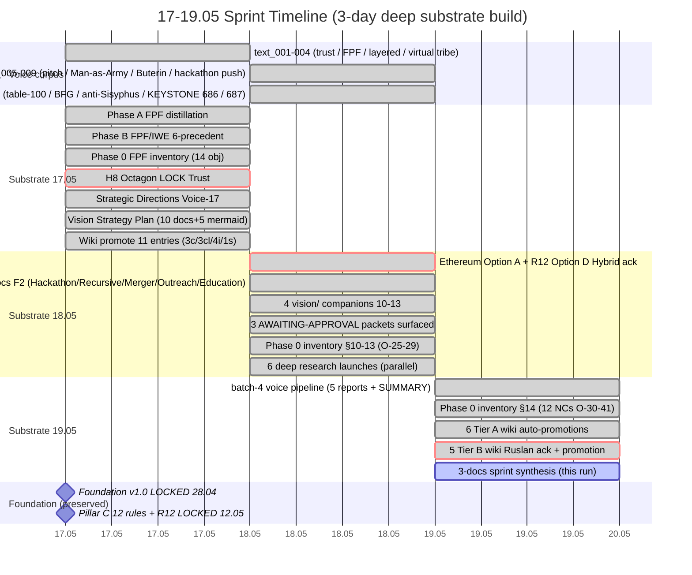

# Diagram 01 — 17-19.05 Sprint Timeline

---

## Legend

- **Crit (red):** Octagon LOCK events / Ethereum architecture ack / Tier B promotion (high-impact)
- **Active (in progress):** этот sprint synthesis run
- **Milestone:** pre-sprint state (Foundation + Pillar C preserved)

## Key timestamps

| Time | Event | F-grade |
|---|---|---|
| 17.05 evening | H8 Octagon LOCK (Trust Infrastructure) | F8 |
| 18.05 morning | Ethereum Option A + R12 Option D Hybrid ack (commit `8a3d800`) | F5 |
| 18.05 day | 5 concept docs F2 + 4 vision/ companions | F2 |
| 18.05 evening | 5 deep concept research launches | parallel runs |
| 18.05 15:22 | KEYSTONE audio_686 dictation (engineer workshop STOPPER + 1M/$1B/100M + 150→15 cascade + 6-resource) | F5 |
| 19.05 morning | batch-4 voice pipeline + Phase 0 §14 (12 NCs) + 6 Tier A wiki auto-promotions | F4 |
| 19.05 noon | 5 Tier B wiki Ruslan ack + этот 3-docs sprint synthesis run | F3-F4 |

---

*Mermaid diagram 01 for Doc 1 §7 sprint-synthesis-2026-05-19.*
